<div align="center">


# Universidad Peruana de Ciencias Aplicadas

## Facultad de Ingeniería

## Programa Académico de Ingeniería de Software

**Ciclo:** 2026-10

**Curso:** Aplicaciones Web

**NRC:** 17953

**Docente del curso:** Alex Humberto Sánchez Ponce


# Informe de Trabajo Final

**Nombre de la Startup:** Flowbit

**Nombre del producto:** Qullqa


## Integrantes

<p align="center">
u202416272 - Asmat Alminco, Martin Alejandro<br>
u202414802 - Contreras Torres, Arturo Valentino<br>
u2024113169 - Güere Calero, Fernando Julio<br>
u20231h067 - Huaman Oscco, Aldo Jesus<br>
u202018427 - Ramos Fuentes Rivera, Adriana Nicole<br>

</p>


*Abril, 2026*

</div>

---

# Registro de Versiones del Informe

<table>
  <tr>
    <th>Versión</th>
    <th>Fecha</th>
    <th>Autor</th>
    <th>Descripción de modificación</th>
  </tr>

  <tr>
    <td><b>Primera Entrega (AV1)</b></td>
    <td>12/04/2026</td>
    <td>
      Asmat Alminco, Martin Alejandro <br>
      <br>
      <p></p>
      Contreras Torres, Arturo Valentino <br>
      <br>
      <p></p>
      Güere Calero, Fernando Julio <br>
      <br>
      <p></p>
      Huaman Oscco, Aldo Jesus <br>
      <br>
      <p></p>
      Ramos Fuentes Rivera, Adriana Nicole <br>
    </td>
    <td>
      Capítulo I: Introducción <br>
      Capítulo II: Requirements Elicitation & Analysis <br>
      Capítulo III: Requirements Specification <br>
      Capítulo IV: Product Design <br>
      Capítulo V: Product Implementation, Validation & Deployment (5.1. & 5.2. Sprint 1) <br>
      Codificación Landing Page
    </td>
  </tr>

  <tr>
    <td><b>Segunda Entrega (TB1)</b></td>
    <td>4/05/2026</td>
    <td>
      Asmat Alminco, Martin Alejandro <br>
      <br>
      <p></p>
      Contreras Torres, Arturo Valentino <br>
      <br>
      <p></p>
      Güere Calero, Fernando Julio <br>
      <br>
      <p></p>
      Huaman Oscco, Aldo Jesus <br>
      <br>
      <p></p>
      Ramos Fuentes Rivera, Adriana Nicole <br>
    </td>
    <td>
      Corrección del reporte <br>
      Mejora de artefactos <br>
      Nueva versión desplegada de Landing Page <br>
      Primera versión desplegada de Frontend Web Applications <br>
      Capítulo V: Product Implementation, Validation & Deployment (Sprint 2) <br>
    </td>
  </tr>
  <tr>
    <td><b>Tercera Entrega (AV2)</b></td>
    <td>02/06/2026</td>
    <td>
      Asmat Alminco, Martin Alejandro <br>
      <br>
      <p></p>
      Contreras Torres, Arturo Valentino <br>
      <br>
      <p></p>
      Güere Calero, Fernando Julio <br>
      <br>
      <p></p>
      Huaman Oscco, Aldo Jesus <br>
      <br>
      <p></p>
      Ramos Fuentes Rivera, Adriana Nicole <br>
    </td>
    <td>
    Corrección del reporte <br>
    Mejora de artefactos <br>
    Nueva versión desplegada de Landing Page <br>
    Nueva versión desplegada de Frontend Web Applications <br>
    Primera versión desplegada de Web Services <br>
    Primera versión publicada de Video About-The-Product <br>
    Primera versión publicada de Video About-The-Team <br>
    Capítulo V: Product Implementation, Validation & Deployment (Sprint 3 / Validation Interviews) <br>
    </td>
  </tr>
</table>

---

# Project Report Collaboration Insights
El informe del proyecto fue desarrollado de manera colaborativa por el equipo mediante repositorios de GitHub creados para la gestión del Project Report y de los diferentes componentes del sistema Qullqa. Estos repositorios contienen los archivos del informe, diagramas, evidencias, wireframes, avances de la landing page y el historial de versiones correspondiente a cada entrega.

URL del repositorio (report): https://github.com/upc-pre-202610-1asi0730-17953-flowbit/qullqa-report <br>
URL del repositorio (webapp): https://github.com/upc-pre-202610-1asi0730-17953-flowbit/qullqa-webapp <br>
URL del repositorio (website): https://github.com/upc-pre-202610-1asi0730-17953-flowbit/qullqa-website <br>
URL del repositorio (platform): https://github.com/upc-pre-202610-1asi0730-17953-flowbit/qullqa-platform <br>
URL del repositorio (mockapi): https://github.com/upc-pre-202610-1asi0730-17953-flowbit/qullqa-mock-api <br>

**Primera Entrega (AV1)**

Durante la primera entrega del proyecto Qullqa, el equipo trabajó de manera colaborativa en la elaboración del Project Report, organizando las actividades y responsabilidades de forma grupal para cubrir las diferentes secciones del informe y los primeros avances del producto.

El desarrollo del trabajo incluyó actividades de investigación, definición de la problemática, análisis del mercado, entrevistas a usuarios, elaboración de artefactos UX y diseño inicial de la solución. Como parte de este proceso, el equipo desarrolló de manera conjunta los apartados relacionados con Lean UX, User Personas, Empathy Maps, User Journey Maps, User Task Matrix, análisis competitivo, EventStorming y Ubiquitous Language, permitiendo consolidar una visión compartida sobre las necesidades de los segmentos objetivo: bodegas y farmacias.

Asimismo, durante esta etapa se realizó el avance de los primeros wireframes mobile y la construcción de la primera versión de la landing page de Qullqa, enfocándose en comunicar la propuesta de valor del proyecto y establecer una identidad visual inicial alineada con la experiencia de usuario planteada.

Para la organización y seguimiento del trabajo, el equipo utilizó GitHub como plataforma principal de colaboración y control de versiones. Mediante repositorios compartidos, commits y ramas de trabajo, fue posible registrar los avances realizados en el informe, los diseños UX/UI y los componentes iniciales de la landing page, manteniendo evidencia continua de la participación grupal y de la evolución del proyecto durante la primera entrega.

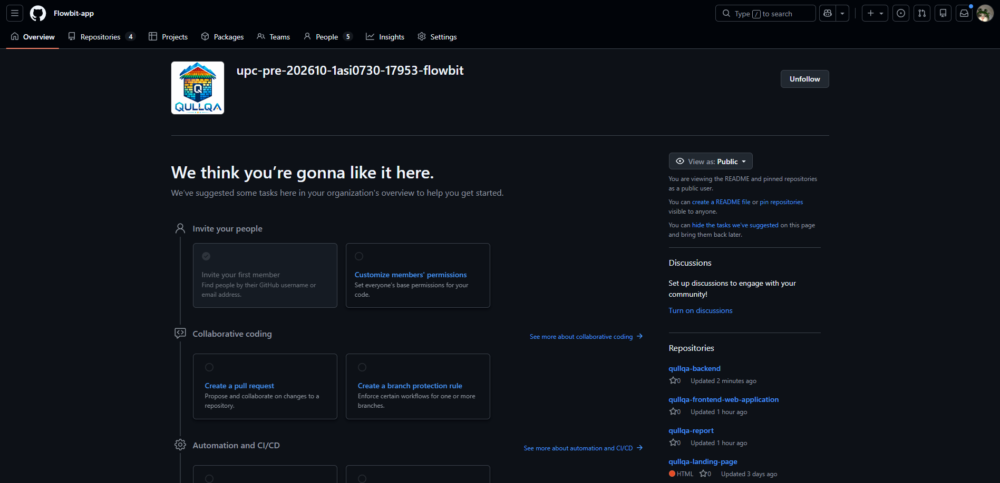

**Trabajo Parcial (TB1)**

Durante el desarrollo del Trabajo Parcial (TB1) del proyecto Qullqa, el equipo continuó trabajando de manera colaborativa en la mejora y consolidación de los avances obtenidos en la primera entrega, enfocándose principalmente en la implementación técnica de la web application, la documentación del sprint y la optimización de los artefactos funcionales y visuales del sistema.

En esta etapa, el equipo desarrolló actividades relacionadas con la implementación de bounded contexts dentro de la arquitectura de la aplicación web, permitiendo una mejor organización de los módulos y funcionalidades del sistema. Asimismo, se realizaron mejoras en la Landing Page para optimizar la experiencia visual y reforzar la propuesta de valor presentada a los usuarios.

Como parte del trabajo técnico y de documentación, se actualizaron User Stories y Technical Stories, se mejoró el Design Level Event Storming y se implementó MockAPI para la simulación y validación de datos dentro del sistema. Además, se realizaron mejoras en el diagrama de base de datos y revisiones generales de diagramas para mantener coherencia entre la arquitectura, la lógica del negocio y la estructura de datos del proyecto.

Durante el TB1 también se desarrollaron evidencias relacionadas con el Sprint Review, incluyendo Development Evidence, Execution Evidence, Services Documentation Evidence y Software Deployment Evidence, permitiendo registrar el avance técnico del proyecto y las pruebas realizadas sobre la aplicación. Asimismo, se documentaron Team Collaboration Insights y Project Report Collaboration Insights para evidenciar la participación activa y coordinada de todos los integrantes durante el desarrollo del sprint.

Para la gestión y seguimiento del trabajo colaborativo, el equipo continuó utilizando GitHub como herramienta principal de control de versiones y colaboración. Mediante el uso de ramas, commits y repositorios compartidos, se logró mantener un registro organizado de los avances realizados en el desarrollo de la web application, las mejoras visuales, la documentación técnica y las implementaciones funcionales realizadas durante el TB1.


**Tercera Entrega (AV2)**

Durante la entrega del AV2 del proyecto Qullqa, el equipo consolidó los avances previos mediante un enfoque intensivo en la arquitectura de backend y la persistencia de datos. Esta etapa se caracterizó por la integración técnica y la validación funcional del sistema, permitiendo que la web application evolucionara hacia una solución robusta, conectada y preparada para entornos reales donde los clientes validaran el incremento.

En este sprint, el equipo se centró en la implementación del backend y la estructuración de la base de datos, garantizando una comunicación fluida y eficiente con la capa de presentación. Se desarrollaron y desplegaron las primeras versiones de los Web Services, asegurando que la lógica de negocio esté correctamente desacoplada y sea escalable. Paralelamente, se llevó a cabo el despliegue de las versiones actualizadas tanto de la Landing Page como de la Web Application, refinando la experiencia de usuario y optimizando los flujos de interacción basados en las correciones de los entregables anteriores, presentando una mejora continua.

Como parte del rigor técnico y de gestión, se realizó una exhaustiva labor de documentación y validación. Se integraron las entrevistas de validación de usuario y evaluaciones heurísticas para medir la usabilidad del sistema, y se elaboraron los artefactos correspondientes al Sprint 3, incluyendo el Sprint Planning, la definición de roles (líderes y colaboradores) y el Sprint Backlog actualizado. Asimismo, se generaron las evidencias de desarrollo, ejecución, servicios y despliegue técnico, las cuales demuestran la madurez alcanzada en la infraestructura del proyecto.

Para registrar el avance integral del equipo, se produjeron los videos About-the-Product y About-the-Team, junto con el informe final, la presentación keynote y el reporte de desempeño individual. La gestión del trabajo colaborativo mantuvo su base en GitHub, donde se centralizaron el control de versiones, la integración continua y la coherencia del repositorio, asegurando que todos los entregables, tanto el código fuente como los documentos complementarios, cumplan con los estándares de calidad definidos para esta etapa del proyecto.

---

# Contenido

## Tabla de Contenidos

- [Registro de Versiones del Informe](#registro-de-versiones-del-informe)
- [Project Report Collaboration Insights](#project-report-collaboration-insights)
- [Contenido](#contenido)
  - [Tabla de Contenidos](#tabla-de-contenidos)
- [Student Outcome](#student-outcome)
- [Capítulo I: Introducción](#capítulo-i-introducción)
  - [1.1. Startup Profile](#11-startup-profile)
    - [1.1.1. Descripción de la Startup](#111-descripción-de-la-startup)
    - [1.1.2. Perfiles de integrantes del equipo](#112-perfiles-de-integrantes-del-equipo)
  - [1.2. Solution Profile](#12-solution-profile)
    - [1.2.1. Antecedentes y problemática](#121-antecedentes-y-problemática)
    - [1.2.2. Lean UX Process](#122-lean-ux-process)
      - [1.2.2.1. Lean UX Problem Statements](#1221-lean-ux-problem-statements)
      - [1.2.2.2. Lean UX Assumptions](#1222-lean-ux-assumptions)
      - [1.2.2.3. Lean UX Hypothesis Statements](#1223-lean-ux-hypothesis-statements)
      - [1.2.2.4. Lean UX Canvas](#1224-lean-ux-canvas)
  - [1.3. Segmentos objetivo](#13-segmentos-objetivo)
- [Capítulo II: Requirements Elicitation \& Analysis](#capítulo-ii-requirements-elicitation--analysis)
  - [2.1. Competidores](#21-competidores)
    - [2.1.1. Análisis competitivo](#211-análisis-competitivo)
    - [2.1.2. Estrategias y tácticas frente a competidores](#212-estrategias-y-tácticas-frente-a-competidores)
  - [2.2. Entrevistas](#22-entrevistas)
    - [2.2.1. Diseño de entrevistas](#221-diseño-de-entrevistas)
    - [2.2.2. Registro de entrevistas](#222-registro-de-entrevistas)
    - [2.2.3. Análisis de entrevistas](#223-análisis-de-entrevistas)
  - [2.3. Needfinding](#23-needfinding)
    - [2.3.1. User Personas](#231-user-personas)
    - [2.3.2. User Task Matrix](#232-user-task-matrix)
    - [2.3.3. User Journey Mapping](#233-user-journey-mapping)
    - [2.3.4. Empathy Mapping](#234-empathy-mapping)
  - [2.4. Big Picture Event Storming](#24-big-picture-event-storming)
  - [2.5. Ubiquitous Language](#25-ubiquitous-language)
- [Capítulo III: Requirements Specification](#capítulo-iii-requirements-specification)
  - [3.1. User Stories](#31-user-stories)
  - [3.2. Impact Mapping](#32-impact-mapping)
  - [3.3. Product Backlog](#33-product-backlog)
- [Capítulo IV: Product Design](#capítulo-iv-product-design)
  - [4.1. Style Guidelines](#41-style-guidelines)
    - [4.1.1. General Style Guidelines](#411-general-style-guidelines)
    - [4.1.2. Web Style Guidelines](#412-web-style-guidelines)
  - [4.2. Information Architecture](#42-information-architecture)
    - [4.2.1. Organization Systems](#421-organization-systems)
    - [4.2.2. Labeling Systems](#422-labeling-systems)
    - [4.2.3. SEO Tags and Meta Tags](#423-seo-tags-and-meta-tags)
    - [4.2.4. Searching Systems](#424-searching-systems)
    - [4.2.5. Navigation Systems](#425-navigation-systems)
  - [4.3. Landing Page UI Design](#43-landing-page-ui-design)
    - [4.3.1. Landing Page Wireframe](#431-landing-page-wireframe)
    - [4.3.2. Landing Page Mock-up](#432-landing-page-mock-up)
  - [4.4. Web Applications UX/UI Design](#44-web-applications-uxui-design)
    - [4.4.1. Web Applications Wireframes](#441-web-applications-wireframes)
    - [4.4.2. Web Applications Wireflow Diagrams](#442-web-applications-wireflow-diagrams)
    - [4.4.3. Web Applications Mock-ups](#443-web-applications-mock-ups)
    - [4.4.4. Web Applications User Flow Diagrams](#444-web-applications-user-flow-diagrams)
  - [4.5. Web Applications Prototyping](#45-web-applications-prototyping)
  - [4.6. Domain-Driven Software Architecture](#46-domain-driven-software-architecture)
    - [4.6.1. Design-Level Event Storming](#461-design-level-event-storming)
    - [4.6.2. Software Architecture Context Diagram](#462-software-architecture-context-diagram)
    - [4.6.3. Software Architecture Container Diagrams](#463-software-architecture-container-diagrams)
    - [4.6.4. Software Architecture Components Diagrams](#464-software-architecture-components-diagrams)
  - [4.7. Software Object-Oriented Design](#47-software-object-oriented-design)
    - [4.7.1. Class Diagrams](#471-class-diagrams)
  - [4.8. Database Design](#48-database-design)
    - [4.8.1. Database Diagrams](#481-database-diagrams)
- [Capítulo V: Product Implementation, Validation \& Deployment](#capítulo-v-product-implementation-validation--deployment)
  - [5.1. Software Configuration Management](#51-software-configuration-management)
    - [5.1.1. Software Development Environment Configuration](#511-software-development-environment-configuration)
    - [5.1.2. Source Code Management](#512-source-code-management)
    - [5.1.3. Source Code Style Guide \& Conventions](#513-source-code-style-guide--conventions)
    - [5.1.4. Software Deployment Configuration](#514-software-deployment-configuration)
  - [5.2. Landing Page, Services \& Applications Implementation](#52-landing-page-services--applications-implementation)
    - [5.2.1. Sprint 1](#521-sprint-1)
      - [5.2.1.1. Sprint Planning 1](#5211-sprint-planning-1)
      - [5.2.1.2. Aspect Leaders and Collaborators](#5212-aspect-leaders-and-collaborators)
      - [5.2.1.3. Sprint Backlog 1](#5213-sprint-backlog-1)
      - [5.2.1.4. Development Evidence for Sprint Review](#5214-development-evidence-for-sprint-review)
      - [5.2.1.5. Execution Evidence for Sprint Review](#5215-execution-evidence-for-sprint-review)
      - [5.2.1.6. Services Documentation Evidence for Sprint Review](#5216-services-documentation-evidence-for-sprint-review)
      - [5.2.1.7. Software Deployment Evidence for Sprint Review](#5217-software-deployment-evidence-for-sprint-review)
      - [5.2.1.8. Team Collaboration Insights during Sprint](#5218-team-collaboration-insights-during-sprint)
    - [5.2.2. Sprint 2](#522-sprint-2)
      - [5.2.2.1. Sprint Planning 2](#5221-sprint-planning-2)
      - [5.2.2.2. Aspect Leaders and Collaborators](#5222-aspect-leaders-and-collaborators)
      - [5.2.2.3. Sprint Backlog 2](#5223-sprint-backlog-2)
      - [5.2.2.4. Development Evidence for Sprint Review](#5224-development-evidence-for-sprint-review)
      - [5.2.2.5. Execution Evidence for Sprint Review](#5225-execution-evidence-for-sprint-review)
      - [5.2.2.6. Services Documentation Evidence for Sprint Review](#5226-services-documentation-evidence-for-sprint-review)
      - [5.2.2.7. Software Deployment Evidence for Sprint Review](#5227-software-deployment-evidence-for-sprint-review)
      - [5.2.2.8. Team Collaboration Insights during Sprint](#5228-team-collaboration-insights-during-sprint)
    - [5.2.3. Sprint 3](#523-sprint-3)
      - [5.2.3.1. Sprint Planning 3](#5231-sprint-planning-3)
      - [5.2.3.2. Aspect Leaders and Collaborators](#5232-aspect-leaders-and-collaborators)
      - [5.2.3.3. Sprint Backlog 3](#5233-sprint-backlog-3)
      - [5.2.3.4. Development Evidence for Sprint Review](#5234-development-evidence-for-sprint-review)
      - [5.2.3.5. Execution Evidence for Sprint Review](#5235-execution-evidence-for-sprint-review)
      - [5.2.3.6. Services Documentation Evidence for Sprint Review](#5236-services-documentation-evidence-for-sprint-review)
      - [5.2.3.7. Software Deployment Evidence for Sprint Review](#5237-software-deployment-evidence-for-sprint-review)
      - [5.2.3.8. Team Collaboration Insights during Sprint](#5238-team-collaboration-insights-during-sprint)
  - [5.3. Validation Interviews](#53-validation-interviews)
    - [5.3.1. Diseño de Entrevistas](#531-diseño-de-entrevistas)
    - [5.3.2. Registro de Entrevistas](#532-registro-de-entrevistas)
    - [5.3.3. Evaluaciones según heurísticas](#533-evaluaciones-según-heurísticas)
  - [5.4. Video About-the-Product](#54-video-about-the-product)
- [Conclusiones](#conclusiones)
  - [Conclusiones y recomendaciones](#conclusiones-y-recomendaciones)
  - [Video About-the-Team](#video-about-the-team)
- [Bibliografía](#bibliografía)
- [Anexos](#anexos)

---

# Student Outcome

El curso contribuye al cumplimiento del Student Outcome ABET:

**ABET – EAC - Student Outcome 5**

**Criterio:** *Capacidad de comunicarse efectivamente con un rango de audiencias.*

En el siguiente cuadro se describe las acciones realizadas y enunciados de conclusiones por parte del grupo, que permiten sustentar el haber alcanzado el logro del ABET – EAC - Student Outcome 5.

<table>
  <tr>
    <th>Criterio específico</th>
    <th>Acciones realizadas</th>
    <th>Conclusiones</th>
  </tr>
  <tr>
    <td><b>Trabaja en equipo para proporcionar liderazgo en forma conjunta.</b></td>
    <td>
      <b>Asmat Alminco, Martin Alejandro</b><br>
      <u>AV1</u><br>
      Condujo la consolidación del análisis de antecedentes y problemática desde los enfoques <i>When</i> y <i>Where</i>, coordinando con el equipo la redacción conjunta de los Lean UX Problem Statements. Su participación en el diseño, registro y análisis de entrevistas —evidenciada en las actas de entrevistas del repositorio del proyecto— y en la construcción del User Task Matrix mostró capacidad de trabajo coordinado con sus compañeros para sostener la continuidad del análisis de necesidades.
      <br><br><u>TB1</u><br>
      Asumió la corrección de los segmentos objetivo a partir de la retroalimentación recibida y coordinó con el equipo técnico el Software Deployment Configuration y la implementación de bounded contexts en la web application, garantizando continuidad en la gestión de comunicaciones entre los miembros responsables del despliegue.
      <br><br><u>AV2</u><br>
      Estuvo a cargo de tareas de desarrollo backend y coordinó junto al equipo la ejecución de la entrevista de validación, cuyo registro forma parte de la evidencia de Sprint 3, además de participar en la producción del video About the Team. Aplicó la evaluación según heurísticas para sustentar las mejoras propuestas en los userflows y en la web application, manteniendo coordinación constante con el resto del equipo de desarrollo.
      <br><br>
      <b>Contreras Torres, Arturo Valentino</b><br>
      <u>AV1</u><br>
      Lideró la elaboración de la descripción de la startup y del Solution Profile, coordinando con el equipo la definición de segmentos objetivo, el análisis competitivo y el diseño y registro de entrevistas. Condujo la construcción conjunta de los User Personas, el Big Picture Event Storming, el Design Level Event Storming, el Ubiquitous Language y los Diagramas de Clases, demostrando capacidad de articular el trabajo de distintos integrantes en un modelo de dominio coherente.
      <br><br><u>TB1</u><br>
      Estuvo a cargo de la elaboración del Project Report Collaboration Insights y coordinó la mejora del Design Level Event Storming, la actualización de User Stories y Technical Stories, la implementación de bounded contexts y la mejora de la landing page, evidenciando continuidad en la coordinación técnica del equipo a través de las actas de seguimiento del sprint.
      <br><br><u>AV2</u><br>
      Condujo el desarrollo backend y el despliegue en Azure, coordinando la conexión entre frontend y backend. Participó en la entrevista de validación y en el video About the Team, además de impulsar la mejora de la webapp y de los diagramas del proyecto, evidenciando trabajo coordinado y sostenido con el resto del equipo a lo largo del sprint.
      <br><br>
      <b>Güere Calero, Fernando Julio</b><br>
      <u>AV1</u><br>
      Condujo el análisis de antecedentes y problemática desde los enfoques <i>Who</i> y <i>Why</i>, coordinando con el equipo las Lean UX Assumptions y las entrevistas asociadas. Estuvo a cargo del Empathy Mapping, la Information Architecture, el diseño de mockups y wireframes, y el Software Configuration Management, articulando el trabajo entre los aspectos visuales y técnicos del proyecto.
      <br><br><u>TB1</u><br>
      Coordinó la elaboración del Development Evidence y del Execution Evidence for Sprint Review, registrando de forma sistemática el avance técnico del equipo. Lideró la implementación de bounded contexts y la mejora de la landing page, garantizando continuidad entre los registros de evidencia y el trabajo de desarrollo.
      <br><br><u>AV2</u><br>
      Estuvo a cargo del desarrollo backend, la mejora de la webapp y de la landing page, así como la conexión entre frontend y backend y el despliegue en Azure del Swagger. Coordinó con el equipo la realización de la entrevista de validación y participó en el video About the Team, evidenciando capacidad de sostener el liderazgo técnico del proyecto durante todo el sprint.
      <br><br>
      <b>Huaman Oscco, Aldo Jesus</b><br>
      <u>AV1</u><br>
      Condujo el análisis de antecedentes y problemática desde los enfoques <i>How</i> y <i>How Much</i>, coordinando con el equipo la redacción de los Lean UX Hypothesis Statements y la definición de estrategias y tácticas frente a competidores. Su participación en entrevistas y en el Empathy Mapping evidenció trabajo coordinado para validar las hipótesis del proyecto.
      <br><br><u>TB1</u><br>
      Estuvo a cargo de la documentación del Services Documentation Evidence y del Software Deployment Evidence for Sprint Review, además de registrar los Team Collaboration Insights durante el sprint, lo que evidencia de forma directa su capacidad de coordinar y dejar constancia del trabajo conjunto del equipo. Participó también en la implementación de bounded contexts en la web application.
      <br><br><u>AV2</u><br>
      Condujo el desarrollo backend y la actualización del Product Backlog y del Report Collaboration Insights, coordinando con el equipo el desarrollo del Sprint 3. Participó en la entrevista de validación y en el video About the Team, sosteniendo la práctica de documentar evidencia de coordinación que mantuvo desde el TB1.
      <br><br>
      <b>Ramos Fuentes Rivera, Adriana Nicole</b><br>
      <u>AV1</u><br>
      Condujo el análisis de antecedentes y problemática desde el enfoque <i>What</i>, coordinando con el equipo la elaboración del Lean UX Canvas y el registro de entrevistas. Estuvo a cargo de la construcción del User Journey Mapping, el Database Diagram y los General Style Guidelines, articulando el trabajo entre la experiencia de usuario y la estructura de datos del sistema.
      <br><br><u>TB1</u><br>
      Lideró la mejora del diagrama de base de datos y la revisión cruzada de diagramas con el resto del equipo, coordinando además la actualización de conclusiones y recomendaciones. Participó en la implementación de bounded contexts y en la mejora de la landing page, manteniendo coherencia entre la documentación técnica y el trabajo de los demás integrantes.
      <br><br><u>AV2</u><br>
      Estuvo a cargo del desarrollo backend y coordinó la ejecución de la entrevista de validación y la producción del video About the Team y del video About the Product. Aplicó la evaluación según heurísticas y condujo el desarrollo del Sprint 3, evidenciando continuidad en la coordinación del equipo durante el cierre del proyecto.
    </td>
    <td>
      <u>AV1</u><br>
      Como equipo, durante el AV1 se distribuyó el liderazgo de las distintas dimensiones del análisis (antecedentes y problemática, Lean UX, entrevistas, modelado de dominio y diseño visual) entre los cinco integrantes, cada uno asumiendo la conducción de un frente específico. Esta distribución, sustentada en el registro de entrevistas y en la coordinación constante a través de GitHub, permitió que el liderazgo del proyecto se ejerciera de forma conjunta y no centralizada en una sola persona.
      <br><br><u>TB1</u><br>
      Durante el TB1 el equipo mantuvo la práctica de liderazgo compartido, evidenciada en la documentación sistemática de Development, Execution, Services Documentation y Software Deployment Evidence for Sprint Review, así como en los Team Collaboration Insights registrados durante el sprint. Estos artefactos constituyen evidencia directa de coordinación continua entre los integrantes a lo largo del ciclo de desarrollo.
      <br><br><u>AV2</u><br>
      En el AV2 el liderazgo conjunto se reflejó en la coordinación técnica para el desarrollo del backend, la conexión frontend-backend y el despliegue en Azure, tareas que requirieron sincronización constante entre los responsables de cada bounded context. La ejecución coordinada de la entrevista de validación y la producción de los videos About the Team y About the Product reforzaron, con nueva evidencia, la capacidad del equipo para sostener el liderazgo compartido hasta el cierre del proyecto.
    </td>
  </tr>
  <tr>
    <td><b>Crea un entorno colaborativo e inclusivo, establece metas, planifica tareas y cumple objetivos.</b></td>
    <td>
      <b>Asmat Alminco, Martin Alejandro</b><br>
      <u>AV1</u><br>
      Se mostró proactivo en la recopilación y análisis de entrevistas, escuchando las observaciones del equipo sobre los hallazgos identificados para integrarlas en el User Task Matrix y en los Lean UX Problem Statements, lo que permitió establecer metas claras para el cierre del primer avance.
      <br><br><u>TB1</u><br>
      Analizó las observaciones recibidas sobre los segmentos objetivo y propuso la corrección correspondiente; además planificó junto al equipo la configuración del despliegue, garantizando el cumplimiento de los objetivos técnicos establecidos para el sprint.
      <br><br><u>AV2</u><br>
      Fue receptivo a los resultados de la evaluación según heurísticas, proponiendo mejoras concretas en los userflows y en la web application a partir de esas observaciones, y planificó junto al equipo las tareas de desarrollo backend necesarias para cumplir los objetivos del sprint final.
      <br><br>
      <b>Contreras Torres, Arturo Valentino</b><br>
      <u>AV1</u><br>
      Se mostró proactivo en la definición de la startup y del análisis competitivo, escuchando las propuestas del equipo para estructurar el Event Storming y el Ubiquitous Language de forma colaborativa, lo que permitió planificar de manera ordenada las tareas de modelado del dominio.
      <br><br><u>TB1</u><br>
      Analizó las críticas recibidas sobre el Event Storming inicial y propuso su mejora, además de planificar junto al equipo la actualización de User Stories y Technical Stories y la implementación de MockAPI, garantizando el cumplimiento de los objetivos funcionales del sprint.
      <br><br><u>AV2</u><br>
      Propuso e implementó mejoras en la webapp y en los diagramas del proyecto a partir de la retroalimentación del equipo, y planificó el despliegue en Azure y la conexión frontend-backend, asegurando el cumplimiento de los objetivos técnicos previstos para el cierre del proyecto.
      <br><br>
      <b>Güere Calero, Fernando Julio</b><br>
      <u>AV1</u><br>
      Fue proactivo en el diseño de mockups y wireframes, integrando las opiniones del equipo sobre la Information Architecture propuesta, y estableció junto a sus compañeros los lineamientos del Software Configuration Management para ordenar el trabajo colaborativo del proyecto.
      <br><br><u>TB1</u><br>
      Escuchó las observaciones del equipo sobre el avance del sprint y las incorporó en el Development y Execution Evidence for Sprint Review, planificando junto al equipo la implementación de bounded contexts y la mejora de la landing page para cumplir los objetivos establecidos.
      <br><br><u>AV2</u><br>
      Fue proactivo en la planificación de las entrevistas de validación y en la estructuración de tareas de optimización del frontend y desarrollo del backend, garantizando la cooperación entre los integrantes responsables de la conexión frontend-backend y el despliegue del Swagger en Azure.
      <br><br>
      <b>Huaman Oscco, Aldo Jesus</b><br>
      <u>AV1</u><br>
      Analizó oportunidades de mejora frente a los competidores identificados y propuso ajustes a las Lean UX Hypothesis Statements a partir de las entrevistas y el Empathy Mapping, apoyando la toma de decisiones grupales sobre la propuesta de solución.
      <br><br><u>TB1</u><br>
      Documentó de forma proactiva las Services Documentation Evidence y Software Deployment Evidence, escuchando las necesidades del equipo para registrar los Team Collaboration Insights del sprint, lo que garantizó cooperación e integración efectiva entre los miembros del grupo.
      <br><br><u>AV2</u><br>
      Analizó el estado del Product Backlog y propuso su actualización junto con la del Report Collaboration Insights, planificando con el equipo el desarrollo del Sprint 3 para asegurar el cumplimiento de los objetivos de cierre del proyecto.
      <br><br>
      <b>Ramos Fuentes Rivera, Adriana Nicole</b><br>
      <u>AV1</u><br>
      Fue proactiva en la elaboración del Lean UX Canvas y el User Journey Mapping, escuchando las opiniones del equipo para mantener coherencia entre la experiencia de usuario, el diseño visual y la estructura de datos planteada en el Database Diagram.
      <br><br><u>TB1</u><br>
      Analizó las observaciones sobre el diagrama de base de datos y propuso su mejora junto con la revisión cruzada de los demás diagramas, planificando la actualización de conclusiones y recomendaciones para garantizar coherencia entre la documentación y el sistema.
      <br><br><u>AV2</u><br>
      Estableció metas y distribuyó responsabilidades para la ejecución de las entrevistas de validación y la producción de los videos About the Team y About the Product, considerando las opiniones del equipo y de los usuarios entrevistados. Esta organización permitió cumplir, junto con la evaluación según heurísticas y el desarrollo del Sprint 3, los objetivos del cierre del proyecto dentro de los plazos establecidos.
    </td>
    <td>
      <u>AV1</u><br>
      Como equipo, durante el AV1 se promovió un entorno colaborativo e inclusivo mediante la escucha activa de las opiniones de cada integrante durante el análisis de entrevistas y la construcción de los artefactos UX. La planificación de tareas según las fortalezas de cada miembro permitió cumplir los objetivos establecidos para el avance, manteniendo coherencia entre los entregables.
      <br><br><u>TB1</u><br>
      Durante el TB1 el equipo analizó de forma conjunta las críticas y observaciones recibidas sobre los avances del AV1, traduciéndolas en mejoras concretas sobre el Event Storming, los diagramas y la landing page. La planificación coordinada de la documentación de evidencias de sprint y del despliegue permitió garantizar la cooperación, participación e integración efectiva de todos los miembros del grupo.
      <br><br><u>AV2</u><br>
      En el AV2 el equipo estableció metas claras para el cierre del proyecto, distribuyendo de forma inclusiva las tareas de desarrollo backend, conexión frontend-backend, despliegue en Azure y producción audiovisual. La incorporación de las opiniones recogidas en las entrevistas de validación y en la evaluación según heurísticas evidencia que el equipo analizó la retroalimentación recibida y propuso soluciones concretas, cumpliendo los objetivos planificados para el sprint final dentro de los plazos establecidos.
    </td>
  </tr>
</table>

---

# Capítulo I: Introducción
## 1.1. Startup Profile

### 1.1.1. Descripción de la Startup

Somos **Flowbit**, una startup tecnológica creada por estudiantes de la carrera Ingeniería de Software de la Universidad Peruana de Ciencias Aplicadas (UPC). Nuestra startup está enfocada en el desarrollo de soluciones digitales innovadoras orientadas a optimizar la gestión de negocios tradicionales mediante el uso de software inteligente y tecnologías emergentes. La empresa busca transformar procesos manuales e ineficientes en sistemas automatizados que permitan mejorar la toma de decisiones, reducir pérdidas y aumentar la productividad.

Nuestro producto principal es **Qullqa**, una solución diseñada para la gestión de bodegas y farmacias, integrando funcionalidades como control de inventario, reportes de ventas, alertas inteligentes y, como valor diferencial, el uso de dispositivos IoT para el seguimiento de entregas.

La misión de Flowhot es brindar soluciones tecnológicas accesibles e innovadoras que permitan a pequeños y medianos negocios optimizar sus procesos, mejorar su rentabilidad y tomar decisiones basadas en datos reales.

Nuestra visión es consolidarnos como una startup líder en el desarrollo de plataformas digitales para la gestión de negocios en Latinoamérica, destacando por la integración de tecnologías como IoT e inteligencia de datos, y contribuyendo a la transformación digital de sectores tradicionales como lo son las bodegas y farmacias.

Nuestros valores son:
- Innovación: Desarrollo constante de soluciones tecnológicas modernas y eficientes
- Compromiso: Enfoque en resolver problemas reales de nuestros clientes
- Accesibilidad: Crear herramientas fáciles y accesibles para negocios pequeños
- Responsabilidad: Garantizar confiabilidad en los datos y procesos
- Calidad: Priorizar la experiencia y necesidades del usuario

### 1.1.2. Perfiles de integrantes del equipo

<table>
  <tr>
    <td rowspan="4" align="center">
      
    </td>
    <td><b>Nombre:</b> Arturo Valentino Contreras Torres</td>
  </tr>
  <tr>
    <td><b>Código:</b> u202414802</td>
  </tr>
  <tr>
    <td>
      <b>Descripción:</b><br/>
      Soy <b>Arturo Valentino Contreras Torres</b>, tengo 19 años y estudio la carrera de Ingeniería de Software en la UPC, actualmente estoy en el 5to ciclo. Me gusta aprender y aplicar tecnologías innovadoras para resolver problemas complejos y desarrollar soluciones eficientes. Me apasiona participar en concursos de programación en donde aprendo más sobre temas como programación competitiva, lenguajes como C++, Python, Java, frameworks como Flutter y habilidades como el trabajo en equipo.
      <br/><br/>
      Dentro del equipo, contribuyo en el desarrollo frontend y backend, asegurándome de aplicar principios de Domain Driven Design, patrones de diseño y buenas prácticas de desarrollo de software. Me considero una persona responsable, creativa y orientada al trabajo en equipo, con un enfoque en la mejora continua frente a nuevos desafíos.
    </td>
  </tr>
  <tr>
  </tr>

  <tr>
    <td rowspan="4" align="center">
      
    </td>
    <td><b>Nombre:</b> Aldo Jesus Huaman Oscco</td>
  </tr>
  <tr>
    <td><b>Código:</b> u20231h067</td>
  </tr>
  <tr>
    <td>
      <b>Descripción:</b><br/>
      Soy <b>Aldo Jesus Huaman Oscco</b>, tengo 20 años y estudio la carrera de Ingeniería de Software en la UPC, estoy cursando el 5to ciclo de la carrera. Disfruto de resolver distintos tipos de problemas que impliquen logica para su resolucion. Tengo interes en desarrollar proyectos de interes social para el desarrollo de habilidades para mi portafolio profesional, manejo distintas tecnologias como lenguajes de programacion y de tipeado, conozco el desarrollo de fronted y backend. Disfruto de aplicar un manejo estructurado con el desarrollo de metodologias agiles en equipo. 
      <br/><br/>
      Dentro del equipo, contribuyo en fronted y backend con proyeccion a IOT, validare la aplicacion de principios DDD, y el seguimiento de patrones para la arquitectura asi como la implementacion de algoritmos que permitan la escalabilidad de nuestra base de datos en conjunto con el sistema.
    </td>
  </tr>
<tr>

</tr>
  <tr>
    <td rowspan="4" align="center">
      
    </td>
    <td><b>Nombre:</b> Fernando Julio Güere Calero</td>
  </tr>
  <tr>
    <td><b>Código:</b> u202413169</td>
  </tr>
  <tr>
    <td>
    <div align="Justify">
      <b>Descripción:</b><br/>
      Soy <b>Fernando Julio Güere Calero</b>, tengo 19 años y estudio la carrera de Ingeniería de Software en la UPC, estoy cursando el 5to ciclo de la carrera. Cuento con los conocimientos para programar en C++, Python y gestión de base de datos SQL. Además, tengo conocimiento para el desarrollo de páginas web usando HTML, CSS y JavaScript. Siempre estoy interesado en expandir mis conocimientos con otros lenguajes de programación para fortalecer mis competencias técnicas y enfrentar retos en la industria. 
      <br/><br/>
      Dentro del equipo, cumplo con las actividades de documentación y programación en un nivel intermedio. También quisiera destacar que soy responsable con las distintas tareas establecidas.
      </div>
    </td>
  </tr>

  <tr>
  </tr>
  <tr>
    <td rowspan="4" align="center">
      
    </td>
    <td><b>Nombre:</b> Adriana Nicole Ramos Fuentes Rivera</td>
  </tr>
  <tr>
    <td><b>Código:</b> u202018427</td>
  </tr>
  <tr>
    <td>
      <b>Descripción:</b><br/>
      Soy <b>Adriana Nicole Ramos Fuentes Rivera</b>, tengo 23 años y estudio la carrera de Ingeniería de Software en la UPC, actualmente estoy en el 5to ciclo. Me gusta aprender nuevas tecnologias y conocimientos complementarios que me permitan desarrollar soluciones a problematicas dentro de un contexto real. Cuento con experiencia en lenguajes de programación como C++ y Python, además de conocimientos en base de datos no relacional como MongoDB.
      <br/><br/>
      Dentro del equipo, me enfoco en el desarrollo de backend, aplicando principios de Domain Driven Design para mantener una lógica de negocio clara. Me considero una persona organizada y empática.
    </td>
  </tr>

  <tr>
  </tr>
  <tr>
    <td rowspan="4" align="center">
      
    </td>
    <td><b>Nombre:</b> Martin Alejandro Asmat Alminco </td>
  </tr>
  <tr>
    <td><b>Código:</b> u202416272 </td>
  </tr>
  <tr>
    <td>
      <b>Descripción:</b><br/>
    Soy <b>Martin Asmat</b>, estudiante de quinto ciclo de la carrera de Ingeniería de Software. Cuento con experiencia en lenguajes de programación como Python y C++ para proyectos enfocados en el desarrollo de habilidades computacionales, las cuales apliqué en proyectos académicos enfocados en solucionar un problema a través de procesos de documentación de Ingeniería de software.
      <br/><br/>
     Dentro del equipo, cumplo el rol de un full stack al realizar actividades de documentación y programación a un nivel medio. Considero que soy una persona responsable y adaptable a distintas situaciones con buen time-management.  
    </td>
  </tr>

</table>

## 1.2. Solution Profile

Qullqa es una aplicación desarrollada por la startup Flowbit, orientada a optimizar la gestión de bodegas y farmacias independientes mediante herramientas digitales accesibles y eficientes. La plataforma permite a los usuarios controlar su inventario, registrar ventas, gestionar productos y obtener reportes que faciliten la toma de decisiones.

El sistema está diseñado para reemplazar métodos manuales o poco eficientes, integrando funcionalidades como alertas de bajo stock, notificaciones de productos por vencer y dashboards interactivos que brindan un visión clara del estado del negocio. De esta manera, Qullqa contribuye a reducir pérdidas económicas, mejorar la organización y aumentar la rentabilidad de los negocios.

Además, como valor diferencial, la solución tiene integración con dispositivos IoT que permiten el seguimiento de entregas hacia el almacén o bodega, brindando mayor seguridad y control de los productos.

Qullqa se presenta como una solución escalable, con distintos planes que se adaptan a las necesidades de cada negocio, desde funcionalidades básicas hasta herramientas más avanzadas de análisis y gestión.


### 1.2.1. Antecedentes y problemática

- **What:**
<br>
  <div>
    Nuestra propuesta de solución, Qullqa, se propone resolver las siguientes 3 problemáticas recurrentes en el comercio independiente:
  </div>
  <br>
  <div align="justify">
    Uno de los problemas más comunes que se enfrentan los dueños de bodegas y farmacias es la deficiencia en la gestión de inventarios y falta de rotación, los cuales, por ausencia de un sistema de gestión que les permita registrar información relevante acerca de sus productos, como la fecha de caducidad, número de lote, proveedor, cadena de frío, ubicación exacta (pasillo, estante, nivel), etc. En consecuencia, provoca que muchos establecimientos mantengan productos vencidos en sus almacenes, lo cual representa un riesgo significativo, ya que, de acuerdo con el Artículo 30 del Código de Protección y Defensa del Consumidor (2010), los consumidores tienen derecho a consumir alimentos inocuos. Los proveedores son responsables de la inocuidad de los alimentos que ofrecen en el mercado, de conformidad con la legislación sanitaria.
  </div>
  <br>
  <div align="justify">
    Por otro lado, el desconocimiento de la rentabilidad y finanzas generales, también representa un problema difícil de resolver para los dueños de bodegas y farmacias. Según la Cámara de Comercio de Lima (2025), la falta de liquidez continúa siendo un obstáculo determinante para las pequeñas y medianas empresas en el Perú. Cada año, más de 100 mil de estas unidades económicas dejan de funcionar, y cerca del 40% lo hace debido a la imposibilidad de sostener su flujo de caja. Además, al ser un negocio independiente donde el manejo de las finanzas puede llegar a ser desordenado e incompleto debido a la inexperiencia y falta de conocimiento por parte del dueño, es más común no saber el margen de ganancia real de los productos vendidos. Por consecuencia, al momento de realizar decisiones importantes, en muchos casos, terminan siendo decisiones erradas, reflejadas en los precios mal establecidos, problemas de flujo de caja, elecciones erróneas de productos a vender, etc.
  </div>
  <br>
  <div align="justify">
    Por último, otro problema es la logística enfocada en las entregas de los proveedores, ya que cuando un proveedor envía un pedido, los dueños no tienen visibilidad en tiempo real de dónde está el vehículo, cuándo llegará aproximadamente o si hubo demoras, como resultado, genera descoordinación, pérdida de tiempo y, en el caso de productos perecibles y medicamentos, riesgos de calidad. Además, es usual que los pedidos lleguen incompletos, con productos distintos a los solicitados o en mal estado por golpes o manipulación incorrecta durante el transporte, por lo que, sin un registro de evidencia fotográfica o de sensores, no se podría realizar el reclamo correspondiente al proveedor. Por consiguiente, brindar una solución eficiente a este problema, generaría una reducción en las pérdidas de productos.
  </div> <br>


- **Where:**
  <div align="justify">
   
  Se encuentra en bodegas y farmacias emprendedoras que se encuentren dentro del rango en ingresos y gestión de productos del NRUS como régimen tributario. Dichos emprendedores necesitan poder reducir brechas de tiempo y de accesibilidad en la gestión de sus productos por la poca calidad de software gratuitos y el precio de los mismos, sin posibilidad de ajustar sus necesidades a sus casos específicos. Dicho sector se encuentra entre los más solicitados por los emprendedores, ya que alínea las necesidades no genera costos exorbitantes por pertenecer a la misma. 
  
  También ocurre con trabajadores de las bodegas o farmacias, los cuales utilizan la infraestructura del negocio planteada previamente propuesta.

  </div>


- **When:**
  <div align="justify">
   
   Cuando un usuario que gestiona la bodega y farmacias se encuentra con propuesta de gestión de inventario robustas que sobrepasan su capacidad de inversión en las mismas, por lo que recurre a propuestas más económicas que no cumple con un buen estándar de optimización o directamente no las utiliza, lo que genera el uso de técnicas manuales.
   Luego, ocurre también con los trabajadores, aunque no sean mayoría. Según la SUNAT (2025), el NRUS permite como máximo en las bajas categorías unos 8.000 soles, por lo que en promedio para no sobrepasar costos, se tiene que considerar máximo 2 trabajadores. Ellos, se encargan en su mayoría de registrar los productos, para lo cual tienen que entender, de ser que un software se utilice, interfaces poco intuitivas y complejas debido a la poca inversión dedicada. Luego, de ser que no exista uno, se recurre a registros manuales, como tomar apuntas en una hoja o cuaderno, lo que da chance a más errores de registro. 

  </div>


- **Who:** <br/>
  <div align="justify">
    El problema afecta principalmente a dos perfiles de microempresarios en el sector de ventas minoristas:
  </div>
  <ul>
    <li>
      <div align="justify">
        El primer segmento objetivo son los bodegueros independientes. Este segmento está conformado por propietarios de bodegas o minimarkets que, por lo general, gestionan su negocio de forma manual o apoyándose en herramientas muy básicas. Estos emprendedores suelen manejar sus establecimientos de manera independiente o con el soporte de su familia, basando su administración diaria mayormente en métodos empíricos que resultan insuficientes para las demandas actuales del mercado.
      </div>
    </li>
    <br/>
    <li>
      <div align="justify">
        Como consecuencia de esta gestión tradicional, los bodegueros enfrentan desafíos críticos como el descontrol total de su stock, pérdidas económicas por productos vencidos y una falta de claridad sobre las ganancias reales obtenidas mes a mes. Ante esta situación, nuestro grupo busca una solución tecnológica que sea simple y accesible, permitiéndoles organizar mejor su negocio y optimizar su rentabilidad de manera intuitiva.
      </div>
    </li>
  </ul>

</div>

- **Why:** <br/>
  <div align="justify">
    La realidad del sector minorista en el Perú se caracteriza por una profunda brecha tecnológica y operativa que compromete la sostenibilidad de miles de microempresas. Según Romero (2024), de las más de 535,000 bodegas que operan a nivel nacional, apenas un 12 % había logrado adoptar herramientas digitales antes de la emergencia sanitaria, cifra que experimentó un retroceso debido a la inexistencia de soluciones adaptadas a la realidad técnica de estos negocios. Esta situación es crítica si se considera que el 70 % de estos establecimientos son gestionados bajo métodos estrictamente tradicionales y manuales, donde la administración diaria depende casi en su totalidad de la memoria del propietario o de registros informales en papel. Esta dependencia de sistemas no automatizados genera un entorno de ineficiencia operativa que no solo ralentiza la atención, sino que anula la capacidad de crecimiento y competitividad frente a las grandes cadenas de retail moderno.
  </div>
  <br/>
  <div align="justify">
    Este rezago digital tiene un impacto financiero directo y medible, especialmente en el manejo de inventarios críticos. De acuerdo con Mendoza y Anchiraico (2018), la ausencia de sistemas de gestión técnica en las boticas independientes es el detonante principal de los quiebres de stock y la baja rotación de productos, factores que merman severamente la rentabilidad anual del negocio. En este contexto, la falta de una trazabilidad precisa sobre las existencias no solo deriva en pérdidas económicas por mercadería vencida, sino que escala a un riesgo latente para la salud pública al no poder garantizar la integridad de los fármacos. Asimismo, Delgado y Lopez (2024) sostienen que una gestión deficiente incide negativamente en los márgenes de ganancia al generar costos ocultos por almacenamiento inadecuado y desperdicio de capital. Esta problemática se agrava por la incertidumbre constante en la cadena de suministro y la falta de monitoreo en tiempo real, manteniendo al pequeño empresario en un estado de vulnerabilidad financiera ante un mercado cada vez más automatizado.
  </div>
  <br/>

- **How:** <br/>
  <div align="justify">
  La ineficiencia operativa en bodegas y farmacias independientes se manifiesta a través de un flujo de trabajo fragmentado y empírico. Actualmente, la gestión de inventarios se ejecuta mediante registros manuales en cuadernos o hojas sueltas, lo que imposibilita una alerta temprana sobre fechas de vencimiento o niveles críticos de stock. Este proceso "analógico" provoca que el control dependa exclusivamente de la memoria del dueño, derivando en una fricción operativa constante.

  La problemática se agrava significativamente cuando el negocio cuenta con personal, ya que la ausencia de trazabilidad digital facilita conductas de riesgo. Al no existir un sistema de control que registre cada salida de producto o ingreso de dinero, el dueño pierde la capacidad de auditar las operaciones de sus empleados. Esto genera un entorno donde el personal puede manipular el stock, ocultar gastos o incurrir en "robos hormiga" sin ser detectados. Asimismo, se produce una confusión sistemática entre gastos personales y del negocio, donde la falta de una plataforma de auditoría impide supervisar efectivamente las transacciones de caja, permitiendo fugas de capital y una gestión de costos opaca.

  Por otro lado, la problemática logística ocurre por la opacidad en la comunicación con proveedores, interrumpiendo la atención al cliente para recibir pedidos sin una verificación técnica, y la gestión financiera se da por "bolsillo único", donde el flujo de caja personal se mezcla con el del negocio, impidiendo conocer el margen de ganancia real.
  </div>

- **How much:** <br/>
  <div align="justify">
  El impacto de esta problemática es crítico y medible tanto a nivel financiero como de mercado. A nivel macro, la falta de una gestión técnica contribuye a que el 40% de las microempresas en Perú cierren anualmente por insolvencia y mala administración de su liquidez (CCL, 2025). En el día a día, esta brecha tecnológica se traduce en pérdidas económicas directas que pueden representar entre el 10% y 15% del valor del inventario anual debido a productos vencidos o mermas logísticas.

  A esto se suma el impacto de la gestión negligente o malintencionada del personal: los costos ocultos por discrepancias de inventario, errores en el manejo de caja y la mezcla de gastos personales con los operativos, actúan como un factor silencioso que erosiona el margen de ganancia neto. Estas pérdidas, al no ser detectadas por un sistema de control centralizado, representan un "gasto fantasma" que acelera la insolvencia del establecimiento, impidiendo que el dueño tenga visibilidad real de cuánto dinero gana o pierde realmente.

  Desde la perspectiva del sector, el problema afecta a una escala masiva: el 88% de las más de 535,000 bodegas en el país operan en un estado de vulnerabilidad digital. Además, en el caso específico de las farmacias, el costo escala a un riesgo de salud pública, donde la falta de trazabilidad técnica pone en peligro la inocuidad de los medicamentos, exponiendo a los dueños a sanciones legales y multas que comprometen la continuidad de su patrimonio.
  </div>


### 1.2.2. Lean UX Process

#### 1.2.2.1. Lean UX Problem Statements

**Problem statement 1:** <br>
Nuestro producto fue diseñado para optimizar la gestión de productos e inventario para micro empresas o emprendedores las cuales no poseen una ERP, donde les ofrecemos distintos tipos de planes que se adapten a sus necesidades particulares y con ello, optimicen costos por ganancia y tiempo invertido en el registro de los productos.

Hemos observado que estos negocios no están logrando una gestión adecuada del inventario, debido al uso de métodos manuales o herramientas digitales poco accesibles, complejas o costosas, que no cumplen con los requerimientos mínimos o los sobrepasan.

Esto genera pérdidas económicas por productos vencidos, errores en el registro de stock y falta de visibilidad sobre el estado real del negocio, lo que afecta directamente su rentabilidad y sostenibilidad.

Por tanto, nos preguntamos: ¿Cómo podríamos simplificar y hacer más accesible la gestión de inventario para estos microempresarios, de modo que reduzcan errores operativos y mejoren el control de su stock, medido a través de la disminución de pérdidas?

**Problem statement 2:** <br>
El producto que creamos fue diseñado para ayudar a los pequeños emprendedores da un sector retail minorista para optimizar la gestión de su inventario.
Con ello, hemos observado que los dueños y trabajadores de farmacias y tiendas pasan demasiado tiempo registrando salidas y entradas de productos, debido a las herramientas que no son fáciles de usar o por procedimientos manuales. Esto causa retrasos en la atención al cliente, equivocaciones en las transacciones y poco rendimiento de eficiencia en las actividades diarias de la empresa.

Por tanto, nos preguntamos: ¿Qué estrategias podemos emplear para agilizar los procesos de gestión y administración de un inventario, con el objetivo de reducir el tiempo invertido y mejorar la efectividad de operaciones?

#### 1.2.2.2. Lean UX Assumptions
<div align="Justify">

- **1. ¿Quién es el usuario?** <br/>
  
    Los usuarios de Qullqa principalmente son propietarios de bodegas y minimarkets independientes que gestionan sus negocios de forma empírica y manual, representando un sector donde el 70% de los dueños superan los 41 años. También se incluyen dueños de farmacias y boticas pequeñas que requieren un control técnico más estricto para evitar riesgos sanitarios y operativos.
  

- **2. ¿Dónde encaja nuestro producto en su trabajo o vida?** <br/>
  
    Qullqa se integra en el núcleo de la operación diaria del negocio. En las bodegas, sustituye el cuaderno de notas o la memoria del dueño por un centro de control digital para registrar ventas y stock en tiempo real. En las farmacias, se convierte en la herramienta de seguridad que monitorea la vigencia de los medicamentos. Además, facilita la recepción de mercadería al conectar la gestión del almacén con dispositivos IoT que rastrean el estado de las entregas.
  

- **3. ¿Qué problema tiene nuestro producto y cómo se puede resolver?** <br/>
  <ul>
    <li> 
      <b>Resistencia al cambio digital:</b> Muchos bodegueros temen la complejidad técnica. <b>Solución:</b> Una interfaz extremadamente simplificada y un proceso de acompañamiento inicial que no requiera conocimientos avanzados.
    </li>

    <li>
      <b>Costo de implementación:</b> Las MYPES suelen tener presupuestos limitados. <b>Solución:</b> Un modelo de precios escalonado (freemium) donde las funciones básicas sean accesibles para negocios muy pequeños.
    </li>

    <li>
      <b>Precisión de los datos IoT:</b> Fallos en la conectividad podrían generar desconfianza. <b>Solución:</b> Implementar un sistema de caché local para que la app funcione sin internet y sincronice datos apenas recupere la conexión.
    </li>

  </ul>

- **4. ¿Cuándo y cómo es usado nuestro producto?** <br/>
  
    Es una herramienta de uso constante: desde la apertura del local para verificar el inventario, durante todo el día para registrar cada venta, y al momento de recibir pedidos de proveedores para validar el ingreso de stock mediante sensores IoT. También se consulta el cierre de caja para visualizar el dashboard de ganancias netas y reportes de desempeño.
  

- **5. ¿Qué características son importantes?** <br/>
  <ul>
    <li><b>Gestión Inteligente de Inventario:</b> Registro automatizado de entradas, salidas y alertas de bajo stock.</li>
    <li><b>Notificaciones de Vencimiento:</b> Alertas proactivas para evitar pérdidas por productos caducados.</li>
    <li><b>Módulo IoT de Seguimiento:</b> Monitoreo de seguridad para productos en tránsito hacia el negocio.</li>
    <li><b>Dashboards Financieros:</b> Visualización clara de ventas y rentabilidad real mes a mes.</li>
  </ul>
</div>

- **6. ¿Cómo debe verse nuestro producto y cómo comportarse?** <br/>
  <div align="justify">
    Debe ser limpio, rápido y de alto contraste, facilitando la lectura para usuarios mayores que operan en entornos de iluminación variable. El comportamiento debe ser predictivo; por ejemplo, sugerir la reposición de un producto antes de que se agote basándose en patrones de venta previos.
  </div>
  <br/>

- **Business Outcomes:** <br/>
  <ul>
    <li>
    Posicionamiento como la plataforma de gestión para MYPES líder en el mercado peruano.</li>
    <li>Generación de ingresos mediante planes premium para funciones avanzadas de análisis de datos e integración IoT.</li>
    <li>Reducción del 20% en las pérdidas por productos vencidos en los negocios afiliados.</li>
    <li>Alianzas estratégicas con proveedores mayoristas para integrar sus catálogos directamente en la app.</li>
  </ul>

- **User Outcomes:** <br/>
  <ul>
    <li><b>Claridad financiera:</b> El usuario conoce exactamente cuánto dinero gana y qué productos son los más rentables.</li>
    <li><b>Ahorro de tiempo:</b> Reducción del tiempo dedicado a inventarios manuales de horas a solo minutos.</li>
    <li><b>Seguridad:</b> Mayor confianza al recibir mercadería gracias al rastreo IoT.</li>
    <li><b>Reducción de riesgos:</b> Eliminación de multas o riesgos sanitarios por venta de productos vencidos en farmacias.</li>
  </ul>

- **Features:** <br/>
  <ul>
    <li><b>Dashboard de Inventario:</b> Panel visual con estados de stock (disponible, crítico, agotado).</li>
    <li><b>Sistema de Alertas:</b> Notificaciones push y correos sobre vencimientos próximos.</li>
    <li><b>Integración con Sensores IoT:</b> Conexión con hardware para el seguimiento de entregas en tiempo real.</div></li>
    <li><b>Registro de Ventas POS:</b> Interfaz táctil rápida para facturación y boleteo.</li>
    <li><b>Reportes de Rentabilidad:</b> Gráficos automáticos de ingresos vs. egresos mensuales.</li>
  </ul>
</div> 


#### 1.2.2.3. Lean UX Hypothesis Statements
<div align="justify">

**Hypothesis Statement 1** <br>
Creemos que simplificar y hacer más accesible la gestión de inventario mediante una plataforma intuitiva permitirá a los microempresarios reducir errores operativos y mejorar el control de su stock. Sabremos que esto es cierto cuando veamos que las pérdidas por productos vencidos se reducen en al menos un 50%, y la precisión del inventario aumenta hasta un 90% o más.

**Hypothesis Statement 2** <br>
Creemos que implementar herramientas que agilicen el registro de entradas y salidas de productos permitirá a los usuarios reducir el tiempo invertido en la gestión del inventario. Sabremos que esto es cierto cuando veamos que el tiempo promedio de registro de productos se reduce en al menos un 60%, y la eficiencia en la atención al cliente mejora en un 40%.

#### 1.2.2.4. Lean UX Canvas
<div>
  
</div>

## 1.3. Segmentos objetivo

**Bodegueros independientes** <br>
Propietarios de bodegas o minimarkets que gestionan su negocio de forma manual o con herramientas básicas. Presentan problemas como descontrol del stock, pérdidas por productos vencidos y falta de claridad sobre sus ganancias mes a mes. Buscan una solución simple y accesible para organizar mejor su negocio

Estos negocios se encuentran en Lima, Perú, donde cuentan con una infraestructura apta para una gestión de productos baja a media. Normalmente, se localizan en mercados o tiendas mayoristad como un supermarket donde con un puesto, venden libremente sus productos sin mucho cobro por uso de la zona donde venden sus productos. Por tanto, este grupo está compuesto por micro y pequeños empresarios que operan con recursos limitados e intentan recortar presupuesto para optimizar la ganancia adquirida. Sin embargo, por otro lado, representan segmento con alto potencial de adopción tecnológica debido a la necesidad creciente de digitalización en pequeños comercios y a la búsqueda de soluciones accesibles y fáciles de implementar. 


**Farmacias independientes** <br>
Pequeñas farmacias que requieran un control más riguroso del inventario, especialmente en fechas de vencimiento y disponibilidad de medicamentos. Necesitan 
herramientas más confiables que les permitan reducir riesgos, evitar pérdidas y asegurar un mejor control operativo.

Este grupo se encuentra distribuidos a lo largo del departamento de Lima, siendo este departamento donde mayor movimiento de stock en farmacia se mueve en el Perú.Lima Metropolitana concentra cerca del 27% de establecimientos autorizados a vender a nivel nacional. Luego, estos están conformados por pequeños establecimientos farmacéuticos que no cuentan con sistemas empresariales avanzados debido a limitaciones económicas o técnicas. Estos tienen cierto contacto marcas distribuidoras; Sin embargo, no contacto directo con laboratorios especializados.

Demográficamente, representan un mercado relevante debido al crecimiento de pequeñas farmacias en sectores urbanos y distritos con alta demanda de atención rápida y cercana. Esto los convierte en usuarios potenciales de una solución tecnológica simple, confiable y escalable.

# Capítulo II: Requirements Elicitation & Analysis

## 2.1. Competidores

En esta sección se realiza la identificación y descripción de los principales competidores directos, los cuales ofrecen soluciones digitales enfocadas en la gestión de inventarios y operaciones comerciales, similares a la propuesta de valor de Qullqa.

- **Spry Sales** <br>
  Plataforma digital peruana enfocada en la gestión de ventas e inventario para pequeños y medianos negocios. Su propuesta se centra en simplificar el control de stock, registro de productos y seguimiento de ventas en tiempo real, permitiendo a los emprendedores tener una mejor visibilidad de su negocio. Ofrece funcionalidades como control de inventario, reportes básicos, gestión de clientes y ventas desde dispositivos móviles. Su principal fortaleza radica en su enfoque local y facilidad de uso; sin embargo, presenta limitaciones en cuanto a escalabilidad, automatización avanzada y personalización profunda de procesos, lo que puede restringir su adopción en negocios en crecimiento.

- **Zoho Inventory** <br>
  Solución global de gestión de inventario basada en la nube que permite a empresas gestionar pedidos, controlar stock, automatizar procesos y administrar múltiples canales de venta. Se integra con otras herramientas del ecosistema Zoho y plataformas externas como e-commerce y marketplaces, ofreciendo funcionalidades avanzadas como gestión de órdenes, seguimiento de envíos y reportes detallados. Su modelo de negocio se basa en suscripciones por niveles. Aunque es altamente robusto y escalable, su complejidad y costo pueden resultar poco accesibles para microempresarios o pequeños negocios que buscan soluciones más simples y económicas.

- **Odoo Inventory** <br>
  Parte del ecosistema ERP de Odoo, una plataforma modular que permite gestionar inventarios, logística, compras y ventas de manera integrada. Ofrece funcionalidades avanzadas como trazabilidad de productos, gestión de almacenes, automatización de reabastecimiento y control en tiempo real. Su principal ventaja es la integración con múltiples módulos empresariales (contabilidad, CRM, ventas, etc.), lo que permite una gestión completa del negocio. No obstante, su implementación puede ser compleja y requiere cierto nivel técnico o inversión en configuración, lo cual puede representar una barrera para microempresas o usuarios sin experiencia en sistemas ERP.

### 2.1.1. Análisis competitivo

<table>
  <tr>
    <th colspan="6" align="left">Competitive Analysis Landscape</th>
  </tr>

  <tr>
    <td><b>¿Por qué llevar a cabo este análisis?</b></td>
    <td colspan="5">
      Con el fin de identificar oportunidades de diferenciación, fortalezas clave y posibles debilidades. Esto permitirá definir una ventaja competitiva clara orientada a microempresarios y negocios pequeños que requieren soluciones accesibles, simples y eficientes.
    </td>
  </tr>
  <tr>
    <th></th>
    <th></th>
    <th>Qullqa</th>
    <th>Spry Sales</th>
    <th>Zoho Inventory</th>
    <th>Odoo Inventory</th>
  </tr>

  <!-- PERFIL -->
  <tr>
    <td rowspan="2"><b>Perfil</b></td>
    <td><b>Overview</b></td>
    <td>Plataforma de gestión de inventario simple y accesible enfocada en microempresas (bodegas y farmacias).</td>
    <td>Sistema de ventas e inventario enfocado en pequeños negocios peruanos.</td>
    <td>Software global de inventario en la nube con múltiples integraciones.</td>
    <td>Módulo ERP completo para gestión empresarial integral.</td>
  </tr>

  <tr>
    <td><b>Ventaja competitiva</b></td>
    <td>Simplicidad, bajo costo y enfoque específico en microempresarios con problemas reales de inventario.</td>
    <td>Fácil uso y enfoque local adaptado a pequeños negocios.</td>
    <td>Alta automatización e integración con múltiples plataformas.</td>
    <td>Integración total con otros módulos empresariales (ERP).</td>
  </tr>

  <!-- PERFIL DE MARKETING -->
  <tr>
    <td rowspan="2"><b>Perfil de Marketing</b></td>
    <td><b>Mercado objetivo</b></td>
    <td>Bodegueros y farmacias independientes.</td>
    <td>Pequeños negocios y emprendedores locales.</td>
    <td>PYMES y empresas en crecimiento.</td>
    <td>Empresas medianas y grandes con procesos complejos.</td>
  </tr>

  <tr>
    <td><b>Estrategias de marketing</b></td>
    <td>Enfoque en educación digital, redes sociales y validación con usuarios reales.</td>
    <td>Marketing digital local y enfoque en emprendedores.</td>
    <td>Estrategia global, contenido educativo y ecosistema SaaS.</td>
    <td>Marketing basado en soluciones empresariales integradas.</td>
  </tr>

  <!-- PERFIL DE PRODUCTO  -->
  <tr>
    <td rowspan="3"><b>Perfil de Producto</b></td>
    <td><b>Productos & Servicios</b></td>
    <td>Gestión de inventario, alertas de vencimiento, control de stock, reportes simples.</td>
    <td>Control de ventas, inventario y clientes.</td>
    <td>Gestión de pedidos, inventario, envíos y reportes avanzados.</td>
    <td>Gestión de almacenes, trazabilidad, compras, ventas y más.</td>
  </tr>

  <tr>
    <td><b>Precios & Costos</b></td>
    <td>Modelos de suscripción y un plan gratuito. Plan Free <b>S/0</b>, Plan Pro <b>S/49.90</b>, Plan Premium <b>S/89.90</b></td>
    <td>Modelos de suscripción. Plan Inicia <b>S/49.90</b>, Plan Arranca <b>S/79.90</b>, Plan Vuela <b>S/99.90</b></td>
    <td>Modelos de suscripción y un plan gratuito. Plan Gratis <b>S/0</b>, Plan Estandar <b>S/159</b>, Plan Profesional <b>S/399</b>, Plan Premium <b>S/639</b>, Plan Empresa <b>S/1199</b></td>
    <td>Modelos de suscripción y un plan gratuito. Plan Gratis <b>S/0</b>, Plan Pro <b>S/99</b>, Plan Empresa <b>S/239</b></td>
  </tr>

  <tr>
    <td><b>Canales de distribución</b></td>
    <td>Web y móvil (enfocado en facilidad de acceso).</td>
    <td>Web y móvil.</td>
    <td>Web (cloud-based).</td>
    <td>Web (cloud y on-premise).</td>
  </tr>

  <!-- ANÁLISIS SWOT -->
  <tr>
    <td rowspan="4"><b>Análisis SWOT</b></td>
    <td><b>Fortalezas</b></td>
    <td>Enfoque específico en microempresas, facilidad de uso y bajo costo accesible.</td>
    <td>Adaptación al mercado local, interfaz simple.</td>
    <td>Alta integración con otras herramientas, funcionalidades avanzadas.</td>
    <td>Sistema ERP completo, alta personalización.</td>
  </tr>

  <tr>
    <td><b>Debilidades</b></td>
    <td>Menor reconocimiento de marca, funcionalidades limitadas en etapas iniciales.</td>
    <td>Limitada escalabilidad, pocas funcionalidades avanzadas.</td>
    <td>Complejidad para usuarios básicos, costos relativamente altos.</td>
    <td>Complejidad de implementación, requiere conocimientos técnicos.</td>
  </tr>

  <tr>
    <td><b>Oportunidades</b></td>
    <td>Alto número de negocios informales sin sistemas digitales, crecimiento de la digitalización en pequeños negocios.</td>
    <td>Crecimiento de emprendedores digitales.</td>
    <td>Expansión de negocios digitales globales.</td>
    <td>Empresas que buscan soluciones integrales.</td>
  </tr>

  <tr>
    <td><b>Amenazas</b></td>
    <td>Competidores consolidados con más recursos, resistencia al cambio tecnológico.</td>
    <td>Competidores más robustos.</td>
    <td>Soluciones más simples y económicas.</td>
    <td>Alternativas más simples para pequeños negocios.</td>
  </tr>

</table>

### 2.1.2. Estrategias y tácticas frente a competidores

### **Spry Sales** 
Es una solución peruana de gestión comercial y facturación electrónica diseñada específicamente para micro y pequeñas empresas (MYPE). Se especializa en digitalizar negocios tradicionales como bodegas, farmacias y ferreterías, integrando la normativa de la SUNAT.
<http://www.spry.pe/>

##### **Características Principales**
* **Gestión de Inventario Local:** Permite el control de stock en tiempo real, alertas de stock mínimo y, crucial para farmacias, el seguimiento de fechas de vencimiento.
* **Cumplimiento Fiscal:** Generación automática de boletas y facturas electrónicas integradas directamente con los sistemas de la SUNAT.
* **Movilidad y Punto de Venta (POS):** Incluye una aplicación móvil que permite realizar ventas y arqueos de caja desde cualquier lugar, ideal para negocios con despacho o preventa.
* **Reportes de Rentabilidad:** Genera informes diarios de ganancias y egresos, facilitando la visión financiera del dueño del negocio.

##### **Estructura de Planes**

| Plan | Descripción / Enfoque | Costo |
| :--- | :--- | :--- |
| **Basico : Inicia** | Control basico en la app sin acceder a stock, almacen y otras funcionalidades | 49.90$ |
| **Emprendedor : Arranca** | Integracion de funcionalidades de almacen y reportes | 79.90$ |
| **Empresarial : Vuela** | Auditorías estrictas de inventario, credito y cobranzas | 99.90$ |
---

##### **FODA respecto a SPRY**

| Categoría | Análisis de Spry Sales |
| :--- | :--- |
| **Fortalezas** | Cumplimiento nativo con SUNAT; marca establecida en el sector MYPE peruano. |
| **Oportunidades** | Crecimiento de la formalización de bodegas en provincias. |
| **Debilidades** | Interfaz de usuario (UI) anticuada; soporte técnico estandarizado y poco personalizado. |
| **Amenazas** | Aparición de soluciones con mejor diseño y mayor automatización. |
--

###### **Conexión Estratégica:**
* La estrategia de diferenciación ataca directamente la Debilidad de su interfaz rígida. Al detectar que el usuario valora la fluidez, la táctica de soporte proactivo transforma la amenaza de un competidor establecido en una oportunidad para captar a clientes insatisfechos con el trato impersonal de Spry.

##### **Estrategia respecto a Spry**
* Diferenciación por UX (Experiencia de Usuario). Spry es funcional pero su interfaz puede sentirse rígida.
* Especialización Técnica y Preventiva.
##### **Tactica respecto a Spry**
* Ofrece una interfaz más limpia e intuitiva que requiera menos clics para el ingreso de productos. Angelica prefiere un sistema por un año para ver errores, ofrécerle un soporte proactivo que Spry no suele dar a nivel personal. Ademas, el coste que piden respecto a porcentaje de funcionalidades que ofrece es muy dispareja lo que nos permite consolidarnos como una opcion mas amigable con el usuario.
* Sistema de notificaciones vía WhatsApp o correo que avise a la dueña 30, 60 y 90 días antes de que un lote de medicamentos venza, sugiriendo promociones automáticas para liquidar ese stock antes de que sea pérdida total.
<br></br>

### **Zoho Inventory**
**Perfil de la Empresa:** Es una plataforma global de gestión de inventarios basada en la nube, parte del ecosistema Zoho. Se destaca por su capacidad de integración con plataformas de e-commerce y su robustez para empresas en crecimiento que buscan automatización.
<https://www.zoho.com/inventory/>

##### **Características Principales**
* **Seguimiento de Lotes y Series:** Facilita el rastreo de medicamentos mediante números de lote y series, lo cual es fundamental para el cumplimiento de normativas de salud.
* **Integración Multicanal:** Sincroniza inventarios automáticamente con tiendas online como Shopify, Amazon o Mercado Libre.
* **Gestión de Almacenes:** Permite transferencias de stock entre múltiples depósitos y el seguimiento de pedidos desde el embalaje hasta la entrega.
* **Automatización de Reorden:** Configuración de puntos de pedido automáticos que notifican cuando un producto está por agotarse.

##### **Valor Agregado**

| Plan | Descripción / Enfoque | Costo |
| :--- | :--- | :--- |
| **Standard** | 500 orders/month / 2 users / 2 locations | 29$ |
| **Professional** | 3000 orders/month / 2 users / 4 locations | 79$ |
| **Premium** | 7500 orders/month / 2 users / 6 locations / 2000 bins/location | 129$ |
| **Enterprise** | 15000 orders/month / 7 users / 10 locations / 5000 bins/location | 249$ |
---

##### **FODA respecto a ZOHO**

| Categoría | Análisis de Zoho Inventory |
| :--- | :--- |
| **Fortalezas** | Automatización de procesos de alto nivel; integración con e-commerce global. |
| **Oportunidades** | Auge de farmacias que buscan vender por canales digitales (Marketplaces). |
| **Debilidades** | Curva de configuración alta; falta de campos específicos para la normativa de salud peruana. |
| **Amenazas** | Cambios regulatorios locales que Zoho no implemente a tiempo. |

###### **Conexión Estratégica:**
* La estrategia de Localización Extrema se construye sobre la Debilidad de Zoho de ser un software "genérico". La táctica del botón de "Reporte DIGEMID" resuelve la frustración de usuarios (como el caso de Angélica) que pierden tiempo configurando herramientas globales, convirtiendo la robustez de Zoho en una desventaja frente a la agilidad de Qullqa.

##### **Estrategia respecto a Zoho**
* Localización y cumplimiento legal específico. Zoho es potente pero no maneja las particularidades de DIGEMID o normativas de salud peruanas nativamente.
* Reportes legales asistidos.
##### **Tactica respecto a Zoho**
* Incluye de fábrica los campos legales necesarios para la venta de medicamentos en Perú que Zoho obligaría a configurar manualmente, un proceso que Angelica menciono era una de las cosas que mas detestaba debido a la perdida de tiempo y lo tedioso de hacerlo.
* Botón de "generar reporte para inspección" que exporte exactamente los formatos que pide la DIGEMID.
<br></br>

### **Odoo Inventory**
**Descripción General:** Es un módulo dentro del ERP de código abierto Odoo. Su gran fortaleza es la trazabilidad total y la modularidad, permitiendo que una farmacia crezca desde un simple inventario hasta una gestión contable y de compras compleja.
<https://www.odoo.com/app/inventory>

#### **Pilares Estratégicos**
* **Inventario de Doble Entrada:** Utiliza un sistema único donde no hay "salidas" de stock, sino "movimientos" entre ubicaciones, garantizando una trazabilidad del 100%.
* **Personalización Extrema:** Al ser modular, permite añadir campos específicos para farmacias (como registros sanitarios o composiciones químicas) mediante su herramienta Studio.
* **Reportes Avanzados:** Ofrece tableros en tiempo real con rotación de inventario, valoración de stock (FIFO/FEFO) y predicciones de demanda.
* **Trazabilidad FEFO:** Prioriza la salida de productos con fecha de vencimiento más próxima (First Expired, First Out), esencial para productos farmacéuticos.

#### **Resumen de Valor**

| Enfoque | Objetivo Principal |
| :--- | :--- |
| **App Free** | Una aplicación sin límite de usuarios Odoo en línea |
| **Estándar** | Todas las aplicaciones Odoo en línea |
| **Personalizado** | Todas las aplicaciones del sistema|
---

##### **FODA respecto a ODOO**

| Categoría | Análisis de Odoo Inventory |
| :--- | :--- |
| **Fortalezas** | Gestión de vencimientos impecable; sistema modular altamente escalable. |
| **Oportunidades** | Negocios que planean expandirse a múltiples sucursales rápidamente. |
| **Debilidades** | Costo de implementación elevado; requiere capacitación técnica para el usuario final. |
| **Amenazas** | Versiones gratuitas (Open Source) que pueden ser configuradas por terceros. |

###### **Conexión Estratégica:**
* La estrategia de simplicidad sadical responde a la Debilidad de la complejidad de Odoo. Mientras Odoo ofrece un sistema difícil de maniobrar, Qullqa ofrece una interfaz rápida. La táctica del Dashboard simplificado permite que el dueño del negocio se enfoque en la operación diaria, evitando el "parálisis por análisis" que generan los sistemas modulares pesados.

##### **Estrategia respecto a Odoo**
* Enfoque en Cero curva de aprendizaje, simplicidad radical y costo de Implementación.
* Simplicidad Radical y Costo de Implementación.
##### **Tactica respecto a Odoo**
* Posiciona a Qullqa como la solución "todo en uno pero simplificada". Mientras Odoo requiere consultoría para implementarse, tu sistema debe estar listo para usarse intuitivamente. De manera que al usuario se le acompañe en las funcionalidades generales y este cree rutas de uso rapido de manera empirica con el uso de la app.
* Dashboard ultra-simplificado diseñado para tablets, donde en una sola pantalla se vea: stock crítico, ventas del día y próximos vencimientos. Menos es más para un dueño de negocio que también atiende en el mostrador.
<br></br>

## 2.2. Entrevistas

### 2.2.1. Diseño de entrevistas

En esta sección se presenta el diseño de las entrevistas dirigidas a los segmentos objetivos, con el propósito de recolectar información relevante que permita comprender sus necesidades, comportamientos y problemáticas. Para ello, se han formulado preguntas principales y complementarias que guían la conversación, asegurando la obtención de datos tanto generales como específicos.

**Preguntas complementarias:**
- ¿Cuál es su edad?
- ¿En qué distrito reside actualmente?
- ¿Cuál es su estado civil?
- ¿A qué se dedica?
- ¿Qué fue lo que le inspiró a abrir su negocio?
- ¿Qué habilidades considera que son más sobresalientes en usted?
- ¿Qué canales usa para comunicarse con sus clientes?
- ¿Cuál es su objetivo como bodeguero/dueña de farmacia respecto a ventas y gestión de su  negocio?
- ¿Tiene alguna frustración respecto al manejo de su inventario?

**Preguntas principales** <br>
- Segmento Objetivo 1: (Bodegueros independientes)
  - ¿Cómo es su rutina desde que llega la primera mercadería del día hasta que cierra la reja de la bodega?
  - ¿Qué aplicaciones usa más en su día a día (WhatsApp para pedidos, Facebook, apps de bancos o alguna de delivery)?
  - ¿Cómo anota o registra los productos que le traen los proveedores? ¿Usa cuaderno, Excel o confía en su memoria?
  - ¿Qué hace usted cuando nota que un producto está por vencer y todavía tiene varias unidades en el estante?
  - ¿Cuál es el mayor problema que enfrenta actualmente al manejar su inventario?
  - ¿Ha tenido pérdidas por productos vencidos o falta de stock? ¿Cómo suele manejar esas situaciones?
  - ¿Cómo calcula sus ganancias diarias o mensuales? ¿Le resulta fácil o complicado? 
  - Si tuviera que contratar a un ayudante, ¿qué información del negocio le permitiría ver y qué cosas preferiría manejar solo usted?
  - Si existiera una aplicación que le ayude a controlar su inventario y ventas de manera sencilla, ¿la usaría? ¿por qué?
  - ¿Qué le podría generar dificultades al usar una aplicación para gestionar su negocio?

- Segmento Objetivo 2: (Farmacias independientes)
  - ¿Cómo es el proceso desde que un proveedor llega hasta que el producto está disponible para la venta?
  - ¿Qué herramientas o aplicaciones utilizas en tu día a día para gestionar la farmacia?
  - ¿Cómo registras los productos que ingresan a la farmacia?
  - ¿Cómo controlas las fechas de vencimiento de los medicamentos? Cuáles son sus métodos para prevenirlo? 
  - ¿Cuál es el mayor problema que enfrentas al manejar tu inventario?
  - ¿Has tenido pérdidas por vencimientos o falta de stock? ¿Cómo las manejas?
  - ¿Cómo haces el seguimiento de tus ventas o ganancias?
  - ¿Qué información le gustaría tener para decidir qué productos comprar más o dejar de vender?
  - ¿Qué tarea te quita más tiempo en el día y te gustaría automatizar?
  - Si existiera una aplicación que te ayude a controlar inventario, vencimientos y ventas, ¿la usarías? ¿Qué te preocuparía o dificultaría al usarla?
  - ¿Cómo categorizan los productos?


### 2.2.2. Registro de entrevistas

**PRIMER SEGMENTO OBJETIVO (BODEGUEROS INDEPENDIENTES)**

<u>Entrevista 1:</u>

Entrevistador: Fernando Julio Güere Calero

Datos del entrevistado

- **Nombre:** Raul
- **Apellidos:** Gimenez
- **Edad:** 61 años
- **Distrito:** Chaclacayo
- **Timing:** 

<p align="center">
  
  <br/><i>Evidencia de entrevista: Raul Gimenez</i>
</p>

**Resumen descriptivo:**
<div align="justify">
Es un emprendedor de tercera generación. Gestiona su inventario de forma manual con cuadernos y su principal frustración es la presión de la SUNAT y la municipalidad. Aunque usa Yape y aplicaciones de proveedores, teme que las apps de gestión "encadenen" sus datos. Busca un punto de venta (POS) sencillo que no restrinja el acceso a su información histórica.
</div>

***Enlace del video:*** [Ver grabación aquí](https://upcedupe-my.sharepoint.com/:v:/g/personal/u202413169_upc_edu_pe/IQCNzoA_BvcPRJP9Baxc_4mKAVFCGG13ZxRKSkL4itnHBLA?e=mPE13c&nav=eyJyZWZlcnJhbEluZm8iOnsicmVmZXJyYWxBcHAiOiJTdHJlYW1XZWJBcHAiLCJyZWZlcnJhbFZpZXciOiJTaGFyZURpYWxvZy1MaW5rIiwicmVmZXJyYWxBcHBQbGF0Zm9ybSI6IldlYiIsInJlZmVycmFsTW9kZSI6InZpZXcifX0%3D)


<u>Entrevista 2:</u>

Entrevistador: Fernando Julio Güere Calero

Datos del entrevistado

- **Nombre:** Jimmy
- **Apellidos:** Viera
- **Edad:** 28 años
- **Distrito:** Chaclacayo
- **Timing:** 

<p align="center">
  
  <br/><i>Evidencia de entrevista: Jimmy Viera</i>
</p>

**Resumen descriptivo:**
<div align="justify">
Estudiante que apoya en el negocio familiar. Confía principalmente en su memoria para el inventario, lo que resulta tedioso al trabajar con más personas. Utiliza aplicaciones de proveedores para pedidos pero critica la falta de flexibilidad en los horarios de entrega. Considera que una app de gestión le facilitaría mucho el control de stock y la comunicación.
</div>

***Enlace del video:*** [Ver grabación aquí](https://upcedupe-my.sharepoint.com/:v:/g/personal/u202413169_upc_edu_pe/IQCeSnkB2TLFSYasRy9oINIGAd67FUgsN5274thKlHodem0?e=GaLWEi&nav=eyJyZWZlcnJhbEluZm8iOnsicmVmZXJyYWxBcHAiOiJTdHJlYW1XZWJBcHAiLCJyZWZlcnJhbFZpZXciOiJTaGFyZURpYWxvZy1MaW5rIiwicmVmZXJyYWxBcHBQbGF0Zm9ybSI6IldlYiIsInJlZmVycmFsTW9kZSI6InZpZXcifX0%3D)


<u>Entrevista 3:</u>

Entrevistador: Arturo Valentino Contreras Torres

Datos del entrevistado

- **Nombre:** Ruben
- **Apellidos:** De la Cruz
- **Edad:** 53 años
- **Distrito:** Comas
- **Timing:** 

<p align="center">
  
  <br/><i>Evidencia de entrevista: Ruben de la Cruz</i>
</p>

**Resumen descriptivo:**

<div align="justify">
El señor Rubén, dueño de una bodega con dos años de funcionamiento, gestiona su negocio de manera manual. Registra la mercadería en un cuaderno mientras atiende a los clientes, y se comunica con proveedores mediante WhatsApp. El control de inventario lo realiza físicamente, revisando constantemente el almacén para evitar productos vencidos, ya que no todos los proveedores aceptan cambios. Aunque las pérdidas por vencimiento no son frecuentes, sí afectan sus ingresos. Además, lleva un control básico de sus ganancias, sin tener claridad total sobre su rentabilidad. Si bien le interesa la idea de usar un sistema digital, percibe estas herramientas como difíciles de aprender y costosas, lo que le genera desconfianza y limita su adopción.
</div>

***Enlace del video:*** [Ver grabación aquí](https://upcedupe-my.sharepoint.com/:v:/g/personal/u202414802_upc_edu_pe/IQAwnxxLJTtrS6U2w2slSTN8AfUZdIlp36-Q1lKlwXCfn68?nav=eyJyZWZlcnJhbEluZm8iOnsicmVmZXJyYWxBcHAiOiJTdHJlYW1XZWJBcHAiLCJyZWZlcnJhbFZpZXciOiJTaGFyZURpYWxvZy1MaW5rIiwicmVmZXJyYWxBcHBQbGF0Zm9ybSI6IldlYiIsInJlZmVycmFsTW9kZSI6InZpZXcifX0%3D&e=fv17HA)

<br>

**SEGUNDO SEGMENTO OBJETIVO (FARMACIAS INDEPENDIENTES)**

<u>Entrevista 1:</u>

Entrevistador: Martin Alejandro Asmat Alminco 

Datos del entrevistado

- **Nombre:** Pedro Pablo 
- **Apellidos:**  Aguilar Noquez
- **Edad:** 55
- **Distrito:** Lima 
- **Timing:**

<p align="center">
  
  <br/><i>Evidencia de entrevista: Pablo Aguilar </i>
</p>

**Resumen descriptivo:**

El entrevistado Pablo Aguilar, es un administrador que lleva ejerciciendo su labor por aproximadamente 8 años. Considera que en el negocio es importante el uso de herramientas externas como calculadora o también el uso de un pequeño sistema. El conteo de productos lo gestiona acordemente con la llegada de pedidos y lo coordina con los trabajadores y el gerente. Luego, ve pertinente una funcionalidad que gestione le vencimiento de medicamentos y ciertas herramientas que ayuden con el apartado de pagos, ya que en caja suelen tener problemas de tiempo donde no cuentan con la tecnología adecuada para una óptima atención. 


***Enlace del video:***[Ver grabación aquí](https://upcedupe-my.sharepoint.com/:v:/g/personal/u202416272_upc_edu_pe/IQApqvIQKAp9So3sO81gGlleAXXLnRJuWysvvT7iDuDZa60?e=f7PKe4)


<u>Entrevista 2:</u>

Entrevistador: Aldo Jesus Huaman Oscco

Datos del entrevistado

- **Nombre:** Angelica Sonia 
- **Apellidos:** Rojas Navarro
- **Edad:** 45
- **Distrito:** Pachacamac
- **Timing:** 

<p align="center">
  
  <br/><i>Evidencia de entrevista: Angelica Rojas</i>
</p>

**Resumen descriptivo:**
<div align="justify">
La entrevistada, Angélica Rojas, es una farmacéutica que ha heredado el negocio de su familia y se dedica a continuar con las labores de atención en la farmacia local. Nos comenta que, al ser un negocio familiar, se vio influenciada a estudiar Farmacia para poder seguir con las actividades del negocio Asimismo, nos habla sobre la importancia de tener sistemas que gestionen el ingreso de productos para la logística interna, lo cual le permitiría monitorear ingresos y egresos; esto es vital también por el marco legal, al tratarse de productos de salud vendidos directamente al público. Finalmente, menciona que, en caso de probar un sistema, su preferencia sería un plazo anual para poder evaluar las funcionalidades y los posibles errores del software.
</div>

***Enlace del video:*** [Ver grabación aquí](https://upcedupe-my.sharepoint.com/:v:/g/personal/u20231h067_upc_edu_pe/IQDrNip7FRbETrfjdFNrZgaVAZn8UuX_zQCE4gZBN_hkycU?nav=eyJyZWZlcnJhbEluZm8iOnsicmVmZXJyYWxBcHAiOiJPbmVEcml2ZUZvckJ1c2luZXNzIiwicmVmZXJyYWxBcHBQbGF0Zm9ybSI6IldlYiIsInJlZmVycmFsTW9kZSI6InZpZXciLCJyZWZlcnJhbFZpZXciOiJNeUZpbGVzTGlua0NvcHkifX0&e=vL2i7Z)

<br>


<u>Entrevista 3:</u>

Entrevistador: Adriana Nicole Ramos Fuentes Rivera

Datos del entrevistado

- **Nombre:** María Genoveva
- **Apellidos:** Mariños Robles
- **Edad:** 49
- **Distrito:** Comas
- **Timing:** 

<p align="center">
  
  <br/><i>Evidencia de entrevista: María Mariños</i>
</p>

**Resumen descriptivo:**

<div align="justify">
  La señora Maria Mariños, quien es dueña de una farmacia, menciona en la entrevista que gestiona su inventario y venta de productos por medio de un cuaderno, y esta información, la pasa a un Excel posteriormente. Además, indica que el mayor problema al que se enfrenta es el inventario, puesto que le toma demasiado tiempo realizar y suele ser una actividad consecutiva. Por otro lado, respecto a la ganancia por producto, lo calcula de una forma básica, por lo que desconoce de la rentabilidad de su negocio. Por ultimo, menciona que le gustaría obtener un sistema que le permita mejorar, principalmente, la gestion de su inventario, pero que la adquisición de este producto depende de su precio.
</div>

***Enlace del video:*** [Ver grabación aquí](https://upcedupe-my.sharepoint.com/:v:/g/personal/u202018427_upc_edu_pe/IQC4-_ubbFf6Q7HKqdCr4uCQAXuOPh_nO3Spldu0g0S0dUY?e=Rcjs2n&nav=eyJyZWZlcnJhbEluZm8iOnsicmVmZXJyYWxBcHAiOiJTdHJlYW1XZWJBcHAiLCJyZWZlcnJhbFZpZXciOiJTaGFyZURpYWxvZy1MaW5rIiwicmVmZXJyYWxBcHBQbGF0Zm9ybSI6IldlYiIsInJlZmVycmFsTW9kZSI6InZpZXcifX0%3D)


### 2.2.3. Análisis de entrevistas

El 100% de los entrevistados consideran que deben mantener como información privada, su dinero ingresado de la bodega. Ello incluye al personal que trabaja con ellos a pesar de poder llevar cierto tipo de conteo o caja registradora. 

El 75% de los entrevistados realizan algún tipo de apunte manual para el control de inventario o apuntes momentáneos para el monitereo de productos.

El 100% de los entrevistados siempre recibe inmediatamente a los proveedores a pesar de estar en proceso de atención con un cliente para luego poder desplegarlos lo antes posible y coordinarse con otros trabajadores de ser que hubieran.

El 50% de los entrevistados consideran relevante la comunicación con los trabajadores, especialmente los proveedores con lo que gestionan la venta de productos en la bodega. Es probable que alguna falla haya y ello genere confusión en la entrega de productos. 

El 100% de los entrevistados rematan o promocionana sus productos cuando la fecha de vencimiento se acerca, pero luego solo el 25% de de estos, cuando se les logra vencer el producto... desisten e intentan pedir cambio de producto al proveedor. 

El 100% de los usuarios entrevistados consideran una buena idea una aplicación que agilice sus procesos de control de inventario y mayor seguimiento de productos, para que a futuro se ahorren costos. 

El 75% de los entrevistados considera pertinente algún tipo de orientación o guia sobre el uso de una aplicación que se encargue de una gestión de inventario aceptable. 

El 50% mencióno que solo delegería gente de mucha confianza para tener trabajadores que agilicen el proceso de atención a los clientes.

El 100% mencionó que un problema grave con respecto a la atención es la rapidez con la cual se antiende. Se señala que se pierden potenciales clientes que intentan ser antendidos rápdiamente, pero al ser atendidos en orden y de forma manual, no es viable en muchos casos. 

EL 33% mencionó que ya tiene un programa preestablecido para su negocio pero que no cuenta con la funcionalidad de gestión de fecha de vencimiento, que es con lo que mayores problemas tienen en términos de optimización e inversión recuperable. 

## 2.3. Needfinding

### 2.3.1. User Personas

En esta sección se presentan los User Personas construidos a partir del análisis de entrevistas a bodegueros y farmacias independientes. Estos perfiles representan sus necesidades, comportamientos y dificultades en la gestión de inventario, permitiendo orientar el diseño de Qullqa hacia soluciones simples, prácticas y adaptadas a su realidad.

**PRIMER SEGMENTO OBJETIVO**


<br>

**SEGUNDO SEGMENTO OBJETIVO**


### 2.3.2. User Task Matrix

<table border="1" cellpadding="8" cellspacing="0" style="border-collapse: collapse; text-align: center; width: 100%;">
    <thead style="background-color: #f2f2f2;">
        <tr>
            <th rowspan="2">Tasks</th>
            <th colspan="2">Bodegueros independientes (Carlos Mendoza)</th>
            <th colspan="2">Farmacias independientes (Carmen Rojas)</th>
        </tr>
        <tr>
            <th>Frecuencia</th>
            <th>Importancia</th>
            <th>Frecuencia</th>
            <th>Importancia</th>
        </tr>
    </thead>
    <tbody>
        <tr>
            <td>Registrar un nuevo producto</td>
            <td>Siempre</td>
            <td>Alta</td>
            <td>Siempre</td>
            <td>Alta</td>
        </tr>
        <tr>
            <td>Hacer conteo de stock</td>
            <td>Siempre</td>
            <td>Alta</td>
            <td>A veces</td>
            <td>Alta</td>
        </tr>
        <tr>
            <td>Supervisar fecha de vencimiento</td>
            <td>Siempre</td>
            <td>Alta</td>
            <td>Siempre</td>
            <td>Alta</td>
        </tr>
        <tr>
            <td>Reportar pago realizado por un cliente</td>
            <td>A veces</td>
            <td>Baja</td>
            <td>A veces</td>
            <td>Media</td>
        </tr>
        <tr>
            <td>Consultar ingresos semanales o mensuales</td>
            <td>Siempre</td>
            <td>Alta</td>
            <td>Siempre</td>
            <td>Media</td>
        </tr>
        <tr>
            <td>Realizar promociones de productos</td>
            <td>A veces</td>
            <td>Media</td>
            <td>A veces</td>
            <td>Media</td>
        </tr>
    </tbody>
</table>

<p align = "center"> </p>

De las actividades recopiladas del primer segmento de bodegueros independientes, se obtiene que la actividad con mayor frecuencia que se realiza es la supervisión de productos 

vencidos debido a la gran pérdida que estas generan, luego, lógicamente la otra actividad más frecuente es el registro de un nuevo producto en la bodegua, así como también recibir stock de un proveedor. 

### 2.3.3. User Journey Mapping

<div align="justify">
  En esta sección se presentan los User Journey Maps elaborados a partir de los user persona por cada segmento. Estos mapas describen la experiencia actual del usuario en la gestión diaria de su negocio, identificando sus acciones, pensamientos, emociones y principales dificultades a lo largo del proceso. Asimismo, permiten visualizar los puntos de contacto y los pain points más relevantes, con el fin de detectar oportunidades de mejora que orienten el diseño de Qullqa hacia soluciones simples, prácticas y alineadas a su realidad.
</div>

<br>

**Primer segmento objetivo: Bodegueros Independientes**
<p align="center">
  
  <br/><i>Artefacto: User Journey Map basado en el user persona Carlos Mendoza.</i>
</p>

**Segundo segmento objetivo: Farmacias Independientes**
<p align="center">
  
  <br/><i>Artefacto: User Journey Map basado en el user persona Carmen Rojas.</i>
</p>

### 2.3.4. Empathy Mapping

<div align="justify">
El Empathy Mapping es un artefacto visual que permite profundizar en la comprensión de los usuarios, analizando lo que oyen, ven, dicen y hacen, además de sus dolores y ganancias. En el desarrollo de Qullqa, esta técnica es fundamental para transformar observaciones en insights accionables, garantizando que cada funcionalidad de la plataforma responda directamente a las experiencias emocionales y operativas reales de los dueños de negocios independientes.
</div>
<br/>

**Primer segmento objetivo: Bodegueros Independientes**
<p align="center">
  
  <br/><i>Artefacto 1: Mapa de empatía basado en el perfil del bodeguero tradicional.</i>
</p>

<br/>

**Segundo segmento objetivo: Farmacias Independientes**
<p align="center">
  
  <br/><i>Artefacto 2: Mapa de empatía enfocado en la gestión técnica farmacéutica.</i>
</p>

## 2.4. Big Picture Event Storming

El Big Picture Event Storming es una técnica colaborativa de modelado que permite explorar y comprender el dominio de un negocio a alto nivel mediante la identificación de eventos clave, actores y sus interacciones. A través de esta herramienta, se obtiene una visión global del funcionamiento del sistema, facilitando la detección de procesos, relaciones y posibles problemáticas dentro del negocio.

En este contexto, se realizó con el objetivo de comprender el dominio del negocio de gestión de inventarios, identificando los eventos clave, actores y flujos principales. Este modelo no se limita a las herramientas actuales utilizadas, sino que representa el funcionamiento general del negocio, proporcionando el contexto en el cual se inserta la solución propuesta, Qullqa.

Para realizar el Big Picture Event Storming se utilizaron 3 pasos importantes:

- **Step 1: Generating Domain Events** <br>
  En esta etapa se identificaron todos los eventos relevantes del dominio del negocio, es decir, hechos significativos que ocurren en el sistema y que representan cambios de estado importantes. Estos eventos se expresan en pasado y permiten construir una visión inicial del funcionamiento del negocio.

  <div>
    
  </div> <br>

- **Step 2: Sorting Domain Events (chronologically)** <br>
  En este paso se organizaron los eventos de dominio de forma cronológica, permitiendo visualizar el flujo natural de los procesos del negocio. Esto facilita la comprensión de cómo se desarrollan las operaciones y cómo se relacionan los distintos eventos entre sí.

  <div>
    
  </div> <br>

- **Step 3: Adding Actors and External systems** <br>
  Finalmente, se incorporaron los actores y sistemas externos que interactúan con el dominio, identificando quiénes participan en los procesos y qué herramientas o medios intervienen. Esto permite contextualizar los eventos dentro del ecosistema real del negocio.

  <div>
    
  </div> <br>

## 2.5. Ubiquitous Language

El Ubiquitous Language es un conjunto de términos y conceptos compartidos que permiten establecer una comunicación clara y consistente entre todos los miembros del equipo y los stakeholders del proyecto. Este lenguaje se construye a partir del dominio del negocio y busca eliminar ambigüedades en la interpretación de los procesos y entidades involucradas. <br>

En el contexto de Qullqa, se ha definido el siguiente glosario de términos clave relacionados con la gestión de inventarios en bodegas y farmacias independientes. Estos términos están expresados en inglés, incluyendo su equivalente en español, y sus definiciones permiten alinear el entendimiento del dominio entre todos los participantes del proyecto.

- **Store Owner (Dueño del negocio)** <br>
  Persona responsable de gestionar el inventario, registrar productos, realizar ventas y coordinar pedidos con proveedores.

- **Product (Producto)** <br>
  Bien físico que es almacenado, vendido o gestionado dentro del inventario del negocio.

- **Inventory (Inventario)** <br>
  Conjunto de productos disponibles en el negocio, incluyendo sus cantidades y estado.

- **Stock (Stock)** <br>
  Cantidad disponible de un producto específico dentro del inventario.

- **Updated Stock (Actualización de stock)** <br>
  Cambio en la cantidad disponible de un producto debido a ventas, reposiciones, pérdidas u otros factores.

- **Reduced Stock (Reducción de stock)** <br>
  Disminución de la cantidad de un producto debido a una venta, pérdida o ajuste.

- **Sale (Venta)** <br>
  Transacción en la que uno o más productos son entregados a un cliente a cambio de un pago.

- **Registered Sale (Registro de venta)** <br>
  Registro de una venta realizada, incluyendo productos, cantidades y monto.

- **Payment (Pago)** <br>
  Acción mediante la cual el cliente entrega dinero u otro medio de pago a cambio de productos.

- **Sale Cancellation (Cancelación de venta)** <br>
  Anulación de una venta previamente realizada.

- **Revenue (Ingresos)** <br>
  Dinero generado a partir de las ventas.

- **Revised Inventory (Revisión de inventario)** <br>
  Proceso de verificación del estado y cantidades del inventario.

- **Expired Product (Producto vencido)** <br>
  Producto cuya fecha de vencimiento ha sido superada y no puede ser vendido.

- **Expiring Product (Producto próximo a vencer)** <br>
  Producto cuya fecha de vencimiento está cercana.

- **Lost Product (Producto extraviado)** <br>
  Producto que no puede ser localizado físicamente en el inventario.

- **Stock Shortage (Falta de stock)** <br>
  Situación en la que no hay suficiente cantidad de un producto para satisfacer la demanda.

- **Inventory Loss (Pérdida de inventario)** <br>
  Pérdida de productos debido a vencimiento, extravío u otros factores.

- **Alert (Alerta)** <br>
  Notificación generada para informar sobre eventos importantes del inventario, como productos próximos a vencer.

- **Spare Stock (Stock de reposición)** <br>
  Cantidad adicional de productos utilizada para reabastecer el inventario.

- **Supplier (Proveedor)** <br>
  Persona o empresa encargada de suministrar productos al negocio.

- **Order (Pedido)** <br>
  Solicitud de productos realizada al proveedor para abastecer el negocio.

- **Order Delivery (Recepción de pedido)** <br>
  Proceso mediante el cual el negocio recibe productos del proveedor.

- **Lead Time (Tiempo de entrega)** <br>
  Tiempo entre la solicitud del pedido y su recepción.


# Capítulo III: Requirements Specification

## 3.1. User Stories

En esta sección se presenta el conjunto de Epics, User Stories y Technical Stories definidos para Qullqa, elaborados a partir de los requisitos identificados durante el proceso de investigación, análisis del dominio y necesidades de los segmentos objetivo. Cada historia describe una funcionalidad o capacidad que aporta valor al usuario, al negocio o al desarrollo técnico de la solución. Asimismo, se incluyen criterios de aceptación redactados bajo la estructura Gherkin (Given–When–Then), con el fin de establecer condiciones claras, comprobables y alineadas al comportamiento esperado del sistema.

Las historias consideradas abarcan tanto la Landing Page, orientada a visitantes de los segmentos objetivo, como la Web Application y los features técnicos del RESTful API, asegurando una especificación integral de los requisitos del producto digital Qullqa, según lo solicitado en el enunciado del proyecto.

<table>
  <tr>
    <th>Epic / Story ID</th>
    <th>Título</th>
    <th>Descripción</th>
    <th>Criterios de Aceptación</th>
    <th>Relacionado con (Epic ID)</th>
  </tr>

  <tr>
    <td><strong>US01</strong></td>
    <td>Conocer la propuesta de valor para bodegueros</td>
    <td>
      Como visitante del segmento bodegueros independientes, quiero conocer la propuesta de valor de Qullqa,
      para entender cómo mejorar el control de stock, reducir pérdidas y conocer mejor la rentabilidad del negocio.
    </td>
    <td>
      <strong>Escenario 1: Consulta de beneficios para el segmento</strong><br>
      Dado que el visitante pertenece al segmento de bodegueros independientes<br>
      Cuando el visitante consulta la propuesta de valor de Qullqa<br>
      Entonces el sistema presenta beneficios relacionados con control de stock, vencimientos y ventas.
      <p></p>
      <strong>Escenario 2: Contenido alineado al problema del segmento</strong><br>
      Dado que el visitante revisa la información del producto<br>
      Cuando el sistema presenta el contenido para el segmento<br>
      Entonces el sistema comunica problemas y beneficios coherentes con la realidad operativa de una bodega independiente.
    </td>
    <td>EP01 – Landing Page y captación</td>
  </tr>

  <tr>
    <td><strong>US02</strong></td>
    <td>Conocer la propuesta de valor para farmacias</td>
    <td>
      Como visitante del segmento farmacias independientes, quiero conocer la propuesta de valor de Qullqa,
      para entender cómo controlar mejor vencimientos, disponibilidad y reposición de medicamentos.
    </td>
    <td>
      <strong>Escenario 1: Consulta de beneficios para farmacias</strong><br>
      Dado que el visitante pertenece al segmento farmacias independientes<br>
      Cuando el visitante consulta la propuesta de valor de Qullqa<br>
      Entonces el sistema presenta beneficios relacionados con control de vencimientos, stock crítico y disponibilidad de productos.
      <p></p>
      <strong>Escenario 2: Enfoque en control riguroso</strong><br>
      Dado que el visitante revisa la información del producto<br>
      Cuando el sistema presenta el contenido para farmacias<br>
      Entonces el sistema destaca la necesidad de control riguroso del inventario y reducción de riesgos operativos.
    </td>
    <td>EP01 – Landing Page y captación</td>
  </tr>

  <tr>
    <td><strong>US03</strong></td>
    <td>Visualizar funcionalidades y planes</td>
    <td>
      Como visitante, quiero visualizar las funcionalidades y planes de Qullqa,
      para comparar alternativas y reconocer cuál se ajusta mejor a mi negocio.
    </td>
    <td>
      <strong>Escenario 1: Visualización de funcionalidades por plan</strong><br>
      Dado que el visitante consulta la información comercial de Qullqa<br>
      Cuando el visitante revisa los planes disponibles<br>
      Entonces el sistema presenta las funcionalidades incluidas en Free, Pro y Premium.
      <p></p>
      <strong>Escenario 2: Comparación de planes</strong><br>
      Dado que el visitante analiza más de un plan<br>
      Cuando el sistema presenta el detalle de cada uno<br>
      Entonces el sistema diferencia claramente los límites y beneficios de cada plan.
    </td>
    <td>EP01 – Landing Page y captación</td>
  </tr>

  <tr>
    <td><strong>US04</strong></td>
    <td>Redirigirse desde la Landing Page hacia la aplicación</td>
    <td>
      Como visitante, quiero acceder desde la Landing Page a la vista correspondiente de la Web Application,
      para iniciar mi proceso de registro o uso del servicio.
    </td>
    <td>
      <strong>Escenario 1: Redirección hacia flujo correspondiente</strong><br>
      Dado que el visitante decide continuar con la propuesta de Qullqa<br>
      Cuando el visitante selecciona una acción de conversión<br>
      Entonces el sistema redirige al visitante a la vista correspondiente dentro de la Web Application.
      <p></p>
      <strong>Escenario 2: Consistencia entre experiencias</strong><br>
      Dado que el visitante pasa de la Landing Page a la Web Application<br>
      Cuando el sistema completa la redirección<br>
      Entonces la experiencia mantiene consistencia en contenido, propósito y continuidad del flujo.
    </td>
    <td>EP01 – Landing Page y captación</td>
  </tr>

  <tr>
    <td><strong>US05</strong></td>
    <td>Registrarse e iniciar sesión</td>
    <td>
      Como dueño de bodega o farmacia, quiero registrarme e iniciar sesión en Qullqa,
      para acceder de forma segura a la gestión de mi negocio.
    </td>
    <td>
      <strong>Escenario 1: Registro exitoso</strong><br>
      Dado que el usuario no cuenta con una cuenta registrada<br>
      Cuando el usuario registra datos válidos<br>
      Entonces el sistema crea la cuenta y habilita el acceso a la plataforma.
      <p></p>
      <strong>Escenario 2: Inicio de sesión exitoso</strong><br>
      Dado que el usuario cuenta con una cuenta activa<br>
      Cuando el usuario ingresa credenciales válidas<br>
      Entonces el sistema autentica al usuario y habilita su sesión.
      <p></p>
      <strong>Escenario 3: Credenciales inválidas</strong><br>
      Dado que el usuario intenta acceder a la plataforma<br>
      Cuando el usuario ingresa credenciales inválidas<br>
      Entonces el sistema rechaza la autenticación e informa que el acceso no es válido.
    </td>
    <td>EP02 – Acceso, cuentas y suscripción</td>
  </tr>

  <tr>
    <td><strong>US06</strong></td>
    <td>Gestionar el plan contratado y sus límites</td>
    <td>
      Como dueño del negocio, quiero conocer y gestionar el plan contratado,
      para entender las capacidades habilitadas y los límites de uso disponibles.
    </td>
    <td>
      <strong>Escenario 1: Visualización de límites del plan</strong><br>
      Dado que el usuario tiene un plan activo<br>
      Cuando el usuario consulta la información de su suscripción<br>
      Entonces el sistema presenta el plan contratado y sus restricciones operativas.
      <p></p>
      <strong>Escenario 2: Restricción según plan</strong><br>
      Dado que el usuario intenta utilizar una capacidad no incluida en su plan<br>
      Cuando el sistema valida el acceso a esa capacidad<br>
      Entonces el sistema restringe la operación e informa que la funcionalidad requiere un plan superior.
    </td>
    <td>EP02 – Acceso, cuentas y suscripción</td>
  </tr>

  <tr>
    <td><strong>US07</strong></td>
    <td>Registrar producto</td>
    <td>
      Como dueño del negocio, quiero registrar productos con sus datos principales,
      para mantener un inventario organizado y controlado.
    </td>
    <td>
      <strong>Escenario 1: Registro exitoso de producto</strong><br>
      Dado que el usuario cuenta con permisos para gestionar inventario<br>
      Cuando el usuario registra un producto con datos válidos<br>
      Entonces el sistema guarda el producto y lo incorpora al inventario.
      <p></p>
      <strong>Escenario 2: Validación de datos obligatorios</strong><br>
      Dado que el usuario intenta registrar un producto<br>
      Cuando el registro no incluye datos obligatorios<br>
      Entonces el sistema rechaza el registro e informa que los datos son incompletos.
    </td>
    <td>EP03 – Gestión de productos e inventario</td>
  </tr>

  <tr>
    <td><strong>US08</strong></td>
    <td>Actualizar producto y precio</td>
    <td>
      Como dueño del negocio, quiero actualizar la información y precio de un producto,
      para mantener los datos comerciales y operativos al día.
    </td>
    <td>
      <strong>Escenario 1: Actualización exitosa</strong><br>
      Dado que el producto existe en el inventario<br>
      Cuando el usuario modifica información válida del producto<br>
      Entonces el sistema actualiza los datos del producto.
      <p></p>
      <strong>Escenario 2: Conservación de trazabilidad</strong><br>
      Dado que el producto es actualizado<br>
      Cuando el sistema guarda los cambios<br>
      Entonces el sistema conserva el registro actualizado del producto para futuras consultas.
    </td>
    <td>EP03 – Gestión de productos e inventario</td>
  </tr>

  <tr>
    <td><strong>US09</strong></td>
    <td>Consultar lista de productos y disponibilidad</td>
    <td>
      Como dueño del negocio o vendedor, quiero consultar la lista de productos y su disponibilidad,
      para conocer el estado actual del inventario.
    </td>
    <td>
      <strong>Escenario 1: Consulta del inventario</strong><br>
      Dado que el usuario cuenta con acceso al inventario<br>
      Cuando el usuario consulta el catálogo interno<br>
      Entonces el sistema presenta los productos registrados con su disponibilidad actual.
      <p></p>
      <strong>Escenario 2: Identificación de productos no disponibles</strong><br>
      Dado que existen productos sin stock suficiente<br>
      Cuando el usuario consulta el inventario<br>
      Entonces el sistema identifica los productos con disponibilidad insuficiente.
    </td>
    <td>EP03 – Gestión de productos e inventario</td>
  </tr>

  <tr>
    <td><strong>US10</strong></td>
    <td>Controlar stock por almacén</td>
    <td>
      Como dueño del negocio con plan Pro o superior, quiero controlar el stock por almacén,
      para conocer la distribución exacta del inventario en cada ubicación.
    </td>
    <td>
      <strong>Escenario 1: Consulta por almacén</strong><br>
      Dado que el negocio gestiona más de una ubicación<br>
      Cuando el usuario consulta el stock por almacén<br>
      Entonces el sistema presenta la cantidad disponible de cada producto por ubicación.
      <p></p>
      <strong>Escenario 2: Restricción por plan</strong><br>
      Dado que el usuario no cuenta con una suscripción compatible<br>
      Cuando el usuario intenta acceder al control por almacén<br>
      Entonces el sistema restringe la funcionalidad.
    </td>
    <td>EP03 – Gestión de productos e inventario</td>
  </tr>

  <tr>
    <td><strong>US11</strong></td>
    <td>Recibir alertas de bajo stock</td>
    <td>
      Como dueño del negocio, quiero recibir alertas de bajo stock,
      para reponer productos antes de afectar la venta o disponibilidad.
    </td>
    <td>
      <strong>Escenario 1: Generación de alerta</strong><br>
      Dado que un producto alcanza o cae por debajo del stock mínimo definido<br>
      Cuando el sistema evalúa el nivel de inventario<br>
      Entonces el sistema genera una alerta de bajo stock.
      <p></p>
      <strong>Escenario 2: Consulta de alertas activas</strong><br>
      Dado que existen alertas de bajo stock generadas<br>
      Cuando el usuario consulta las alertas operativas<br>
      Entonces el sistema presenta los productos afectados y su nivel de stock actual.
    </td>
    <td>EP04 – Alertas y control operativo</td>
  </tr>

  <tr>
    <td><strong>US12</strong></td>
    <td>Recibir alertas de productos por vencer</td>
    <td>
      Como dueño de bodega o farmacia, quiero recibir alertas de productos por vencer,
      para tomar acciones preventivas y reducir pérdidas.
    </td>
    <td>
      <strong>Escenario 1: Detección de vencimiento próximo</strong><br>
      Dado que un producto se encuentra dentro del umbral de vencimiento definido<br>
      Cuando el sistema evalúa la fecha de expiración<br>
      Entonces el sistema genera una alerta por vencimiento próximo.
      <p></p>
      <strong>Escenario 2: Priorización de productos críticos</strong><br>
      Dado que existen varios productos próximos a vencer<br>
      Cuando el usuario consulta las alertas<br>
      Entonces el sistema presenta primero los productos con vencimiento más cercano.
    </td>
    <td>EP04 – Alertas y control operativo</td>
  </tr>

  <tr>
    <td><strong>US13</strong></td>
    <td>Registrar ingreso o recepción de stock</td>
    <td>
      Como dueño del negocio, quiero registrar ingresos o recepciones de stock,
      para mantener actualizado el inventario real del establecimiento.
    </td>
    <td>
      <strong>Escenario 1: Registro de ingreso exitoso</strong><br>
      Dado que el usuario cuenta con permisos para registrar movimientos<br>
      Cuando el usuario registra una recepción válida de stock<br>
      Entonces el sistema incrementa el inventario del producto correspondiente.
      <p></p>
      <strong>Escenario 2: Actualización del historial de movimientos</strong><br>
      Dado que se registra un ingreso de stock<br>
      Cuando el sistema procesa la operación<br>
      Entonces el sistema guarda el movimiento para fines de control y consulta.
    </td>
    <td>EP04 – Alertas y control operativo</td>
  </tr>

  <tr>
    <td><strong>US14</strong></td>
    <td>Registrar venta POS</td>
    <td>
      Como vendedor, quiero registrar una venta POS,
      para actualizar el inventario y dejar trazabilidad comercial de la operación.
    </td>
    <td>
      <strong>Escenario 1: Venta registrada correctamente</strong><br>
      Dado que el producto cuenta con stock suficiente<br>
      Cuando el vendedor registra una venta válida<br>
      Entonces el sistema guarda la venta y descuenta el stock correspondiente.
      <p></p>
      <strong>Escenario 2: Venta rechazada por stock insuficiente</strong><br>
      Dado que el producto no cuenta con stock suficiente<br>
      Cuando el vendedor intenta registrar la venta<br>
      Entonces el sistema rechaza la operación e informa la insuficiencia de stock.
    </td>
    <td>EP05 – Ventas, dashboard y reportes</td>
  </tr>

  <tr>
    <td><strong>US15</strong></td>
    <td>Visualizar dashboard del negocio</td>
    <td>
      Como dueño del negocio, quiero visualizar un dashboard con indicadores clave,
      para tomar decisiones basadas en ventas, stock y alertas.
    </td>
    <td>
      <strong>Escenario 1: Visualización de indicadores</strong><br>
      Dado que el usuario accede al resumen del negocio<br>
      Cuando el sistema carga la información disponible<br>
      Entonces el sistema presenta indicadores de ventas, inventario y alertas.
      <p></p>
      <strong>Escenario 2: Información actualizada</strong><br>
      Dado que existen operaciones recientes en el negocio<br>
      Cuando el usuario consulta el dashboard<br>
      Entonces el sistema presenta datos actualizados respecto al estado operativo.
    </td>
    <td>EP05 – Ventas, dashboard y reportes</td>
  </tr>

  <tr>
    <td><strong>US16</strong></td>
    <td>Consultar y descargar reportes detallados</td>
    <td>
      Como dueño del negocio con plan Premium, quiero consultar y descargar reportes detallados,
      para analizar el desempeño por día, semana, producto y ventas.
    </td>
    <td>
      <strong>Escenario 1: Consulta de reportes</strong><br>
      Dado que el usuario cuenta con acceso a reportes avanzados<br>
      Cuando el usuario solicita un reporte por criterio de análisis<br>
      Entonces el sistema genera la información correspondiente al período y filtro solicitado.
      <p></p>
      <strong>Escenario 2: Descarga de reporte</strong><br>
      Dado que el sistema genera correctamente el reporte<br>
      Cuando el usuario solicita exportarlo<br>
      Entonces el sistema entrega el reporte en un formato descargable.
    </td>
    <td>EP05 – Ventas, dashboard y reportes</td>
  </tr>

  <tr>
    <td><strong>US17</strong></td>
    <td>Gestionar proveedores</td>
    <td>
      Como dueño del negocio, quiero registrar y consultar proveedores,
      para mantener organizado el abastecimiento y facilitar la reposición de productos.
    </td>
    <td>
      <strong>Escenario 1: Registro de proveedor</strong><br>
      Dado que el usuario cuenta con permisos de administración<br>
      Cuando el usuario registra un proveedor con datos válidos<br>
      Entonces el sistema guarda la información del proveedor.
      <p></p>
      <strong>Escenario 2: Consulta de proveedor asociado a productos</strong><br>
      Dado que existen proveedores registrados<br>
      Cuando el usuario consulta la información de abastecimiento<br>
      Entonces el sistema presenta los proveedores disponibles y su relación con productos cuando corresponda.
    </td>
    <td>EP06 – Proveedores, usuarios y colaboración</td>
  </tr>

  <tr>
    <td><strong>US18</strong></td>
    <td>Gestionar roles y usuarios del negocio</td>
    <td>
      Como administrador del negocio, quiero asignar roles y controlar usuarios,
      para distribuir responsabilidades entre administración y ventas.
    </td>
    <td>
      <strong>Escenario 1: Creación de usuario con rol válido</strong><br>
      Dado que el administrador cuenta con capacidad para gestionar accesos<br>
      Cuando el administrador registra un usuario con rol válido<br>
      Entonces el sistema crea el usuario con los permisos correspondientes.
      <p></p>
      <strong>Escenario 2: Restricción por límite del plan</strong><br>
      Dado que el negocio alcanzó el número máximo de usuarios permitidos<br>
      Cuando el administrador intenta registrar un nuevo usuario<br>
      Entonces el sistema rechaza la operación e informa el límite del plan.
    </td>
    <td>EP06 – Proveedores, usuarios y colaboración</td>
  </tr>

  <tr>
    <td><strong>US19</strong></td>
    <td>Rastrear entrega de productos al almacén</td>
    <td>
      Como dueño del negocio con plan Premium, quiero rastrear la entrega de productos mediante IoT,
      para conocer el estado y ubicación de los envíos hacia mi bodega o almacén.
    </td>
    <td>
      <strong>Escenario 1: Consulta de ubicación de entrega</strong><br>
      Dado que existe una entrega asociada a un dispositivo IoT activo<br>
      Cuando el usuario consulta el estado del envío<br>
      Entonces el sistema presenta la ubicación y estado más reciente de la entrega.
      <p></p>
      <strong>Escenario 2: Entrega finalizada</strong><br>
      Dado que la entrega llega a destino<br>
      Cuando el sistema recibe la confirmación de finalización<br>
      Entonces el sistema actualiza el estado de la entrega como completada.
    </td>
    <td>EP07 – Seguimiento de entregas con IoT</td>
  </tr>

  <tr>
  <td><strong>US20</strong></td>
  <td>Gestionar clientes del negocio</td>
  <td>
    Como dueño del negocio, quiero registrar y eliminar clientes,
    para mantener actualizada la cartera de compradores frecuentes y facilitar el seguimiento de ventas.
  </td>
  <td>
    <strong>Escenario 1: Registro exitoso de cliente</strong><br>
    Dado que el usuario cuenta con permisos de administración<br>
    Cuando el usuario registra un cliente con datos válidos<br>
    Entonces el sistema guarda la información del cliente y lo incorpora a la cartera del negocio.
    <p></p>
    <strong>Escenario 2: Validación de datos obligatorios al registrar</strong><br>
    Dado que el usuario intenta registrar un cliente<br>
    Cuando el registro no incluye datos obligatorios como nombre o número de documento<br>
    Entonces el sistema rechaza el registro e informa que los datos son incompletos.
    <p></p>
    <strong>Escenario 3: Eliminación exitosa de cliente</strong><br>
    Dado que el cliente existe en la cartera del negocio<br>
    Cuando el usuario solicita eliminar al cliente<br>
    Entonces el sistema elimina el registro del cliente del negocio.
  </td>
  <td>EP06 – Proveedores, usuarios y colaboración</td>
  </tr>

  <tr>
    <td><strong>TS01</strong></td>
    <td>Enviar alertas operativas mediante API Notificación</td>
    <td>
      Como developer, quiero enviar alertas operativas mediante la API Notificación,
      para informar eventos críticos como bajo stock o productos próximos a vencer.
    </td>
    <td>
      <strong>Escenario 1: Envío exitoso de alerta de bajo stock</strong><br>
      Dado que existe un producto cuyo stock ha alcanzado el umbral mínimo<br>
      Cuando el developer envía una solicitud POST a /api/notificaciones/alertas con el tipo LOW_STOCK<br>
      Entonces la API responde con 201 Created<br>
      Y registra la alerta correctamente<br>
      Y devuelve el estado de envío de la notificación.
      <p></p>
      <strong>Escenario 2: Envío exitoso de alerta por vencimiento próximo</strong><br>
      Dado que existe un producto dentro del umbral de vencimiento configurado<br>
      Cuando el developer envía una solicitud POST a /api/notificaciones/alertas con el tipo EXPIRATION_WARNING<br>
      Entonces la API responde con 201 Created<br>
      Y registra la alerta correctamente<br>
      Y devuelve el detalle de la notificación generada.
      <p></p>
      <strong>Escenario 3: Consulta de alertas generadas</strong><br>
      Dado que existen alertas registradas para el negocio<br>
      Cuando el developer envía una solicitud GET a /api/notificaciones/alertas/{businessId}<br>
      Entonces la API responde con 200 OK<br>
      Y devuelve la lista de alertas activas<br>
      Y cada alerta incluye tipo, producto relacionado y fecha de generación.
      <p></p>
      <strong>Escenario 4: Solicitud inválida de alerta</strong><br>
      Dado que el developer envía una solicitud sin tipo de alerta o sin identificador de producto<br>
      Cuando la API valida el request<br>
      Entonces la API responde con 400 Bad Request<br>
      Y devuelve el detalle del error de validación.
    </td>
    <td>EP08 – Technical Stories RESTful API</td>
  </tr>

  <tr>
    <td><strong>TS02</strong></td>
    <td>Consultar ubicación de entrega mediante API Geolocalización</td>
    <td>
      Como developer, quiero consultar la ubicación de una entrega mediante la API Geolocalización,
      para mostrar el estado y la posición actual del envío hacia el almacén o bodega.
    </td>
    <td>
      <strong>Escenario 1: Consulta exitosa de ubicación de entrega</strong><br>
      Dado que existe una entrega asociada a un dispositivo o evento de rastreo válido<br>
      Cuando el developer envía una solicitud GET a /api/geolocalizacion/entregas/{deliveryId}<br>
      Entonces la API responde con 200 OK<br>
      Y devuelve la ubicación más reciente de la entrega<br>
      Y devuelve el estado actual del envío.
      <p></p>
      <strong>Escenario 2: Entrega finalizada</strong><br>
      Dado que la entrega ya llegó al destino final<br>
      Cuando el developer consulta /api/geolocalizacion/entregas/{deliveryId}<br>
      Entonces la API responde con 200 OK<br>
      Y devuelve el estado COMPLETED<br>
      Y devuelve la última ubicación registrada como destino final.
      <p></p>
      <strong>Escenario 3: Entrega no encontrada</strong><br>
      Dado que el identificador de entrega no existe en el sistema<br>
      Cuando el developer envía la solicitud de consulta<br>
      Entonces la API responde con 404 Not Found<br>
      Y devuelve un mensaje indicando que la entrega no fue encontrada.
      <p></p>
      <strong>Escenario 4: Solicitud sin autenticación válida</strong><br>
      Dado que el developer intenta consultar una entrega sin token válido<br>
      Cuando la API valida el acceso<br>
      Entonces la API responde con 401 Unauthorized<br>
      Y rechaza la consulta de geolocalización.
    </td>
    <td>EP08 – Technical Stories RESTful API</td>
  </tr>

<tr>
  <td><strong>TS03</strong></td>
  <td>Gestionar usuarios mediante el endpoint /users</td>
  <td>
    Como developer, quiero gestionar usuarios a través del endpoint /users,
    para crear, consultar, actualizar y eliminar cuentas de usuario del sistema.
  </td>
  <td>
    <strong>Escenario 1: Consulta de todos los usuarios</strong><br>
    Dado que existen usuarios registrados en el sistema<br>
    Cuando el developer envía una solicitud GET a /users<br>
    Entonces la API responde con 200 OK<br>
    Y devuelve la lista de todos los usuarios con sus datos principales.
    <p></p>
    <strong>Escenario 2: Consulta de usuario por ID</strong><br>
    Dado que existe un usuario con el identificador proporcionado<br>
    Cuando el developer envía una solicitud GET a /users/{id}<br>
    Entonces la API responde con 200 OK<br>
    Y devuelve los datos del usuario correspondiente.
    <p></p>
    <strong>Escenario 3: Creación de usuario</strong><br>
    Dado que el developer envía un cuerpo de solicitud con datos válidos de usuario<br>
    Cuando el developer envía una solicitud POST a /users<br>
    Entonces la API responde con 201 Created<br>
    Y devuelve el usuario creado con su identificador asignado.
    <p></p>
    <strong>Escenario 4: Actualización de usuario</strong><br>
    Dado que existe un usuario con el identificador proporcionado<br>
    Cuando el developer envía una solicitud PUT a /users/{id} con datos válidos<br>
    Entonces la API responde con 200 OK<br>
    Y devuelve el usuario con los datos actualizados.
  </td>
  <td>EP08 – Technical Stories RESTful API</td>
</tr>

<tr>
  <td><strong>TS04</strong></td>
  <td>Gestionar roles mediante el endpoint /roles</td>
  <td>
    Como developer, quiero gestionar roles a través del endpoint /roles,
    para consultar, crear y eliminar los roles disponibles en el sistema.
  </td>
  <td>
    <strong>Escenario 1: Consulta de todos los roles</strong><br>
    Dado que existen roles registrados en el sistema<br>
    Cuando el developer envía una solicitud GET a /roles<br>
    Entonces la API responde con 200 OK<br>
    Y devuelve la lista de roles disponibles.
    <p></p>
    <strong>Escenario 2: Consulta de rol por ID</strong><br>
    Dado que existe un rol con el identificador proporcionado<br>
    Cuando el developer envía una solicitud GET a /roles/{id}<br>
    Entonces la API responde con 200 OK<br>
    Y devuelve los datos del rol correspondiente.
    <p></p>
    <strong>Escenario 3: Creación de rol</strong><br>
    Dado que el developer envía un cuerpo de solicitud con datos válidos de rol<br>
    Cuando el developer envía una solicitud POST a /roles<br>
    Entonces la API responde con 201 Created<br>
    Y devuelve el rol creado con su identificador asignado.
  </td>
  <td>EP08 – Technical Stories RESTful API</td>
</tr>

<tr>
  <td><strong>TS05</strong></td>
  <td>Gestionar negocios mediante el endpoint /businesses</td>
  <td>
    Como developer, quiero gestionar negocios a través del endpoint /businesses,
    para consultar y actualizar la información de los establecimientos registrados.
  </td>
  <td>
    <strong>Escenario 1: Consulta de todos los negocios</strong><br>
    Dado que existen negocios registrados en el sistema<br>
    Cuando el developer envía una solicitud GET a /businesses<br>
    Entonces la API responde con 200 OK<br>
    Y devuelve la lista de negocios con sus datos principales.
    <p></p>
    <strong>Escenario 2: Consulta de negocio por ID</strong><br>
    Dado que existe un negocio con el identificador proporcionado<br>
    Cuando el developer envía una solicitud GET a /businesses/{id}<br>
    Entonces la API responde con 200 OK<br>
    Y devuelve los datos del negocio correspondiente incluyendo tipo, dirección y plan activo.
  </td>
  <td>EP08 – Technical Stories RESTful API</td>
</tr>

<tr>
  <td><strong>TS06</strong></td>
  <td>Gestionar planes mediante el endpoint /plans</td>
  <td>
    Como developer, quiero gestionar planes a través del endpoint /plans,
    para consultar, crear y actualizar los planes de suscripción disponibles.
  </td>
  <td>
    <strong>Escenario 1: Consulta de todos los planes</strong><br>
    Dado que existen planes registrados en el sistema<br>
    Cuando el developer envía una solicitud GET a /plans<br>
    Entonces la API responde con 200 OK<br>
    Y devuelve la lista de planes con nombre, precio y características incluidas.
    <p></p>
    <strong>Escenario 2: Consulta de plan por ID</strong><br>
    Dado que existe un plan con el identificador proporcionado<br>
    Cuando el developer envía una solicitud GET a /plans/{id}<br>
    Entonces la API responde con 200 OK<br>
    Y devuelve los datos completos del plan correspondiente.
    <p></p>
    <strong>Escenario 3: Creación de plan</strong><br>
    Dado que el developer envía un cuerpo de solicitud con datos válidos de plan<br>
    Cuando el developer envía una solicitud POST a /plans<br>
    Entonces la API responde con 201 Created<br>
    Y devuelve el plan creado con su identificador asignado.
  </td>
  <td>EP08 – Technical Stories RESTful API</td>
</tr>

<tr>
  <td><strong>TS07</strong></td>
  <td>Gestionar almacenes mediante el endpoint /warehouses</td>
  <td>
    Como developer, quiero gestionar almacenes a través del endpoint /warehouses,
    para consultar, crear y actualizar la información de los almacenes del negocio.
  </td>
  <td>
    <strong>Escenario 1: Consulta de todos los almacenes</strong><br>
    Dado que existen almacenes registrados en el sistema<br>
    Cuando el developer envía una solicitud GET a /warehouses<br>
    Entonces la API responde con 200 OK<br>
    Y devuelve la lista de almacenes con código, estado y negocio asociado.
    <p></p>
    <strong>Escenario 2: Consulta de almacén por ID</strong><br>
    Dado que existe un almacén con el identificador proporcionado<br>
    Cuando el developer envía una solicitud GET a /warehouses/{id}<br>
    Entonces la API responde con 200 OK<br>
    Y devuelve los datos del almacén correspondiente.
    <p></p>
    <strong>Escenario 3: Creación de almacén</strong><br>
    Dado que el developer envía un cuerpo de solicitud con datos válidos de almacén<br>
    Cuando el developer envía una solicitud POST a /warehouses<br>
    Entonces la API responde con 201 Created<br>
    Y devuelve el almacén creado con su identificador asignado.
  </td>
  <td>EP08 – Technical Stories RESTful API</td>
</tr>

<tr>
  <td><strong>TS08</strong></td>
  <td>Gestionar productos mediante el endpoint /products</td>
  <td>
    Como developer, quiero gestionar productos a través del endpoint /products,
    para crear, consultar, actualizar y eliminar los productos del catálogo del negocio.
  </td>
  <td>
    <strong>Escenario 1: Consulta de todos los productos</strong><br>
    Dado que existen productos registrados en el sistema<br>
    Cuando el developer envía una solicitud GET a /products<br>
    Entonces la API responde con 200 OK<br>
    Y devuelve la lista de productos con nombre, categoría y negocio asociado.
    <p></p>
    <strong>Escenario 2: Consulta de producto por ID</strong><br>
    Dado que existe un producto con el identificador proporcionado<br>
    Cuando el developer envía una solicitud GET a /products/{id}<br>
    Entonces la API responde con 200 OK<br>
    Y devuelve los datos completos del producto correspondiente.
    <p></p>
    <strong>Escenario 3: Creación de producto</strong><br>
    Dado que el developer envía un cuerpo de solicitud con datos válidos de producto<br>
    Cuando el developer envía una solicitud POST a /products<br>
    Entonces la API responde con 201 Created<br>
    Y devuelve el producto creado con su identificador asignado.
    <p></p>
    <strong>Escenario 4: Actualización de producto</strong><br>
    Dado que existe un producto con el identificador proporcionado<br>
    Cuando el developer envía una solicitud PUT a /products/{id} con datos válidos<br>
    Entonces la API responde con 200 OK<br>
    Y devuelve el producto con los datos actualizados.
    <p></p>
    <strong>Escenario 5: Eliminación de producto</strong><br>
    Dado que existe un producto con el identificador proporcionado<br>
    Cuando el developer envía una solicitud DELETE a /products/{id}<br>
    Entonces la API responde con 200 OK<br>
    Y el producto es removido del catálogo.
    <p></p>
    <strong>Escenario 6: Consulta de productos por negocio</strong><br>
    Dado que existen productos asociados a un negocio específico<br>
    Cuando el developer envía una solicitud GET a /products?businessId={id}<br>
    Entonces la API responde con 200 OK<br>
    Y devuelve únicamente los productos del negocio indicado.
    <p></p>
    <strong>Escenario 7: Consulta de productos por categoría</strong><br>
    Dado que existen productos con una categoría específica registrada<br>
    Cuando el developer envía una solicitud GET a /products?category={category}<br>
    Entonces la API responde con 200 OK<br>
    Y devuelve los productos que corresponden a la categoría indicada.
    <p></p>
    <strong>Escenario 8: Producto no encontrado</strong><br>
    Dado que el identificador de producto no existe en el sistema<br>
    Cuando el developer envía una solicitud GET a /products/{id}<br>
    Entonces la API responde con 404 Not Found<br>
    Y devuelve un mensaje indicando que el producto no fue encontrado.
  </td>
  <td>EP08 – Technical Stories RESTful API</td>
</tr>

<tr>
  <td><strong>TS09</strong></td>
  <td>Gestionar lotes mediante el endpoint /batches</td>
  <td>
    Como developer, quiero gestionar lotes de productos a través del endpoint /batches,
    para registrar, consultar, actualizar y eliminar la información de lotes con fecha de vencimiento.
  </td>
  <td>
    <strong>Escenario 1: Consulta de todos los lotes</strong><br>
    Dado que existen lotes registrados en el sistema<br>
    Cuando el developer envía una solicitud GET a /batches<br>
    Entonces la API responde con 200 OK<br>
    Y devuelve la lista de lotes con fecha de vencimiento, precio de compra y producto asociado.
    <p></p>
    <strong>Escenario 2: Consulta de lote por ID</strong><br>
    Dado que existe un lote con el identificador proporcionado<br>
    Cuando el developer envía una solicitud GET a /batches/{id}<br>
    Entonces la API responde con 200 OK<br>
    Y devuelve los datos completos del lote correspondiente.
    <p></p>
    <strong>Escenario 3: Creación de lote</strong><br>
    Dado que el developer envía un cuerpo de solicitud con datos válidos de lote<br>
    Cuando el developer envía una solicitud POST a /batches<br>
    Entonces la API responde con 201 Created<br>
    Y devuelve el lote creado con su identificador asignado.
    <p></p>
    <strong>Escenario 4: Actualización de lote</strong><br>
    Dado que existe un lote con el identificador proporcionado<br>
    Cuando el developer envía una solicitud PUT a /batches/{id} con datos válidos<br>
    Entonces la API responde con 200 OK<br>
    Y devuelve el lote con los datos actualizados.
    <p></p>
    <strong>Escenario 5: Eliminación de lote</strong><br>
    Dado que existe un lote con el identificador proporcionado<br>
    Cuando el developer envía una solicitud DELETE a /batches/{id}<br>
    Entonces la API responde con 200 OK<br>
    Y el lote es removido del sistema.
    <p></p>
    <strong>Escenario 6: Consulta de lotes por producto</strong><br>
    Dado que existen lotes asociados a un producto específico<br>
    Cuando el developer envía una solicitud GET a /batches?productId={id}<br>
    Entonces la API responde con 200 OK<br>
    Y devuelve únicamente los lotes del producto indicado.
  </td>
  <td>EP08 – Technical Stories RESTful API</td>
</tr>

<tr>
  <td><strong>TS10</strong></td>
  <td>Gestionar inventarios mediante el endpoint /inventories</td>
  <td>
    Como developer, quiero gestionar inventarios a través del endpoint /inventories,
    para consultar, crear, actualizar y eliminar registros de stock por almacén y producto.
  </td>
  <td>
    <strong>Escenario 1: Consulta de todos los inventarios</strong><br>
    Dado que existen registros de inventario en el sistema<br>
    Cuando el developer envía una solicitud GET a /inventories<br>
    Entonces la API responde con 200 OK<br>
    Y devuelve la lista de inventarios con stock, producto y almacén asociados.
    <p></p>
    <strong>Escenario 2: Consulta de inventario por ID</strong><br>
    Dado que existe un inventario con el identificador proporcionado<br>
    Cuando el developer envía una solicitud GET a /inventories/{id}<br>
    Entonces la API responde con 200 OK<br>
    Y devuelve los datos del inventario correspondiente.
    <p></p>
    <strong>Escenario 3: Creación de inventario</strong><br>
    Dado que el developer envía un cuerpo de solicitud con datos válidos de inventario<br>
    Cuando el developer envía una solicitud POST a /inventories<br>
    Entonces la API responde con 201 Created<br>
    Y devuelve el registro de inventario creado con su identificador asignado.
    <p></p>
    <strong>Escenario 4: Actualización de stock en inventario</strong><br>
    Dado que existe un inventario con el identificador proporcionado<br>
    Cuando el developer envía una solicitud PUT a /inventories/{id} con el nuevo valor de stock<br>
    Entonces la API responde con 200 OK<br>
    Y devuelve el inventario con el stock actualizado.
    <p></p>
    <strong>Escenario 5: Eliminación de inventario</strong><br>
    Dado que existe un inventario con el identificador proporcionado<br>
    Cuando el developer envía una solicitud DELETE a /inventories/{id}<br>
    Entonces la API responde con 200 OK<br>
    Y el registro de inventario es removido del sistema.
    <p></p>
    <strong>Escenario 6: Consulta de inventarios por almacén</strong><br>
    Dado que existen inventarios asociados a un almacén específico<br>
    Cuando el developer envía una solicitud GET a /inventories?warehouseId={id}<br>
    Entonces la API responde con 200 OK<br>
    Y devuelve únicamente los inventarios del almacén indicado.
    <p></p>
    <strong>Escenario 7: Consulta de inventarios por negocio</strong><br>
    Dado que existen inventarios asociados a un negocio específico<br>
    Cuando el developer envía una solicitud GET a /inventories?businessId={id}<br>
    Entonces la API responde con 200 OK<br>
    Y devuelve únicamente los inventarios del negocio indicado.
  </td>
  <td>EP08 – Technical Stories RESTful API</td>
</tr>

<tr>
  <td><strong>TS11</strong></td>
  <td>Gestionar ventas mediante el endpoint /sales</td>
  <td>
    Como developer, quiero gestionar ventas a través del endpoint /sales,
    para registrar, consultar, actualizar y eliminar las transacciones de venta del negocio.
  </td>
  <td>
    <strong>Escenario 1: Consulta de todas las ventas</strong><br>
    Dado que existen ventas registradas en el sistema<br>
    Cuando el developer envía una solicitud GET a /sales<br>
    Entonces la API responde con 200 OK<br>
    Y devuelve la lista de ventas con fecha, estado y método de pago.
    <p></p>
    <strong>Escenario 2: Consulta de venta por ID</strong><br>
    Dado que existe una venta con el identificador proporcionado<br>
    Cuando el developer envía una solicitud GET a /sales/{id}<br>
    Entonces la API responde con 200 OK<br>
    Y devuelve los datos completos de la venta correspondiente.
    <p></p>
    <strong>Escenario 3: Creación de venta</strong><br>
    Dado que el developer envía un cuerpo de solicitud con datos válidos de venta<br>
    Cuando el developer envía una solicitud POST a /sales<br>
    Entonces la API responde con 201 Created<br>
    Y devuelve la venta creada con su identificador asignado.
    <p></p>
    <strong>Escenario 4: Actualización de venta</strong><br>
    Dado que existe una venta con el identificador proporcionado<br>
    Cuando el developer envía una solicitud PUT a /sales/{id} con datos válidos<br>
    Entonces la API responde con 200 OK<br>
    Y devuelve la venta con los datos actualizados.
    <p></p>
    <strong>Escenario 5: Eliminación de venta</strong><br>
    Dado que existe una venta con el identificador proporcionado<br>
    Cuando el developer envía una solicitud DELETE a /sales/{id}<br>
    Entonces la API responde con 200 OK<br>
    Y la venta es removida del sistema.
    <p></p>
    <strong>Escenario 6: Consulta de ventas por negocio</strong><br>
    Dado que existen ventas asociadas a un negocio específico<br>
    Cuando el developer envía una solicitud GET a /sales?businessId={id}<br>
    Entonces la API responde con 200 OK<br>
    Y devuelve únicamente las ventas del negocio indicado.
    <p></p>
    <strong>Escenario 7: Consulta de ventas por estado</strong><br>
    Dado que existen ventas con un estado específico (PAID, OPEN, CANCELLED)<br>
    Cuando el developer envía una solicitud GET a /sales?status={status}<br>
    Entonces la API responde con 200 OK<br>
    Y devuelve únicamente las ventas que corresponden al estado indicado.
    <p></p>
    <strong>Escenario 8: Consulta de ventas por cliente</strong><br>
    Dado que existen ventas asociadas a un cliente específico<br>
    Cuando el developer envía una solicitud GET a /sales?customerId={id}<br>
    Entonces la API responde con 200 OK<br>
    Y devuelve únicamente las ventas del cliente indicado.
    <p></p>
    <strong>Escenario 9: Consulta de ventas por método de pago</strong><br>
    Dado que existen ventas registradas con un método de pago específico<br>
    Cuando el developer envía una solicitud GET a /sales?paymentMethod={method}<br>
    Entonces la API responde con 200 OK<br>
    Y devuelve únicamente las ventas realizadas con el método de pago indicado.
    <p></p>
    <strong>Escenario 10: Venta no encontrada</strong><br>
    Dado que el identificador de venta no existe en el sistema<br>
    Cuando el developer envía una solicitud GET a /sales/{id}<br>
    Entonces la API responde con 404 Not Found<br>
    Y devuelve un mensaje indicando que la venta no fue encontrada.
  </td>
  <td>EP08 – Technical Stories RESTful API</td>
</tr>

<tr>
  <td><strong>TS12</strong></td>
  <td>Gestionar detalles de venta mediante el endpoint /saleDetails</td>
  <td>
    Como developer, quiero gestionar los detalles de ventas a través del endpoint /saleDetails,
    para registrar, consultar, actualizar y eliminar las líneas de producto asociadas a cada venta.
  </td>
  <td>
    <strong>Escenario 1: Consulta de todos los detalles de venta</strong><br>
    Dado que existen detalles de venta registrados en el sistema<br>
    Cuando el developer envía una solicitud GET a /saleDetails<br>
    Entonces la API responde con 200 OK<br>
    Y devuelve la lista de detalles con cantidad, precio unitario, descuento y venta asociada.
    <p></p>
    <strong>Escenario 2: Consulta de detalle de venta por ID</strong><br>
    Dado que existe un detalle de venta con el identificador proporcionado<br>
    Cuando el developer envía una solicitud GET a /saleDetails/{id}<br>
    Entonces la API responde con 200 OK<br>
    Y devuelve los datos completos del detalle correspondiente.
    <p></p>
    <strong>Escenario 3: Creación de detalle de venta</strong><br>
    Dado que el developer envía un cuerpo de solicitud con datos válidos de detalle<br>
    Cuando el developer envía una solicitud POST a /saleDetails<br>
    Entonces la API responde con 201 Created<br>
    Y devuelve el detalle creado con su identificador asignado.
    <p></p>
    <strong>Escenario 4: Actualización de detalle de venta</strong><br>
    Dado que existe un detalle de venta con el identificador proporcionado<br>
    Cuando el developer envía una solicitud PUT a /saleDetails/{id} con datos válidos<br>
    Entonces la API responde con 200 OK<br>
    Y devuelve el detalle con los datos actualizados.
    <p></p>
    <strong>Escenario 5: Eliminación de detalle de venta</strong><br>
    Dado que existe un detalle de venta con el identificador proporcionado<br>
    Cuando el developer envía una solicitud DELETE a /saleDetails/{id}<br>
    Entonces la API responde con 200 OK<br>
    Y el detalle es removido del sistema.
    <p></p>
    <strong>Escenario 6: Consulta de detalles por venta</strong><br>
    Dado que existen detalles asociados a una venta específica<br>
    Cuando el developer envía una solicitud GET a /saleDetails?saleId={id}<br>
    Entonces la API responde con 200 OK<br>
    Y devuelve únicamente los detalles de la venta indicada.
    <p></p>
    <strong>Escenario 7: Consulta de detalles por producto</strong><br>
    Dado que existen detalles asociados a un producto específico<br>
    Cuando el developer envía una solicitud GET a /saleDetails?productId={id}<br>
    Entonces la API responde con 200 OK<br>
    Y devuelve únicamente los detalles que involucran el producto indicado.
  </td>
  <td>EP08 – Technical Stories RESTful API</td>
</tr>

<tr>
  <td><strong>TS13</strong></td>
  <td>Gestionar clientes mediante el endpoint /customers</td>
  <td>
    Como developer, quiero gestionar clientes a través del endpoint /customers,
    para registrar, consultar, actualizar y eliminar la información de clientes del negocio.
  </td>
  <td>
    <strong>Escenario 1: Consulta de todos los clientes</strong><br>
    Dado que existen clientes registrados en el sistema<br>
    Cuando el developer envía una solicitud GET a /customers<br>
    Entonces la API responde con 200 OK<br>
    Y devuelve la lista de clientes con nombre, documento y negocio asociado.
    <p></p>
    <strong>Escenario 2: Consulta de cliente por ID</strong><br>
    Dado que existe un cliente con el identificador proporcionado<br>
    Cuando el developer envía una solicitud GET a /customers/{id}<br>
    Entonces la API responde con 200 OK<br>
    Y devuelve los datos completos del cliente correspondiente.
    <p></p>
    <strong>Escenario 3: Creación de cliente</strong><br>
    Dado que el developer envía un cuerpo de solicitud con datos válidos de cliente<br>
    Cuando el developer envía una solicitud POST a /customers<br>
    Entonces la API responde con 201 Created<br>
    Y devuelve el cliente creado con su identificador asignado.
    <p></p>
    <strong>Escenario 4: Actualización de cliente</strong><br>
    Dado que existe un cliente con el identificador proporcionado<br>
    Cuando el developer envía una solicitud PUT a /customers/{id} con datos válidos<br>
    Entonces la API responde con 200 OK<br>
    Y devuelve el cliente con los datos actualizados.
    <p></p>
    <strong>Escenario 5: Eliminación de cliente</strong><br>
    Dado que existe un cliente con el identificador proporcionado<br>
    Cuando el developer envía una solicitud DELETE a /customers/{id}<br>
    Entonces la API responde con 200 OK<br>
    Y el cliente es removido del sistema.
    <p></p>
    <strong>Escenario 6: Consulta de clientes por negocio</strong><br>
    Dado que existen clientes asociados a un negocio específico<br>
    Cuando el developer envía una solicitud GET a /customers?businessId={id}<br>
    Entonces la API responde con 200 OK<br>
    Y devuelve únicamente los clientes del negocio indicado.
    <p></p>
    <strong>Escenario 7: Cliente no encontrado</strong><br>
    Dado que el identificador de cliente no existe en el sistema<br>
    Cuando el developer envía una solicitud GET a /customers/{id}<br>
    Entonces la API responde con 404 Not Found<br>
    Y devuelve un mensaje indicando que el cliente no fue encontrado.
  </td>
  <td>EP08 – Technical Stories RESTful API</td>
</tr>

<tr>
  <td><strong>TS14</strong></td>
  <td>Gestionar proveedores mediante el endpoint /suppliers</td>
  <td>
    Como developer, quiero gestionar proveedores a través del endpoint /suppliers,
    para registrar, consultar, actualizar y eliminar la información de proveedores del negocio.
  </td>
  <td>
    <strong>Escenario 1: Consulta de todos los proveedores</strong><br>
    Dado que existen proveedores registrados en el sistema<br>
    Cuando el developer envía una solicitud GET a /suppliers<br>
    Entonces la API responde con 200 OK<br>
    Y devuelve la lista de proveedores con nombre, RUC, estado y negocio asociado.
    <p></p>
    <strong>Escenario 2: Consulta de proveedor por ID</strong><br>
    Dado que existe un proveedor con el identificador proporcionado<br>
    Cuando el developer envía una solicitud GET a /suppliers/{id}<br>
    Entonces la API responde con 200 OK<br>
    Y devuelve los datos completos del proveedor correspondiente.
    <p></p>
    <strong>Escenario 3: Creación de proveedor</strong><br>
    Dado que el developer envía un cuerpo de solicitud con datos válidos de proveedor<br>
    Cuando el developer envía una solicitud POST a /suppliers<br>
    Entonces la API responde con 201 Created<br>
    Y devuelve el proveedor creado con su identificador asignado.
    <p></p>
    <strong>Escenario 4: Actualización de proveedor</strong><br>
    Dado que existe un proveedor con el identificador proporcionado<br>
    Cuando el developer envía una solicitud PUT a /suppliers/{id} con datos válidos<br>
    Entonces la API responde con 200 OK<br>
    Y devuelve el proveedor con los datos actualizados.
    <p></p>
    <strong>Escenario 5: Eliminación de proveedor</strong><br>
    Dado que existe un proveedor con el identificador proporcionado<br>
    Cuando el developer envía una solicitud DELETE a /suppliers/{id}<br>
    Entonces la API responde con 200 OK<br>
    Y el proveedor es removido del sistema.
  </td>
  <td>EP08 – Technical Stories RESTful API</td>
</tr>

<tr>
  <td><strong>TS15</strong></td>
  <td>Gestionar órdenes de compra mediante el endpoint /purchases</td>
  <td>
    Como developer, quiero gestionar órdenes de compra a través del endpoint /purchases,
    para registrar, consultar, actualizar y eliminar las órdenes de reposición de inventario.
  </td>
  <td>
    <strong>Escenario 1: Consulta de todas las órdenes de compra</strong><br>
    Dado que existen órdenes de compra registradas en el sistema<br>
    Cuando el developer envía una solicitud GET a /purchases<br>
    Entonces la API responde con 200 OK<br>
    Y devuelve la lista de órdenes con fecha, estado, proveedor y negocio asociados.
    <p></p>
    <strong>Escenario 2: Consulta de orden de compra por ID</strong><br>
    Dado que existe una orden de compra con el identificador proporcionado<br>
    Cuando el developer envía una solicitud GET a /purchases/{id}<br>
    Entonces la API responde con 200 OK<br>
    Y devuelve los datos completos de la orden correspondiente.
    <p></p>
    <strong>Escenario 3: Creación de orden de compra</strong><br>
    Dado que el developer envía un cuerpo de solicitud con datos válidos de orden de compra<br>
    Cuando el developer envía una solicitud POST a /purchases<br>
    Entonces la API responde con 201 Created<br>
    Y devuelve la orden creada con su identificador asignado.
    <p></p>
    <strong>Escenario 4: Actualización de estado de orden de compra</strong><br>
    Dado que existe una orden de compra con el identificador proporcionado<br>
    Cuando el developer envía una solicitud PUT a /purchases/{id} con el nuevo estado<br>
    Entonces la API responde con 200 OK<br>
    Y devuelve la orden con el estado actualizado.
    <p></p>
    <strong>Escenario 5: Consulta de órdenes por negocio</strong><br>
    Dado que existen órdenes de compra asociadas a un negocio específico<br>
    Cuando el developer envía una solicitud GET a /purchases?businessId={id}<br>
    Entonces la API responde con 200 OK<br>
    Y devuelve únicamente las órdenes del negocio indicado.
    <p></p>
    <strong>Escenario 6: Consulta de órdenes por proveedor</strong><br>
    Dado que existen órdenes de compra asociadas a un proveedor específico<br>
    Cuando el developer envía una solicitud GET a /purchases?supplierId={id}<br>
    Entonces la API responde con 200 OK<br>
    Y devuelve únicamente las órdenes del proveedor indicado.
  </td>
  <td>EP08 – Technical Stories RESTful API</td>
</tr>

<tr>
  <td><strong>TS16</strong></td>
  <td>Gestionar detalles de compra mediante el endpoint /purchaseDetails</td>
  <td>
    Como developer, quiero gestionar los detalles de órdenes de compra a través del endpoint /purchaseDetails,
    para registrar, consultar, actualizar y eliminar las líneas de producto de cada orden.
  </td>
  <td>
    <strong>Escenario 1: Consulta de todos los detalles de compra</strong><br>
    Dado que existen detalles de compra registrados en el sistema<br>
    Cuando el developer envía una solicitud GET a /purchaseDetails<br>
    Entonces la API responde con 200 OK<br>
    Y devuelve la lista de detalles con cantidad, precio, estado de entrega y número de tracking.
    <p></p>
    <strong>Escenario 2: Consulta de detalle de compra por ID</strong><br>
    Dado que existe un detalle de compra con el identificador proporcionado<br>
    Cuando el developer envía una solicitud GET a /purchaseDetails/{id}<br>
    Entonces la API responde con 200 OK<br>
    Y devuelve los datos completos del detalle correspondiente.
    <p></p>
    <strong>Escenario 3: Creación de detalle de compra</strong><br>
    Dado que el developer envía un cuerpo de solicitud con datos válidos de detalle<br>
    Cuando el developer envía una solicitud POST a /purchaseDetails<br>
    Entonces la API responde con 201 Created<br>
    Y devuelve el detalle creado con su identificador y número de tracking asignados.
    <p></p>
    <strong>Escenario 4: Actualización de estado de entrega</strong><br>
    Dado que existe un detalle de compra con el identificador proporcionado<br>
    Cuando el developer envía una solicitud PUT a /purchaseDetails/{id} con el nuevo estado de entrega<br>
    Entonces la API responde con 200 OK<br>
    Y devuelve el detalle con el estado de entrega actualizado.
    <p></p>
    <strong>Escenario 5: Eliminación de detalle de compra</strong><br>
    Dado que existe un detalle de compra con el identificador proporcionado<br>
    Cuando el developer envía una solicitud DELETE a /purchaseDetails/{id}<br>
    Entonces la API responde con 200 OK<br>
    Y el detalle es removido del sistema.
    <p></p>
    <strong>Escenario 6: Consulta de detalles por orden de compra</strong><br>
    Dado que existen detalles asociados a una orden de compra específica<br>
    Cuando el developer envía una solicitud GET a /purchaseDetails?purchaseId={id}<br>
    Entonces la API responde con 200 OK<br>
    Y devuelve únicamente los detalles de la orden indicada.
    <p></p>
    <strong>Escenario 7: Consulta de detalles por estado de entrega</strong><br>
    Dado que existen detalles de compra con un estado de entrega específico<br>
    Cuando el developer envía una solicitud GET a /purchaseDetails?deliveryStatus={status}<br>
    Entonces la API responde con 200 OK<br>
    Y devuelve únicamente los detalles con el estado de entrega indicado.
    <p></p>
    <strong>Escenario 8: Consulta de detalle por número de tracking</strong><br>
    Dado que existe un detalle de compra con el número de tracking proporcionado<br>
    Cuando el developer envía una solicitud GET a /purchaseDetails?deliveryTrackingNum={trackingNum}<br>
    Entonces la API responde con 200 OK<br>
    Y devuelve el detalle de compra correspondiente a ese número de seguimiento.
  </td>
  <td>EP08 – Technical Stories RESTful API</td>
</tr>

<tr>
  <td><strong>TS17</strong></td>
  <td>Gestionar alertas mediante el endpoint /alerts</td>
  <td>
    Como developer, quiero gestionar alertas operativas a través del endpoint /alerts,
    para consultar, crear, actualizar y eliminar alertas de bajo stock y vencimiento próximo.
  </td>
  <td>
    <strong>Escenario 1: Consulta de todas las alertas</strong><br>
    Dado que existen alertas registradas en el sistema<br>
    Cuando el developer envía una solicitud GET a /alerts<br>
    Entonces la API responde con 200 OK<br>
    Y devuelve la lista de alertas con tipo, severidad, estado y negocio asociado.
    <p></p>
    <strong>Escenario 2: Consulta de alerta por ID</strong><br>
    Dado que existe una alerta con el identificador proporcionado<br>
    Cuando el developer envía una solicitud GET a /alerts/{id}<br>
    Entonces la API responde con 200 OK<br>
    Y devuelve los datos completos de la alerta correspondiente.
    <p></p>
    <strong>Escenario 3: Creación de alerta</strong><br>
    Dado que el developer envía un cuerpo de solicitud con tipo, severidad y producto válidos<br>
    Cuando el developer envía una solicitud POST a /alerts<br>
    Entonces la API responde con 201 Created<br>
    Y devuelve la alerta creada con su identificador asignado.
    <p></p>
    <strong>Escenario 4: Actualización de estado de alerta</strong><br>
    Dado que existe una alerta con el identificador proporcionado<br>
    Cuando el developer envía una solicitud PUT a /alerts/{id} con el nuevo estado<br>
    Entonces la API responde con 200 OK<br>
    Y devuelve la alerta con el estado actualizado.
    <p></p>
    <strong>Escenario 5: Eliminación de alerta</strong><br>
    Dado que existe una alerta con el identificador proporcionado<br>
    Cuando el developer envía una solicitud DELETE a /alerts/{id}<br>
    Entonces la API responde con 200 OK<br>
    Y la alerta es removida del sistema.
    <p></p>
    <strong>Escenario 6: Consulta de alertas por negocio</strong><br>
    Dado que existen alertas asociadas a un negocio específico<br>
    Cuando el developer envía una solicitud GET a /alerts?businessId={id}<br>
    Entonces la API responde con 200 OK<br>
    Y devuelve únicamente las alertas del negocio indicado.
    <p></p>
    <strong>Escenario 7: Consulta de alertas por tipo</strong><br>
    Dado que existen alertas con un tipo específico (LOW_STOCK o EXPIRATION)<br>
    Cuando el developer envía una solicitud GET a /alerts?type={type}<br>
    Entonces la API responde con 200 OK<br>
    Y devuelve únicamente las alertas del tipo indicado.
    <p></p>
    <strong>Escenario 8: Consulta de alertas activas</strong><br>
    Dado que existen alertas con estado ACTIVE en el sistema<br>
    Cuando el developer envía una solicitud GET a /alerts?status=ACTIVE<br>
    Entonces la API responde con 200 OK<br>
    Y devuelve únicamente las alertas que se encuentran activas.
  </td>
  <td>EP08 – Technical Stories RESTful API</td>
</tr>

<tr>
  <td><strong>TS18</strong></td>
  <td>Gestionar métricas mediante el endpoint /metrics</td>
  <td>
    Como developer, quiero gestionar métricas del negocio a través del endpoint /metrics,
    para consultar los indicadores operativos y de ventas de cada establecimiento.
  </td>
  <td>
    <strong>Escenario 1: Consulta de todas las métricas</strong><br>
    Dado que existen registros de métricas en el sistema<br>
    Cuando el developer envía una solicitud GET a /metrics<br>
    Entonces la API responde con 200 OK<br>
    Y devuelve la lista de métricas con total de productos, ventas, valor de inventario y negocio asociado.
    <p></p>
    <strong>Escenario 2: Consulta de métricas por negocio</strong><br>
    Dado que existen métricas asociadas a un negocio específico<br>
    Cuando el developer envía una solicitud GET a /metrics?businessId={id}<br>
    Entonces la API responde con 200 OK<br>
    Y devuelve únicamente las métricas del negocio indicado con la fecha de generación más reciente.
  </td>
  <td>EP08 – Technical Stories RESTful API</td>
</tr>

<tr>
  <td><strong>TS19</strong></td>
  <td>Gestionar entregas mediante el endpoint /deliveries</td>
  <td>
    Como developer, quiero gestionar entregas a través del endpoint /deliveries,
    para registrar, consultar, actualizar y eliminar el estado y ubicación de los envíos en tránsito.
  </td>
  <td>
    <strong>Escenario 1: Consulta de todas las entregas</strong><br>
    Dado que existen entregas registradas en el sistema<br>
    Cuando el developer envía una solicitud GET a /deliveries<br>
    Entonces la API responde con 200 OK<br>
    Y devuelve la lista de entregas con número de tracking, estado, coordenadas y negocio asociado.
    <p></p>
    <strong>Escenario 2: Consulta de entrega por ID</strong><br>
    Dado que existe una entrega con el identificador proporcionado<br>
    Cuando el developer envía una solicitud GET a /deliveries/{id}<br>
    Entonces la API responde con 200 OK<br>
    Y devuelve los datos completos de la entrega incluyendo su última ubicación registrada.
    <p></p>
    <strong>Escenario 3: Creación de entrega</strong><br>
    Dado que el developer envía un cuerpo de solicitud con datos válidos de entrega<br>
    Cuando el developer envía una solicitud POST a /deliveries<br>
    Entonces la API responde con 201 Created<br>
    Y devuelve la entrega creada con su identificador y número de tracking asignados.
    <p></p>
    <strong>Escenario 4: Actualización de estado y ubicación de entrega</strong><br>
    Dado que existe una entrega con el identificador proporcionado<br>
    Cuando el developer envía una solicitud PUT a /deliveries/{id} con el nuevo estado y coordenadas<br>
    Entonces la API responde con 200 OK<br>
    Y devuelve la entrega con el estado y ubicación actualizados.
    <p></p>
    <strong>Escenario 5: Consulta de entregas por negocio</strong><br>
    Dado que existen entregas asociadas a un negocio específico<br>
    Cuando el developer envía una solicitud GET a /deliveries?businessId={id}<br>
    Entonces la API responde con 200 OK<br>
    Y devuelve únicamente las entregas del negocio indicado con su estado actual.
  </td>
  <td>EP08 – Technical Stories RESTful API</td>
</tr>
  
</table>

## 3.2. Impact Mapping

<div align="justify">
  En esta sección se presentan los Impact Mapping elaborados a partir de los user persona por cada segmento. Estos mapas son una técnica de planificación estratégica (creada por Gojko Adzic) que sirve para evitar que los equipos de desarrollo construyan software que nadie necesita o que no ayuda al negocio.
</div>

<br>

**Bussiness Goals: Gestion de Stock y perdidas**
<p align="center">
  
  <br/><i>Artefacto: Mapa de impacto orientado a reduccion de perdidas.</i>
</p>

**Bussiness Goals: Rentabilidad**
<p align="center">
  
  <br/><i>Artefacto: Mapa de impacto orientado rentabilidad del flujo de negocio.</i>
</p>

**Bussiness Goals: Tiempo**
<p align="center">
  
  <br/><i>Artefacto: Mapa de impacto orientado a la velocidad de tareas administrativas.</i>
</p>

## 3.3. Product Backlog

* El Product Backlog funciona como una lista que nos ayudara a priorizar todas las funcionalidades, mejoras y requisitos técnicos necesarios para dar vida a Qullqa.
En el marco de Scrum, nuestro equipo utilizara este inventario para seleccionar las tareas más valiosas durante la planeación de cada sprint, transformando ideas abstractas en entregables tangibles. Para ello usaremos la Herramienta de Jira para el trabajo colaborativo en tiempo real.

## Product Backlog Priorizado

| # Orden | ID | Título | Descripción | Story Points |
| :---: | :--- | :--- | :--- | :---: |
| 1 | **US-16** | Consultar y descargar reportes detallados | Como dueño del negocio con plan Premium, quiero consultar y descargar reportes detallados, para analizar el desempeño por día, semana, producto y ventas. | 5 |
| 2 | **US-19** | Rastrear entrega de productos al almacén | Como dueño del negocio con plan Premium, quiero rastrear la entrega de productos mediante IoT, para conocer el estado y ubicación de los envíos hacia mi bodega o almacén. | 5 |
| 3 | **TS-02** | Consultar ubicación de entrega mediante API Geolocalización | Como developer, quiero consultar la ubicación de una entrega mediante la API Geolocalización para mostrar el estado y la posición actual del envío hacia el almacén o bodega. | 5 |
| 4 | **US-05** | Registrarse e iniciar sesión | Como dueño de bodega o farmacia, quiero registrarme e iniciar sesión en Qullqa, para acceder de forma segura a la gestión de mi negocio. | 3 |
| 5 | **TS-03** | Gestionar usuarios mediante el endpoint /users | Como developer, quiero gestionar usuarios a través del endpoint /users, para crear, consultar, actualizar y eliminar cuentas de usuario del sistema. | 3 |
| 6 | **TS-08** | Gestionar productos mediante el endpoint /products | Como developer, quiero gestionar productos a través del endpoint /products, para crear, consultar, actualizar y eliminar los productos del catálogo del negocio. | 3 |
| 7 | **US-14** | Registrar venta POS | Como vendedor, quiero registrar una venta POS, para actualizar el inventario y dejar trazabilidad comercial de la operación. | 3 |
| 8 | **TS-11** | Gestionar ventas mediante el endpoint /sales | Como developer, quiero gestionar ventas a través del endpoint /sales, para registrar, consultar, actualizar y eliminar las transacciones de venta del negocio. | 3 |
| 9 | **US-13** | Registrar ingreso o recepción de stock | Como dueño del negocio, quiero registrar ingresos o recepciones de stock, para mantener actualizado el inventario real del establecimiento. | 3 |
| 10 | **TS-10** | Gestionar inventarios mediante el endpoint /inventories | Como developer, quiero gestionar inventarios a través del endpoint /inventories, para consultar, crear, actualizar y eliminar registros de stock por almacén y producto. | 3 |
| 11 | **US-10** | Controlar stock por almacén | Como dueño del negocio con plan Pro o superior, quiero controlar el stock por almacén, para conocer la distribución exacta del inventario en cada ubicación. | 3 |
| 12 | **TS-09** | Gestionar lotes mediante el endpoint /batches | Como developer, quiero gestionar lotes de productos a través del endpoint /batches, para registrar, consultar, actualizar y eliminar la información de lotes con fecha de vencimiento. | 3 |
| 13 | **US-11** | Recibir alertas de bajo stock | Como dueño del negocio, quiero recibir alertas de bajo stock, para reponer productos antes de afectar la venta o disponibilidad. | 3 |
| 14 | **US-12** | Recibir alertas de productos por vencer | Como dueño de bodega o farmacia, quiero recibir alertas de productos por vencer, para tomar acciones preventivas y reducir pérdidas. | 3 |
| 15 | **TS-01** | Enviar alertas operativas mediante API Notificación | Como developer, quiero enviar alertas operativas mediante la API Notificación para informar eventos críticos como bajo stock o productos próximos a vencer. | 3 |
| 16 | **TS-17** | Gestionar alertas mediante el endpoint /alerts | Como developer, quiero gestionar alertas operativas a través del endpoint /alerts, para consultar, crear, actualizar y eliminar alertas de bajo stock y vencimiento próximo. | 3 |
| 17 | **US-15** | Visualizar dashboard del negocio | Como dueño del negocio, quiero visualizar un dashboard con indicadores clave, para tomar decisiones basadas en ventas, stock y alertas. | 3 |
| 18 | **TS-18** | Gestionar métricas mediante el endpoint /metrics | Como developer, quiero gestionar métricas del negocio a través del endpoint /metrics, para consultar los indicadores operativos y de ventas de cada establecimiento. | 3 |
| 19 | **US-06** | Gestionar el plan contratado y sus límites | Como dueño del negocio, quiero conocer y gestionar el plan contratado, para entender las capacidades habilitadas y los límites de uso disponibles. | 3 |
| 20 | **US-18** | Gestionar roles y usuarios del negocio | Como administrador del negocio, quiero asignar roles y controlar usuarios, para distribuir responsabilidades entre administración y ventas. | 3 |
| 21 | **TS-15** | Gestionar órdenes de compra mediante el endpoint /purchases | Como developer, quiero gestionar órdenes de compra a través del endpoint /purchases, para registrar, consultar, actualizar y eliminar las órdenes de reposición de inventario. | 3 |
| 22 | **TS-16** | Gestionar detalles de compra mediante el endpoint /purchaseDetails | Como developer, quiero gestionar los detalles de órdenes de compra a través del endpoint /purchaseDetails, para registrar, consultar, actualizar y eliminar las líneas de producto de cada orden. | 3 |
| 23 | **TS-19** | Gestionar entregas mediante el endpoint /deliveries | Como developer, quiero gestionar entregas a través del endpoint /deliveries, para registrar, consultar, actualizar y eliminar el estado y ubicación de los envíos en tránsito. | 3 |
| 24 | **TS-04** | Gestionar roles mediante el endpoint /roles | Como developer, quiero gestionar roles a través del endpoint /roles, para consultar, crear y eliminar los roles disponibles en el sistema. | 2 |
| 25 | **US-07** | Registrar producto | Como dueño del negocio, quiero registrar productos con sus datos principales, para mantener un inventario organizado y controlado. | 2 |
| 26 | **US-08** | Actualizar producto y precio | Como dueño del negocio, quiero actualizar la información y precio de un producto, para mantener los datos comerciales y operativos al día. | 2 |
| 27 | **US-09** | Consultar lista de productos y disponibilidad | Como dueño del negocio o vendedor, quiero consultar la lista de productos y su disponibilidad, para conocer el estado actual del inventario. | 2 |
| 28 | **TS-12** | Gestionar detalles de venta mediante el endpoint /saleDetails | Como developer, quiero gestionar los detalles de ventas a través del endpoint /saleDetails, para registrar, consultar, actualizar y eliminar las líneas de producto asociadas a cada venta. | 2 |
| 29 | **TS-05** | Gestionar negocios mediante el endpoint /businesses | Como developer, quiero gestionar negocios a través del endpoint /businesses, para consultar y actualizar la información de los establecimientos registrados. | 2 |
| 30 | **TS-07** | Gestionar almacenes mediante el endpoint /warehouses | Como developer, quiero gestionar almacenes a través del endpoint /warehouses, para consultar, crear y actualizar la información de los almacenes del negocio. | 2 |
| 31 | **US-17** | Gestionar proveedores | Como dueño del negocio, quiero registrar y consultar proveedores, para mantener organizado el abastecimiento y facilitar la reposición de productos. | 2 |
| 32 | **TS-14** | Gestionar proveedores mediante el endpoint /suppliers | Como developer, quiero gestionar proveedores a través del endpoint /suppliers, para registrar, consultar, actualizar y eliminar la información de proveedores del negocio. | 2 |
| 33 | **US-20** | Gestionar clientes del negocio | Como dueño del negocio, quiero registrar y eliminar clientes, para mantener actualizada la cartera de compradores frecuentes y facilitar el seguimiento de ventas. | 2 |
| 34 | **TS-13** | Gestionar clientes mediante el endpoint /customers | Como developer, quiero gestionar clientes a través del endpoint /customers, para registrar, consultar, actualizar y eliminar la información de clientes del negocio. | 2 |
| 35 | **US-03** | Visualizar funcionalidades y planes | Como visitante, quiero visualizar las funcionalidades y planes de Qullqa, para comparar alternativas y reconocer cuál se ajusta mejor a mi negocio. | 2 |
| 36 | **TS-06** | Gestionar planes mediante el endpoint /plans | Como developer, quiero gestionar planes a través del endpoint /plans, para consultar, crear y actualizar los planes de suscripción disponibles. | 2 |
| 37 | **US-01** | Conocer la propuesta de valor para bodegueros | Como visitante del segmento bodegueros independientes, quiero conocer la propuesta de valor de Qullqa, para entender cómo mejorar el control de stock, reducir pérdidas y conocer mejor la rentabilidad del negocio. | 1 |
| 38 | **US-02** | Conocer la propuesta de valor para farmacias | Como visitante del segmento farmacias independientes, quiero conocer la propuesta de valor de Qullqa, para entender cómo controlar mejor vencimientos, disponibilidad y reposición de medicamentos. | 1 |
| 39 | **US-04** | Redirigirse desde la Landing Page hacia la aplicación | Como visitante, quiero acceder desde la Landing Page a la vista correspondiente de la Web Application, para iniciar mi proceso de registro o uso del servicio. | 1 |

</br>
<p align="center">
  
  <br/><i>Artefacto: Jira para Epics</i>
</p>

<p align="center">
  
  <br/><i>Artefacto: Jira para User Storys</i>
</p>

<p align="center">
  
  <br/><i>Artefacto: Jira para Backlog Priorizado</i>
</p>

>Acceso a artefacto Jira para el desarrollo de Backlog
<https://upc-team-open-source.atlassian.net/jira/software/projects/QULLQA/boards/67/timeline?atlOrigin=eyJpIjoiYzQxN2FjYjgxN2M3NDBiMzk2OTU4OTg3Y2I4NWU5YTYiLCJwIjoiaiJ9>

# Capítulo IV: Product Design
## 4.1. Style Guidelines
<div align="justify">
  En esta parte se presentan una serie de criterios y orientaciones que indican cómo elaborar y dar formato a los documentos de un proyecto. Además, estas pautas ayudan a conservar uniformidad en el estilo, la estructura, el lenguaje y los elementos visuales, lo que contribuye a una comunicación más clara entre los miembros del equipo y a una presentación consistente y profesional.
</div>

### 4.1.1. General Style Guidelines
**Branding**
<div align="justify">
  El nombre de nuestra propuesta de solución es Qullqa, un término de origen quechua que hace referencia a los espacios de almacenamiento utilizados en el antiguo Imperio Inca para conservar recursos de manera organizada y segura. Asimismo, Qullqa simboliza la gestión eficiente y ordenada de la información, lo cual refleja el propósito de la plataforma de centralizar y estructurar datos de forma accesible y confiable. Por otro lado, el uso de una palabra en quechua resalta la conexión con nuestras raíces culturales, aportando identidad y valor local al proyecto. En conjunto, Qullqa representa una solución enfocada en el almacenamiento inteligente de información, promoviendo organización, accesibilidad y una gestión eficiente de los recursos dentro del sistema.
</div>
<br>

<p align="center">
  
  <br/><i>Logo de Qullqa</i>
</p>

**Typography**
<div align="justify">
  La tipografía del nombre de marca en Qullqa cumple un papel fundamental en la construcción de su identidad visual, ya que no solo asegura la legibilidad, sino que también transmite su esencia. Se eligió Orbitron por su estilo geométrico y futurista, que comunica modernidad, innovación y un enfoque tecnológico, alineándose con la personalidad de la marca, mientras que de forma complementaria se utiliza Segoe UI Emoji para integrar elementos gráficos como símbolos o detalles visuales que aportan cercanía y dinamismo. Las formas limpias y angulares de Orbitron permiten que el nombre destaque con claridad en distintos formatos, mientras que su estética distintiva facilita el reconocimiento, y el apoyo de Segoe UI Emoji añade un matiz visual amigable sin perder coherencia. En conjunto, esta combinación tipográfica refuerza una imagen sólida, contemporánea y versátil, haciendo que el brand name sea memorable y visualmente equilibrado.
</div>
<br>

**Orbitron**
<p align="center">
  
  <br/>
</p>
<br>

**Segoe UI Emoji**
<p align="center">
  
  <br/>
</p>

**Colors**
<div align="justify">
  La paleta de colores de Qullqa se compone de una combinación equilibrada de tonos que transmiten modernidad, confianza y dinamismo, alineándose con la identidad innovadora de la marca. Se utilizan colores profundos como el azul (#0B3558) y el gris azulado (#64748B) que aportan solidez y profesionalismo, junto con tonalidades vibrantes como el rojo (#EF4444), amarillo (#FACC15) y verde (#22C55E) que añaden energía, diversidad y vitalidad. Asimismo, los tonos claros y neutros como el celeste (#E0F2FE), crema (#FEF3C7) y grises suaves (#F1F5F9,#F4F6F9,#FAFAF7) contribuyen a generar equilibrio visual, limpieza y una experiencia agradable para el usuario. En conjunto, esta paleta crea una identidad visual atractiva, versátil y contemporánea, capaz de destacar en distintos entornos y aplicaciones.
</div>
<br>
<p align="center">
  
  <br/>
</p>

### 4.1.2. Web Style Guidelines.
<div align="justify">
  Una aplicación como Qullqa requiere ser intuitiva y fácil de usar para cualquier usuario, por lo que, aplicando los elementos visuales y tipográficos definidos previamente, se busca ofrecer una experiencia de navegación clara, fluida y accesible. El diseño prioriza la simplicidad sin perder el carácter moderno de la marca, permitiendo que los usuarios interactúen de manera eficiente mientras perciben seguridad y confianza, especialmente al gestionar información o recursos dentro del sistema. Asimismo, mediante un enfoque responsivo y el uso de elementos gráficos equilibrados, se pretende proyectar una imagen atractiva y profesional, manteniendo al usuario interesado y correctamente informado sobre el funcionamiento de la aplicación en todo momento. 
</div>

## 4.2. Information Architecture

### 4.2.1. Organization Systems
La arquitectura de la información en **Qullqa** está diseñada para que el bodeguero o farmacéutico acceda de manera inmediata a los indicadores de riesgo de su negocio, minimizando la carga cognitiva mediante flujos intuitivos y una organización lógica de los datos.

<a name="org-hierarchy"></a>
**a) Jerarquía visual** </br>
El sistema emplea una estructura donde la información crítica se destaca en los puntos de acceso más frecuentes:
* **Landing Page:** Se utiliza un flujo descendente que inicia con la propuesta de valor en el Hero Section ("Gestión inteligente para tu bodega o farmacia"), seguida de indicadores de impacto social (535K+ bodegas) para generar confianza, y finalmente el detalle de servicios y visión.
* **Dashboard de la aplicación:** Se prioriza la visualización de estados críticos. En la parte superior se ubican tarjetas de resumen con colores de contraste: "Stock Bajo" (Amarillo/Alerta) y "Por Vencer" (Rojo/Peligro), asegurando que el usuario identifique el riesgo antes que la información general.

<a name="org-sequential"></a>
**b) Organización secuencial** </br>
Los flujos complejos se descomponen en pasos simples para evitar la sobrecarga cognitiva:
* **Registro de Ventas (POS):** El usuario sigue un flujo lógico: Selección de productos a visualización de carrito con cálculo de impuestos (IGV), luego a Confirmación de venta y actualización automática de stock.
* **Gestión de inventario:** El flujo de añadir un nuevo producto descompone la carga de datos en campos específicos (Nombre, Precio, Stock, Vencimiento) para asegurar que no se omitan datos críticos de trazabilidad.

<a name="org-matrix"></a>
**c) Organización matricial** </br>
Diseñada para el análisis detallado donde el usuario puede cruzar información de múltiples dimensiones:
* **Control de movimientos:** El usuario puede cruzar información de entradas, salidas y ajustes de stock por tipo de movimiento y fecha, facilitando auditorías rápidas del almacén.

<a name="org-categorization"></a>
**d) Sistemas de categorización** </br>
* **Según Audiencia:**
    * **Bodegueros independientes:** Enfoque en ventas y ganancias reales.
    * **Farmacias/Boticas:** Enfoque en lotes, vencimientos y trazabilidad.
* **Por tópicos:** La aplicación organiza sus funcionalidades en módulos temáticos claramente diferenciados: Inventario, Alertas, Ventas, Proveedores y Reportes.
* **Cronológico:** Las alertas de vencimiento y el historial de movimientos se organizan temporalmente para permitir una gestión proactiva de la merma.

### 4.2.2. Labeling Systems

El sistema de etiquetado busca la máxima simplicidad, utilizando términos cotidianos para el comerciante peruano y eliminando tecnicismos innecesarios que puedan generar confusión.

<a name="label-navigation"></a>
**a) Etiquetas de navegación** </br>
Estas etiquetas se encuentran en los menús principales y barras laterales para orientar al usuario sobre su ubicación actual:
* **Landing Page:** Inicio, Servicios, Visión, Portafolio, Contacto, Iniciar Sesión, Registrarse.
* **Web Application:** Dashboard, Productos, Venta POS, Movimientos, Almacenes, Alertas, Reportes, Proveedores.

<a name="label-action"></a>
**b) Etiquetas de acción** </br>
Identifican las operaciones que el usuario puede ejecutar dentro de la plataforma:
* **CTAs Principales:** "Comenzar gratis", "Ver demo", "Añadir Producto", "Finalizar Venta".
* **Acciones Operativas:** "Editar", "Eliminar", "Filtrar", "Exportar Reporte".

<a name="label-metadata"></a>
**c) Etiquetas informativas y de estado** </br>
Utilizadas para encabezados de métricas y estados del negocio:
* **Indicadores de Inventario:** "Stock Bajo", "Por Vencer", "Valor Inventario", "Productos Totales".
* **Atributos de Producto:** "SKU / Código", "Precio Unitario", "Stock Actual", "Fecha Expiración".

<a name="label-system"></a>
**d) Mensajes de sistema y ayuda** </br>
Etiquetas diseñadas para retroalimentar al usuario sobre procesos internos:
* **Notificaciones:** "Producto añadido con éxito", "Alerta: Stock insuficiente", "Venta registrada".

### 4.2.3. SEO Tags and Meta Tags
Las meta etiquetas permiten codificar y especificar metadatos en las páginas web del proyecto. Aunque no son visibles para los usuarios, los navegadores y rastreadores web las utilizan para leer y analizar la estructura del sitio. Así, facilitan tareas de indexación, mantenimiento del contenido y, sobre todo, mejoran el posicionamiento de la landing page y demás secciones de Qullqa en los motores de búsqueda.

<a name="seo-encoding"></a>
**Codificación de caracteres** </br>
Se utiliza el estándar `utf-8` para asegurar la correcta visualización de tildes y caracteres especiales del idioma español, optimizando además el uso de memoria para la mayoría de casos comunes.

<a name="seo-main-tags"></a>
**Etiquetas principales utilizadas** </br>

* **Title:** Permite definir el nombre visible de la pestaña y el identificador principal para indexación y búsquedas:
  `<title>Qullqa - Gestión Inteligente para tu Negocio</title>`

* **Description:** Describe el objetivo y contenido de la página, mostrándose como resumen en los resultados de búsqueda:
  `<meta name="description" content="Qullqa digitaliza tu inventario, controla tus ventas y monitorea tus entregas con IoT en tiempo real. La solución ideal para bodegas y farmacias en Perú.">`

* **Keywords:** Lista palabras relacionadas al propósito y alcance de la plataforma, ayudando a los buscadores en la categorización temática:
  `<meta name="keywords" content="gestión de inventario, bodega, farmacia, control de stock, IoT, ventas POS, MYPE, Perú, Flowbit, Qullqa">`

* **Author y copyright:** Se especifica el equipo autor y los derechos de autor del desarrollo:
  `<meta name="author" content="Flowbit Team">`
  `<meta name="copyright" content="Copyright Flowbit 2026" />`

<a name="seo-example"></a>
**Ejemplo completo de Meta Tags en una página principal del proyecto** </br>

```html
<!DOCTYPE html>
<html lang="es">
<head>
    <meta charset="UTF-8">
    <meta name="viewport" content="width=device-width, initial-scale=1.0">
    <title>Qullqa - Gestión Inteligente para tu Negocio</title>
    <meta name="description" content="Digitaliza tu inventario, controla tus ventas y monitorea tus entregas con IoT en tiempo real.">
    <meta name="keywords" content="inventario, bodega, farmacia, stock, IoT, POS, Qullqa">
    <meta name="author" content="Flowbit">
    <meta name="copyright" content="Copyright Flowbit 2026" />
</head>
```


### 4.2.4. Searching Systems

Para evitar que el usuario se sienta perdido ante un volumen alto de productos, se han implementado sistemas de búsqueda reactivos que garantizan una toma de decisiones rápida y precisa.

<a name="search-keywords"></a>
**a) Búsqueda por palabras clave** </br>
Implementada en el módulo de inventario, permite al usuario localizar productos de manera instantánea:
* **Criterios de búsqueda:** Nombre de producto o escaneo de código de barras.
* **Ubicación:** Barra de búsqueda superior persistente en el módulo de Inventario.

<a name="search-filters"></a>
**b) Sistemas de filtrado avanzado** </br>
Permite reducir el ruido informativo y aislar rápidamente los productos en situación crítica:
* **Filtros por Alerta:** Capacidad de aislar productos con "Stock Bajo" o "Próximos a Vencer" para priorizar la reposición o el retiro.
* **Filtros por Categoría:** Clasificación de productos según el rubro (Abarrotes, Medicamentos, Bebidas, etc.).

<a name="search-results"></a>
**c) Visualización de resultados** </br>
* **Resultados con códigos de color:** Si una búsqueda devuelve un producto con stock crítico, este se resalta visualmente para forzar la atención del administrador.
* **Estado de "Sin resultados":** Si no se encuentra un producto, el sistema ofrece un acceso directo para "Añadir nuevo producto", manteniendo el flujo operativo sin interrupciones.

### 4.2.5. Navigation Systems

El sistema de navegación de **Qullqa** guía al usuario de forma satisfactoria tanto en la fase de descubrimiento (Landing) como en la fase operativa (App), asegurando que siempre mantenga la noción de su ubicación dentro de la plataforma.

<a name="nav-global"></a>
**a) Navegación global** </br>
Es el nivel superior de navegación que permite moverse entre las áreas principales de la solución de forma persistente:
* **Landing Page:** Menú superior persistente (Navbar) con navegación por anclas (`#hero`, `#servicios`, `#vision`) que permite recorrer la página sin recargas.
* **Web Application:** Menú lateral izquierdo (Sidebar) que permite el salto directo entre los módulos operativos (Inventario, Ventas, Alertas) de manera constante.

<a name="nav-local"></a>
**b) Navegación local y contextual** </br>
Permite la exploración de contenidos específicos dentro de un módulo sin perder el contexto global:
* **Dashboard Contextual:** Desde las tarjetas de resumen (ej. "Stock Bajo"), el usuario puede hacer clic para navegar directamente a la lista filtrada de productos en riesgo.
* **Detalle de Producto:** Permite navegar entre la visualización de datos básicos y el historial específico de movimientos de ese ítem.

<a name="nav-sequential"></a>
**c) Navegación secuencial** </br>
Diseñada para procesos que requieren una serie de pasos lógicos y ordenados:
* **Proceso de Venta:** Carrito → Selección de pago → Confirmación.
* **Registro de Usuario:** Elección de plan → Datos del negocio → Configuración inicial de almacén.

<a name="nav-suplementaria"></a>
**d) Navegación suplementaria** </br>
Proporciona vías alternativas para encontrar información o realizar acciones rápidas:
* **Breadcrumbs:** Implementados en las vistas profundas de la aplicación para que el usuario pueda retornar fácilmente a los niveles superiores.


## 4.3. Landing Page UI Design

### 4.3.1. Landing Page Wireframe
 <br>
### 4.3.2. Landing Page Mock-up
 <br>

## 4.4. Web Applications UX/UI Design

### 4.4.1. Web Applications Wireframes
 <br>
 <br>
 <br>
 <br>
 <br>
 <br>
 <br>
 <br>
 <br>
 <br>
 <br>
 <br>
 <br>
 <br>
 <br>
 <br>
 <br>
 <br>
 <br>
 <br>
 <br>
 <br>
 <br>
 <br>
 <br>

#### Wireflow: Visualización del plan de suscripción adquirido y posible mejora 


######  User goal: 

Que el usuario pueda observar a todo detalle cuales son las funcionalidades que desbloquea dependiendo del tipo de suscripción que posea para luego evaluar cambiarlo.

###### US asociada: US06	-- Gestionar el plan contratado y sus límites


#### Wireflow: Visualización del reporte y generación de archivos multimedia


###### User goal: 

Que el usuario pueda observar todas las métricas posibles dentro de su lógica del negocio. Luego, podrá realizar un reporte en un formato conocido resumiendo el reporte.

###### US asociada: US16 -Consultar y descargar reportes detallados


### 4.4.3. Web Applications Mock-ups
 <br>
 <br>
 <br>
 <br>
 <br>
 <br>
 <br>
 <br>
 <br>
 <br>
 <br>
 <br>
 <br>
 <br>
 <br>
 <br>
 <br>
 <br>
 <br>
 <br>
 <br>

### 4.4.4. Web Applications User Flow Diagrams

6) <strong>User Flow 6:</strong> Gestionar el plan contratado y sus límites

- User goal:
<br> Como dueño del negocio, quiero conocer y gestionar el plan contratado, para entender las capacidades habilitadas y los límites de uso disponibles.

<br><strong>User Story asociada:</strong></br>
US06 - Como dueño del negocio, quiero conocer y gestionar el plan contratado, para entender las capacidades habilitadas y los límites de uso disponibles.

- mobile
<p align="center">
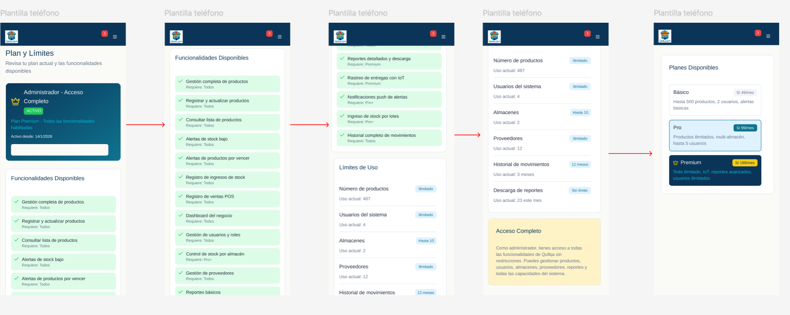
</p>

- <strong>Descripción del flujo:</strong>

**Happy path:**
El usuario accede a la sección "Plan y Límites" desde el menú principal, donde visualiza el estado de su suscripción actual (por ejemplo, "Plan Premium - Todas las funcionalidades habilitadas", con estado ACTIVO y fecha de activación). A continuación, el sistema presenta el listado de "Funcionalidades Disponibles", indicando para cada una el nivel de plan requerido (Todos, Pro+, etc.) y marcándolas como habilitadas según el plan contratado. El usuario desplaza la vista hacia la sección "Límites de Uso", donde el sistema muestra cada recurso (número de productos, usuarios del sistema, almacenes, proveedores, historial de movimientos, descarga de reportes) junto con su límite asignado según el plan (por ejemplo, "Ilimitado" o "Hasta 10") y el uso actual registrado. Finalmente, el sistema despliega un bloque informativo "Acceso Completo" que resume las capacidades habilitadas para el rol de administrador bajo el plan vigente, incluyendo gestión de productos, usuarios, almacenes, proveedores y reportes.

**Unhappy path (restricción según plan):**
Si el usuario intenta utilizar una capacidad que no está incluida en su plan actual (por ejemplo, una funcionalidad marcada como "Requiere: Premium" mientras cuenta con un plan inferior), el sistema valida el acceso a dicha capacidad y la restringe, informando al usuario que la funcionalidad requiere un plan superior. El usuario es dirigido a la pantalla "Planes Disponibles", donde puede comparar las características y precios de los planes Básico (S/49/mes), Pro (S/99/mes) y Premium (S/199/mes), y seleccionar uno superior para habilitar la capacidad solicitada.


16) <strong>User Flow 16:</strong> Consultar y descargar reportes detallados

- User goal:
<br> Como dueño del negocio con plan Premium, quiero consultar y descargar reportes detallados, para analizar el desempeño por día, semana, producto y ventas.

<br><strong>User Story asociada:</strong></br>
US16 - Como dueño del negocio con plan Premium, quiero consultar y descargar reportes detallados, para analizar el desempeño por día, semana, producto y ventas.

- mobile
<p align="center">
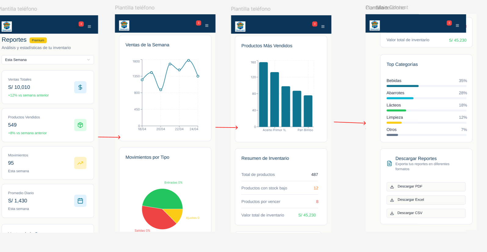
</p>

- <strong>Descripción del flujo:</strong>

**Happy path:**
El usuario, contando con plan Premium habilitado, accede a la sección "Reportes" desde el menú principal y selecciona el período de análisis deseado (por ejemplo, "Esta Semana") mediante el filtro desplegable. El sistema genera y presenta los indicadores generales correspondientes al período seleccionado: Ventas Totales, Productos Vendidos, Movimientos y Promedio Diario, cada uno con su variación porcentual respecto al periodo anterior. Al continuar el recorrido, el sistema muestra el gráfico de "Ventas de la Semana" y el gráfico circular de "Movimientos por Tipo" (Entradas, Salidas, Ajustes). Más adelante, presenta el gráfico de barras "Productos Más Vendidos" junto con el "Resumen de Inventario" (total de productos, productos con stock bajo, productos por vencer y valor total de inventario) y el desglose de "Top Categorías" con su participación porcentual (Bebidas, Abarrotes, Lácteos, Limpieza, Otros). Finalmente, el usuario accede al bloque "Descargar Reportes" y selecciona el formato de exportación deseado —"Descargar PDF", "Descargar Excel" o "Descargar CSV"—, tras lo cual el sistema genera y entrega el reporte correspondiente en el formato seleccionado.

**Unhappy path:**
No se desprende un unhappy path explícito de esta user story ni de las pantallas del flujo, dado que el acceso a la sección de Reportes está condicionado al plan Premium (validado previamente en la gestión de planes), y ambos escenarios descritos —consulta y descarga— corresponden a flujos exitosos del proceso de generación de reportes.


<strong>User Flow 3:</strong> Recibir alertas de productos por vencer

- User goal:
<br> Como dueño de bodega o farmacia, quiero recibir alertas de productos por vencer, para tomar acciones preventivas y reducir pérdidas.

<br><strong>User Story asociada:</strong></br>
US12 - Como dueño de bodega o farmacia, quiero recibir alertas de productos por vencer, para tomar acciones preventivas y reducir pérdidas.

- web
<p align="center">
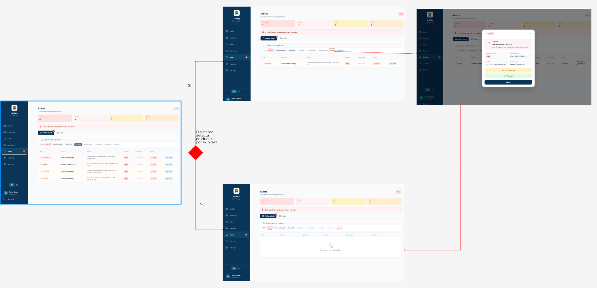
</p>

- <strong>Descripción del flujo:</strong>

**Happy path (SI):**
El usuario accede a la sección Alerts desde el menú lateral, donde visualiza el resumen general de alertas activas (Active alerts, Critical, Stock, Expiry) junto con el banner "X critical alerts require immediate attention". El sistema evalúa la fecha de expiración de los productos registrados y detecta que existen productos dentro del umbral de vencimiento definido. El usuario aplica el filtro "to expire" en la barra de búsqueda, y el sistema presenta el listado de alertas priorizando los productos según la cercanía de su fecha de vencimiento, mostrando tipo de alerta, producto, detalle, severidad, fecha de generación y estado. Al presionar "View" sobre una alerta de tipo "Expired", el sistema despliega el modal de detalle con la información completa de la alerta (producto, fecha de vencimiento, severidad, días desde la expiración), permitiendo al usuario "Acknowledge" o "Resolve" la alerta, o cerrarla mediante "Close".

**Unhappy path (NO):**
Si el sistema evalúa las fechas de expiración de los productos y no detecta ningún producto próximo a vencer, el usuario accede a la sección Alerts y, al aplicar el filtro "Expired", el listado se muestra vacío con el ícono de campana y el mensaje "No alerts match these filters", indicando que no existen alertas de vencimiento activas en ese momento, sin generar errores en la interfaz.

4) <strong>User Flow 4:</strong> Gestionar proveedores

- User goal:
<br> Como dueño del negocio, quiero registrar y consultar proveedores, para mantener organizado el abastecimiento y facilitar la reposición de productos.

<br><strong>User Story asociada:</strong></br>
US17 - Como dueño del negocio, quiero registrar y consultar proveedores, para mantener organizado el abastecimiento y facilitar la reposición de productos.

- web
<p align="center">
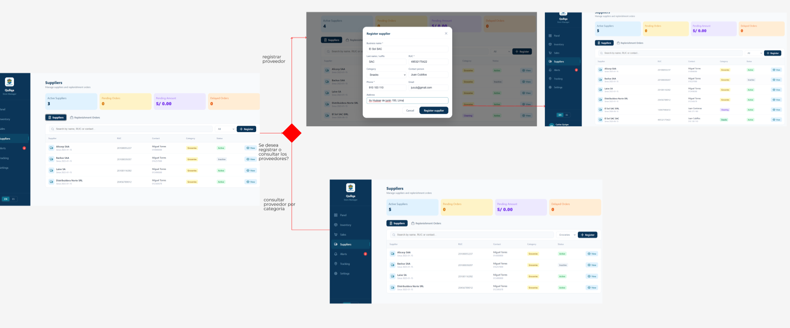
</p>

- <strong>Descripción del flujo:</strong>

**Happy path (registrar proveedor):**
El usuario accede a la sección Suppliers desde el menú lateral, donde visualiza el resumen general (Active Suppliers, Pending Orders, Pending Amount, Delayed Orders) y el listado de proveedores registrados con su RUC, contacto, categoría y estado. El usuario presiona el botón "+ Register" y el sistema despliega el modal "Register supplier", donde ingresa el nombre del negocio (Business name), apellido o sufijo, RUC, categoría, persona de contacto, teléfono, email y dirección. Al presionar "Register supplier", el sistema valida y guarda la información del nuevo proveedor, actualizando el contador de Active Suppliers y agregando el registro al listado general.

**Happy path (consultar proveedor por categoría):**
El usuario accede a la sección Suppliers y utiliza el filtro desplegable de categoría (por ejemplo, "Groceries") ubicado junto a la barra de búsqueda. El sistema presenta el listado filtrado mostrando únicamente los proveedores asociados a dicha categoría, con su información de RUC, contacto, categoría y estado (Active/Inactive), permitiendo al usuario presionar "View" sobre cualquier proveedor para consultar el detalle.

**Unhappy path:**
No se desprende un unhappy path explícito de esta user story ni de las pantallas del flujo, ya que ambos escenarios descritos (registro y consulta) corresponden a flujos exitosos del proceso de gestión de proveedores.

5) <strong>User Flow 5:</strong> Consultar lista de productos y disponibilidad

- User goal:
<br> Como dueño del negocio o vendedor, quiero consultar la lista de productos y su disponibilidad, para conocer el estado actual del inventario.

<br><strong>User Story asociada:</strong></br>
US09 - Como dueño del negocio o vendedor, quiero consultar la lista de productos y su disponibilidad, para conocer el estado actual del inventario.

- web
<p align="center">
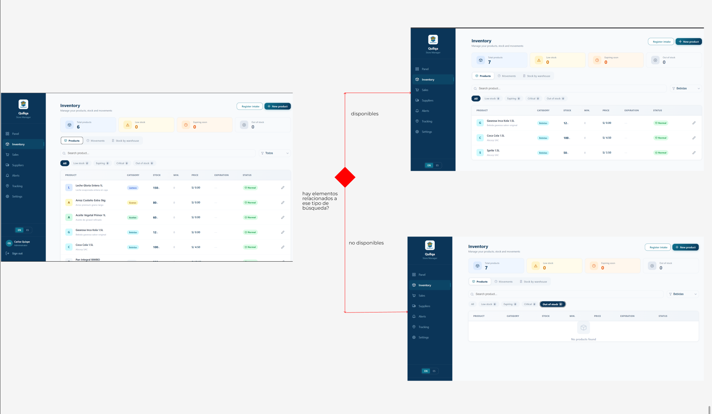
</p>

- <strong>Descripción del flujo:</strong>

**Happy path (productos disponibles):**
El usuario accede a la sección Inventory desde el menú lateral, donde visualiza el resumen general (Total products, Low stock, Expiring soon, Out of stock) junto con el listado de productos registrados, mostrando categoría, stock, mínimo, precio, expiración y estado. El usuario filtra por categoría mediante el selector desplegable (por ejemplo, "Bebidas") y el sistema evalúa si existen elementos relacionados a ese criterio de búsqueda. Al encontrar coincidencias, el sistema presenta el listado filtrado mostrando los productos disponibles de dicha categoría (por ejemplo, Gaseosa Inca Kola 1.5L, Coca Cola 1.5L, Sprite 1.5L) junto con su stock actual y estado "Normal", permitiendo al usuario editar cada producto mediante el ícono correspondiente.

**Unhappy path (sin elementos disponibles):**
Si el usuario aplica un filtro de categoría y adicionalmente selecciona el indicador "Out of stock", el sistema evalúa la búsqueda y determina que no existen productos que cumplan con dicho criterio. En ese caso, el listado se muestra vacío con un ícono de caja y el mensaje "No products found", indicando que no hay productos sin stock disponibles para la categoría seleccionada, sin generar errores en la interfaz.

## 4.5. Web Applications Prototyping

  <div>
    
  </div> <br>

***Enlace del video:*** [Ver grabación aquí](https://upcedupe-my.sharepoint.com/:v:/g/personal/u202414802_upc_edu_pe/IQD-6yWqUeH0Q6vF38H0ZKtyAWr8-l5OcorW5kveBpszCzE?nav=eyJyZWZlcnJhbEluZm8iOnsicmVmZXJyYWxBcHAiOiJPbmVEcml2ZUZvckJ1c2luZXNzIiwicmVmZXJyYWxBcHBQbGF0Zm9ybSI6IldlYiIsInJlZmVycmFsTW9kZSI6InZpZXciLCJyZWZlcnJhbFZpZXciOiJNeUZpbGVzTGlua0NvcHkifX0&e=J1HICp)

  <div>
    
  </div> <br>

***Enlace del video:*** [Ver grabación aquí](https://upcedupe-my.sharepoint.com/:v:/g/personal/u202414802_upc_edu_pe/IQBRYjvsldiZRrHfLLrnWJFYAVI452UMLxj62G48YWe1Y5k?nav=eyJyZWZlcnJhbEluZm8iOnsicmVmZXJyYWxBcHAiOiJPbmVEcml2ZUZvckJ1c2luZXNzIiwicmVmZXJyYWxBcHBQbGF0Zm9ybSI6IldlYiIsInJlZmVycmFsTW9kZSI6InZpZXciLCJyZWZlcnJhbFZpZXciOiJNeUZpbGVzTGlua0NvcHkifX0&e=hTV8ws)


## 4.6. Domain-Driven Software Architecture

### 4.6.1. Design-Level Event Storming

En esta sección se presenta el Design-Level EventStorming de Qullqa, realizado con el fin de detallar y refinar el modelado del dominio identificado previamente. Durante la sesión, el equipo organizó eventos de dominio, comandos, políticas, agregados y bounded contexts relacionados con los principales procesos del sistema, como la gestión de inventario, ventas, alertas, almacenes, proveedores, reportes y suscripciones. Este análisis permitió comprender mejor las responsabilidades de cada contexto y sus relaciones, sirviendo como base para el diseño de la arquitectura del software.

**Design Level Event Storming - Qullqa**

  <div>
    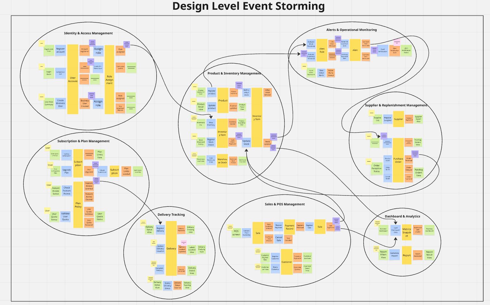
  </div> <br>

**Bounded Contexts**

Identity & Access Management <br>

 <div>
    
  </div> 

<br>
Subscription & Plan Management <br>

 <div>
    
  </div> 

<br>
Delivery Tracking <br>

 <div>
    
  </div> 

<br>
Product & Inventory Management <br>

 <div>
    
  </div> 

<br>
Sales & POS Management <br>

 <div>
    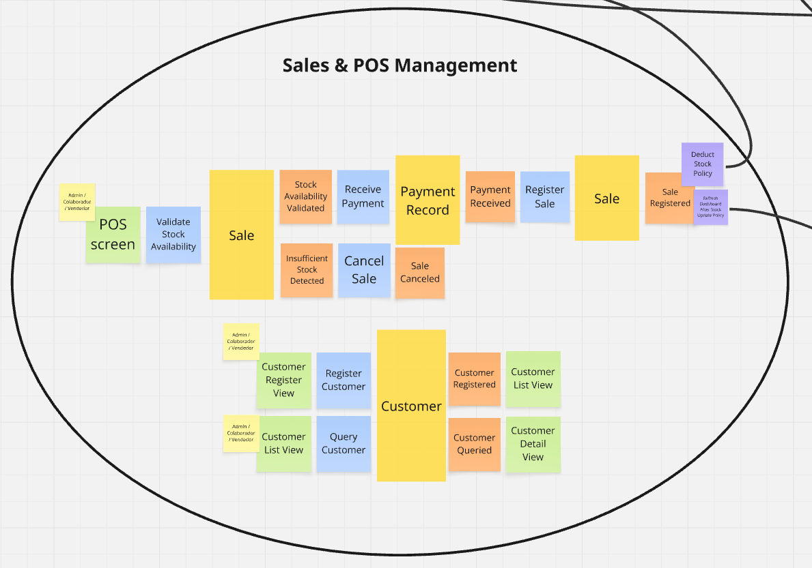
  </div> 

<br>
Alerts & Operational Monitoring <br>

 <div>
    
  </div> 

<br>
Supplier & Replenishment Management <br>

 <div>
    
  </div> 

<br>
Dashboard & Analytics <br>

 <div>
    
  </div> 

### 4.6.2. Software Architecture Context Diagram

*Diagrama de contexto*


### 4.6.3. Software Architecture Container Diagrams

*Diagrama de contenedores*


### 4.6.4. Software Architecture Components Diagrams

#### Diagrama de componentes

###### Diagrama de componentes de Access Management
<p align = "center">


###### Diagrama de componentes de Billing
<p align = "center">


###### Diagrama de componentes de Inventory Management
<p align = "center">


###### Diagrama de componentes de notifications
<p align = "center">


###### Diagrama de componentes de tracking
<p align = "center">


###### Diagrama de componentes de sales
<p align = "center">


## 4.7. Software Object-Oriented Design

### 4.7.1. Class Diagrams

**Bounded Contexts**

- Shared <br><br>
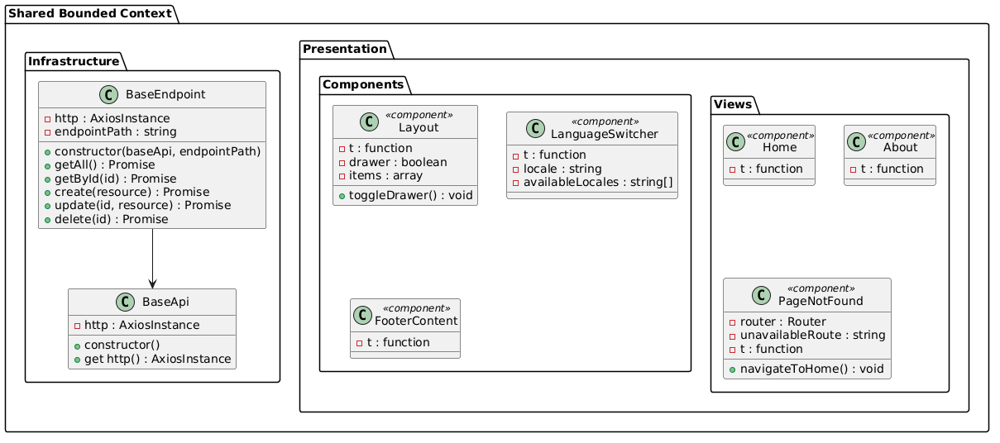 <br>

- Identity & Access Management <br><br>
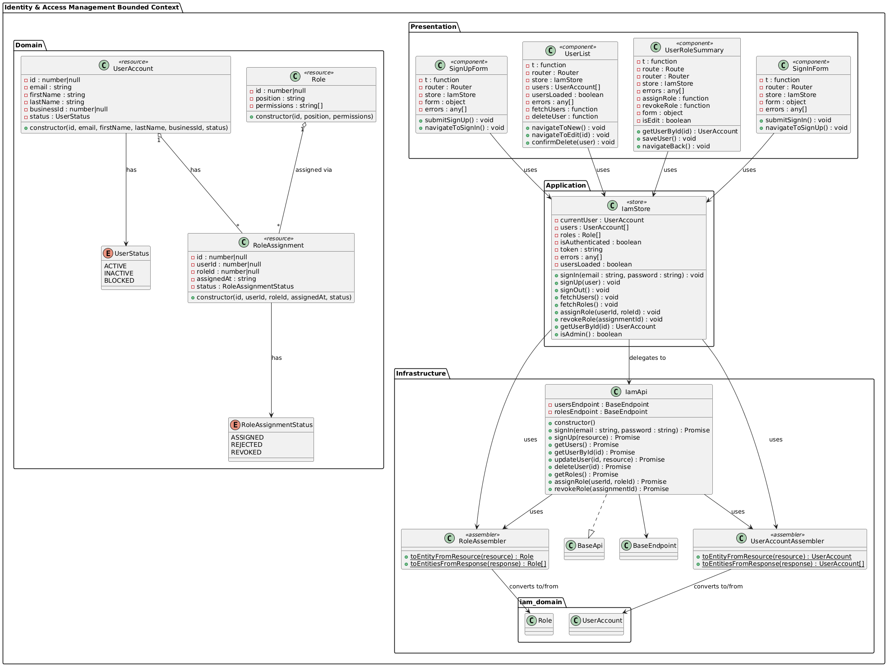 <br>

- Subscription & Plan Management <br><br>
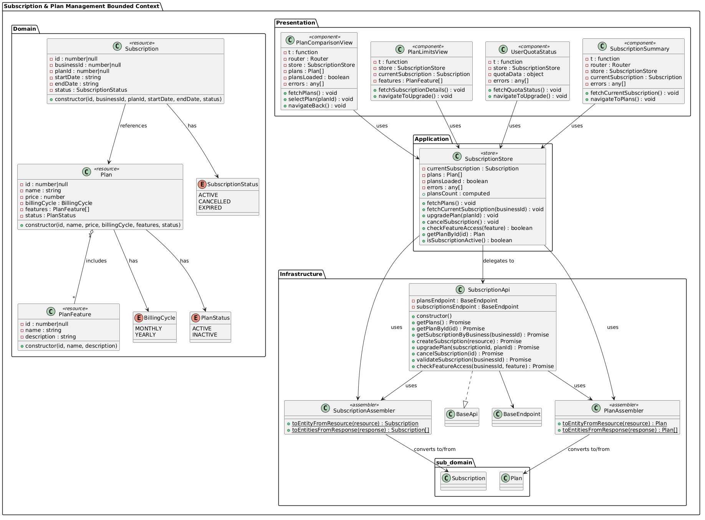 <br>

- Product & Inventory Management <br><br>
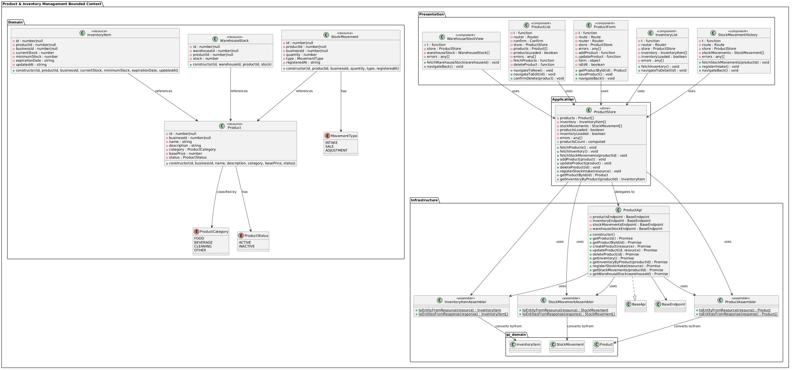 <br>

- Sales & POS Management <br><br>
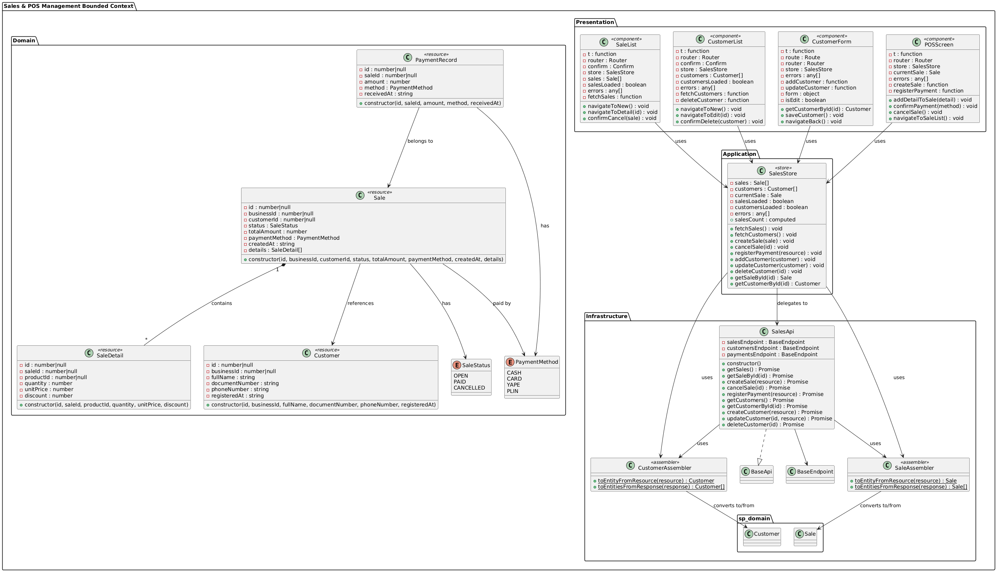 <br>

- Alerts & Operational Monitoring <br><br>
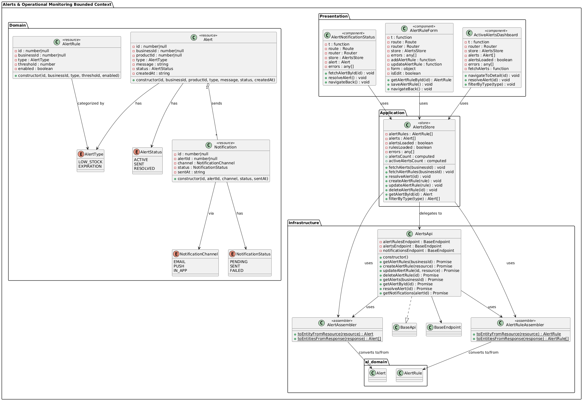 <br>

- Supplier & Replenishment Management <br><br>
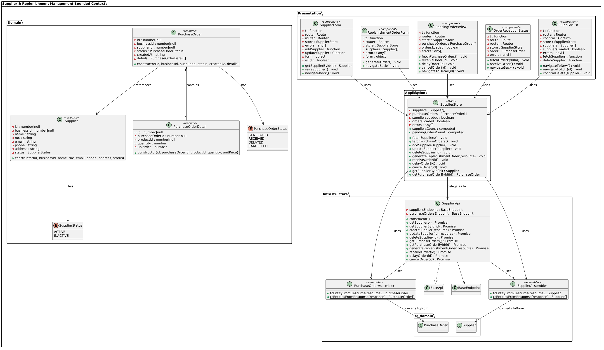 <br>

- Dashboard & Analytics <br><br>
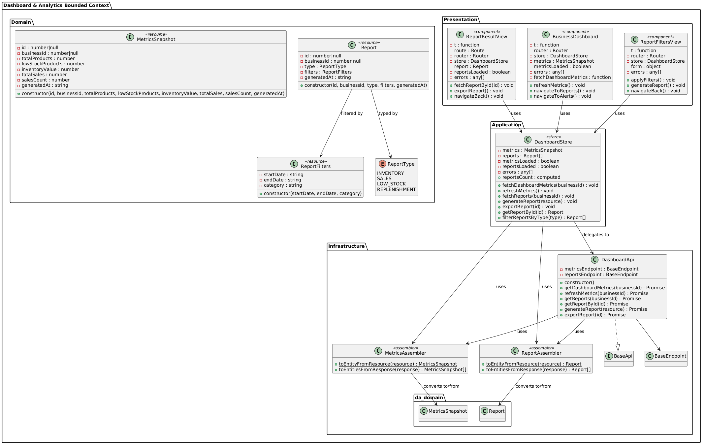 <br>

- Delivery Tracking <br><br>
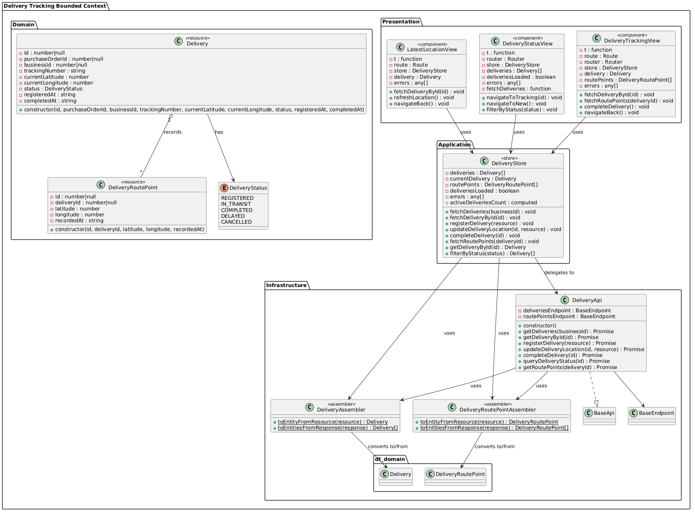 <br>

## 4.8. Database Design
<p align="justify">
  Para el proyecto, la elaboración del diagrama de base de datos resulta fundamental, ya que permite estructurar de manera clara y organizada todas las entidades, atributos y relaciones del sistema. Esto facilita la comprensión del funcionamiento de la plataforma, asegura una correcta gestión de la información y ayuda a prevenir errores en el desarrollo. Además, el diagrama sirve como guía durante la implementación, optimiza el diseño del sistema y contribuye a que la solución sea escalable y mantenible a lo largo del tiempo. Además, se decidió usar MySQL como motor de base de datos.
</p>

### 4.8.1. Database Diagrams
<p align="center">
  
  <br/><i>Qullqa Database Diagram</i>
</p>

# Capítulo V: Product Implementation, Validation & Deployment

## 5.1. Software Configuration Management

### 5.1.1. Software Development Environment Configuration

A continuación se detallarán los productos de software que se han utilizado para el proyecto de acuerdo a las diferentes actividades realizadas.

**Project Management**

**WhatsApp:** Es una aplicación de mensajería instantánea que permite la comunicación asíncrona y coordinación rápida de tareas operativas entre los miembros del equipo. </br>
Referencia: https://web.whatsapp.com/

**Google Meet:** Es una plataforma de videoconferencias que permite realizar reuniones virtuales con audio, video y compartir pantalla. Se hizo uso de esta plataforma para la realización de ceremonias Scrum, reuniones de sincronización técnica y compartición de pantalla en tiempo real. </br>
Referencia: https://meet.google.com/

**Discord:** Es una plataforma de comunicación en línea que permite realizar llamadas, videollamadas y chats por canales. Lo utilizamos para reuniones rápidas entre los miembros disponibles del equipo y para resolver dudas de forma rápida. </br>
Referencia: https://discord.com/

---

**Product UX/UI Design**

**UXPressia:** Es una plataforma en línea especializada en el mapeo de la experiencia del usuario y diseño de servicios. Se usó para elaborar las user personas, user journey mapping, empathy mapping e impact mapping del proyecto. </br>
Referencia: https://uxpressia.com/

**Miro:** Es una pizarra colaborativa digital que permite crear diagramas y esquemas de forma visual y en tiempo real. Se usó para desarrollar sesiones de Event Storming para identificar procesos de negocio y definir Bounded Contexts. </br>
Referencia: https://miro.com/

**Figma:** Es un editor de gráficos vectoriales y herramienta de prototipado de interfaces basada principalmente en la web. Lo utilizamos para elaborar los wireframes, mockups y prototipos del proyecto. </br>
Referencia: https://www.figma.com/

**Jira:** Es un software de gestión de proyectos diseñado para equipos ágiles que utilizan Scrum o Kanban. Se usó para gestionar el Product Backlog, priorizar requerimientos y documentar las User Stories con sus criterios de aceptación. </br>
Referencia: https://www.atlassian.com/es/software/jira

---

**Software Development**

**Visual Studio Code:** Es un editor de código fuente ligero, altamente extensible y compatible con múltiples lenguajes de programación. Se usó para realizar ediciones rápidas, refactorización de scripts y desarrollo de componentes frontend específicos. </br>
Descargar: https://code.visualstudio.com/

---

**Software Deployment**

**GitHub:** Es una plataforma de desarrollo colaborativo que utiliza el sistema de control de versiones Git y servicios de hosting. Se usó para alojar el código fuente del proyecto y gestionar el despliegue continuo de la Landing Page. </br>
Referencia: https://github.com/

---

**Software Documentation**

**GitHub:** Es una plataforma de control de versiones y colaboración en línea. Se usó para redactar, organizar y dar seguimiento al informe completo del proyecto. </br>
Referencia: https://github.com/

**Structurizr:** Es una herramienta para modelado de arquitectura de software mediante el enfoque C4. Lo utilizamos para construir los diagramas de arquitectura C4 del proyecto. </br>
Referencia: https://structurizr.com/

**Vertabelo:** Es una herramienta en línea para el diseño y modelado visual de bases de datos relacionales, que permite crear, compartir y exportar diagramas de forma colaborativa. Se usó para elaborar el diagrama de la base de datos del proyecto. </br>
Referencia: https://vertabelo.com/

---

### 5.1.2. Source Code Management

Para la gestión del código fuente y el control de versiones, el equipo utiliza **GitHub** como plataforma principal. Esta herramienta permite la colaboración distribuida y asegura la integridad de los artefactos digitales del proyecto.

**Repositorios del Proyecto:** </br>
Landing Page: https://github.com/Flowbit-app/Qullqa-LandingPage

**Estrategia de Flujo de Trabajo (GitFlow):** </br>
El equipo adoptará formalmente el modelo **GitFlow** para mantener un ciclo de vida profesional. Se utilizarán dos ramas principales de larga duración:
* **`main`:** Almacena exclusivamente versiones estables y probadas del software (versiones listas para producción).
* **`develop`:** Funciona como la rama de integración principal donde se consolidan las funcionalidades antes de un lanzamiento.

Para el desarrollo dinámico, se aplicarán las siguientes convenciones de ramificación:
* **Feature branches:** Utilizadas para desarrollar nuevas funcionalidades. Ejemplo: `feature/landing-page-services`.
* **Release branches:** Ramas temporales creadas desde `develop` para preparar el despliegue de una nueva versión (`v1.0.0`, `v1.1.0`, etc.).
* **Hotfix branches:** Ramas de emergencia creadas desde `main` para corregir errores críticos en producción que no pueden esperar al siguiente ciclo de desarrollo.

**Convención de Mensajes de Commit:** </br>
Se implementa el estándar de **Conventional Commits** con el formato obligatorio: `<type>(<scope>): <description>`.
* `feat`: Para la implementación de nuevas características.
* `fix`: Para la corrección de errores de código.
* `docs`: Para cambios exclusivos en la documentación.
* `style`: Para cambios que no afectan la lógica del código (formato, CSS, espacios).
* `refactor`: Para cambios en el código que no corrigen errores ni añaden funciones.

**Versionamiento Semántico (Semantic Versioning):** </br>
El equipo utiliza el formato `vMAJOR.MINOR.PATCH` para identificar las versiones del producto:
* `MAJOR`: Incrementado en cambios que rompen la compatibilidad (ej. `v2.0.0`).
* `MINOR`: Incrementado al añadir funcionalidades compatibles (ej. `v1.1.0`).
* `PATCH`: Incrementado al realizar correcciones de errores menores (ej. `v1.0.1`).

---

### 5.1.3. Source Code Style Guide & Conventions

**1. HTML**
* **Lower-case Element Names:** Los nombres de etiquetas deben estar en minúsculas para mantener la consistencia con los estándares de la W3C. Ejemplo: `<div>` en lugar de `<DIV>`.
* **Close All Elements:** Todo elemento HTML debe cerrarse correctamente para evitar errores de renderizado. Ejemplo: `<p>Update stock.</p>`.
* **Lowercase Attribute Names:** Atributos como `class`, `id`, `src` y `href` deben escribirse en minúsculas. Ejemplo: ``.
* **Alt, Width, and Height for Images:** Es obligatorio especificar el atributo `alt` por accesibilidad y las dimensiones para optimizar el Cumulative Layout Shift (CLS).
* **Spaces and Equal Signs:** Se evita el uso de espacios alrededor del signo igual en los atributos. Ejemplo: `type="text"` en lugar de `type = "text"`.

**2. CSS**
* **Naming Style (Kebab-case):** Se utilizarán nombres significativos y descriptivos usando el formato kebab-case. Ejemplo: `#inventory-dashboard`, `.product-card-title`.
* **Shorthand Properties:** Se prioriza el uso de propiedades abreviadas para reducir el peso del archivo. Ejemplo: `padding: 10px 5px;`.
* **0 and Units:** Se omite la unidad de medida cuando el valor es `0`. Ejemplo: `margin: 0;`.
* **Declaration Order:** Las propiedades se ordenan alfabéticamente para facilitar la edición y mantenimiento por múltiples desarrolladores.

**3. JavaScript**
* **Variable and Function Naming:** Se aplica el formato `lowerCamelCase`. Los nombres deben ser verbos para funciones y sustantivos para variables. Ejemplo: `let productPrice = 25.50;`, `function updateInventoryStock() { ... }`.
* **Declaration (ES6+):** Se prohíbe el uso de `var`. Solo se permite `const` para valores inmutables y `let` para variables con ámbito de bloque.
* **Expanded Syntax:** Las llaves de apertura se colocan en la misma línea que la declaración, y las de cierre en una línea nueva.

**4. C#**
* **PascalCase:** Utilizado obligatoriamente para nombres de clases, namespaces y métodos. Ejemplo: `public class InventoryManager { public void SaveProduct() { ... } }`.
* **camelCase:** Utilizado para parámetros de métodos y variables locales. Ejemplo: `int currentStockCount = 50;`.
* **Single Responsibility Principle:** Cada clase o método debe realizar una única tarea bien definida dentro de la lógica de Qullqa.
* **Comments & Documentation:** Uso de comentarios XML (`///`) para documentar el propósito de métodos complejos y clases.

**5. Gherkin**
* **Given-When-Then Structure:** Se sigue estrictamente esta estructura para definir el comportamiento del sistema desde la perspectiva del usuario.
* **Business-Readable Language:** Los escenarios deben redactarse en un lenguaje comprensible para el usuario final, evitando tecnicismos.
* **Scenario Outline:** Se utiliza para pruebas masivas con diferentes juegos de datos.

```gherkin
Scenario Outline: Product stock alert
  Given the store owner is in the inventory dashboard
  When the stock of "<product>" falls below <threshold>
  Then the system should display a "Low Stock" alert
  Examples:
    | product | threshold |
    | Rice    | 10        |
    | Milk    | 5         |
```
### 5.1.4. Software Deployment Configuration

#### Descripción General del Despliegue

La solución de flowbit está compuesta por tres productos digitales principales:
1) ##### Landing Page corporativa con propuesta de valor explayada
2) ##### Frontend Web
3) ##### Backend REST API y microservicios desplegados como software ERP

Cada componente es desplegado de manera independiente utilizando servicios cloud que permiten escalabilidad, integración continua y acceso remoto seguro para los usuarios. El flujo de despliegue se basa en repositorios GitHub utilizando las buenas prácticas como el modelo de ramificación de Gitflow para el correcto desarrollo de la la aplicación y el uso de plataformas de publicación automática como Vercel y Azure App Service, permitiendo automatizar la integración y entrega continua (CI/CD).

###### Explicación de la Landing Page:

La landing page tiene como objetivo principal comunicar de forma eficiente la propuesta de valor que ofrece nuestro producto. Para nuestro caso, se buscó un diseño simplista para comunicar confianza y seriedad para nuestro enfoque **ERP**. 

Se desarrolló utilizando el framework **Vite** con el *IDE webstorm*, para luego compaginarlo con el uso de lenguaje de programación *javascript* para programar las funcionalidades. De momento, para el desarrollo se mantiene segementados cada site en la barra de navegación.

Para ello, realizamos los siguientes pasos mencionados a continuación:

- Se programó utilizando Webstorm con el framework Vite y se consideró la pertinente aplicación de UX design. 

- Se tuvo consideración en primero subir el código en github con su respectivo repositorio, llamado *qullqa-landing-page*.

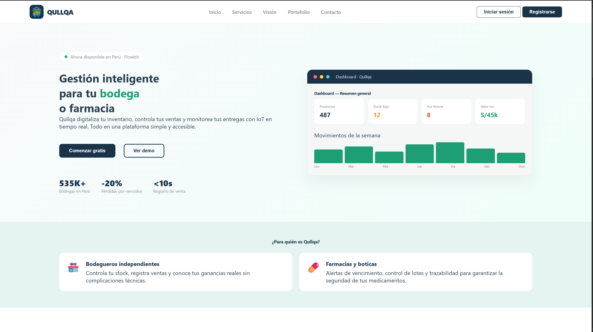

- Importar el repositorio subido al github a vercel y realizar su respectivo deployment.

- Publicar la aplicación dentro del entorno de vercel y probar la URL generada en el navegador.

*URL generada y validada*: https://qullqa-landing-page.vercel.app/

###### Explicación del despliegue la aplicación Frontend

Para este caso, aplicamos el mismo formato de producción continua, donde todo el team se encarga de desarollar el código para luego ser subido al github. 

La aplicación proporciona las siguientes funcionalidades **core**: 

- Autentiticación de usuarios para roles de trabajo
- Visualización de inventario a tiempo real
- Gestión de stock en entrada y salida
- Gestión de stock brindada por proveedores
- Apartado dedicado pedidos en línea/deliverys. 

Para la conexión correcta de recuperación de datos para nuestras funcionalidades, utilizamos el criterio de Mock-API, que será desplegado a una máquina virtual en el servicio Azure. 

*Evidencia de la VM desplegada en Azure*


Para esto, se realizaron los siguientes pasos:

- Subir el proyecto frontend al repositorio GitHub.
- Conectar el repositorio con Vercel.
- Configurar variables de entorno de producción.
- Definir el comando de construcción.
- Ejecutar el despliegue automático.
- Validar la conexión entre frontend y backend

*URL de la API deployada*: https://flowbit-api.azurewebsites.net

Consideraciones para el deployment de la máquina virtual: 

- Subir el backend al repositorio GitHub.
- Crear un Azure App Service.
- Configurar runtime de Node.js.
- Configurar variables de entorno y credenciales.
- Conectar el repositorio GitHub con Azure.
- Activar despliegue automático.
- Publicar la API.
- Validar endpoints mediante pruebas HTTP.

###### Explicación del flujo general para el desarrollo del team

El team, bajo la metodología de trabajo SCRUM, se consideró el modelo de ramificación gitflow para el sistema de controld e versiones **git**. 

Para esta entrega, se considera ya el deployment completo de máquina virtual con el MOCK API utilizando azure, así como también el uso de vercel como tecnologías relevantes. Para la programación, el uso de webstorm fue fundamental para el correcto desarrollo.

<div align = "center">

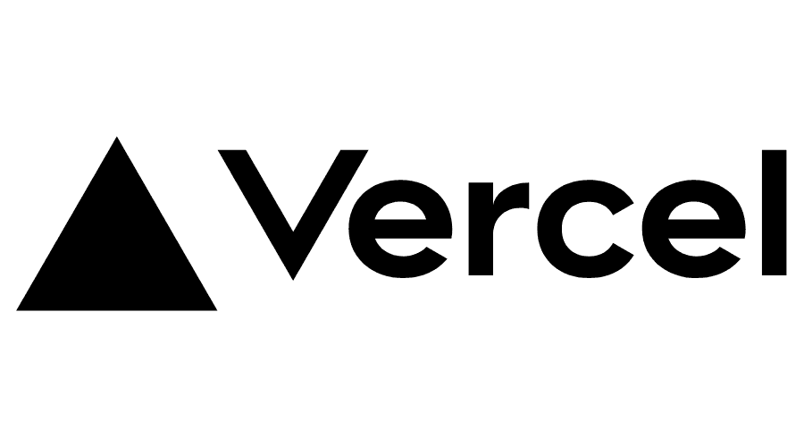

</div>

## 5.2. Landing Page, Services & Applications Implementation

En este apartado se documenta la ejecución técnica de QULLQA, abarcando desde la construcción de la Landing Page informativa hasta el despliegue de los microservicios y la aplicación web para bodegas y farmacias. Siguiendo el orden de prioridad de nuestro Product Backlog, el desarrollo se ha ejecutado en iteraciones ágiles, asegurando que funcionalidades como la autenticación de usuarios sean implementadas bajo estándares de diseño adaptable (Responsive Web Design) y desplegadas en la nube de forma progresiva.

### 5.2.1. Sprint 1

Este primer ciclo de desarrollo se centró en establecer los pilares operativos de QULLQA, integrando el esfuerzo colaborativo para entregar un producto funcional inicial. Durante este Sprint, el equipo priorizó la captación de usuarios mediante la Landing Page, documentando cada fase desde la planificación hasta el despliegue final para validar la funcionalidad base del sistema.

#### 5.2.1.1. Sprint Planning 1

El Sprint Planning Meeting marcó el inicio formal del desarrollo del código de QULLCA. Durante esta sesión, el equipo de desarrollo junto al Product Owner seleccionaron las Historias de Usuario más prioritarias del Product Backlog para definir el objetivo central de la iteración. A continuación, se presenta el cuadro resumen con los detalles y acuerdos de esta reunión:

| **Sprint #** | Sprint 1 |
| :--- | :--- |
| **Sprint Planning Background** | |
| **Date** | 2026-04-18 |
| **Time** | 9:00 AM |
| **Location** | Cubiculo - Pabellon L |
| **Prepared By** | Arturo Valentino Contreras Torres  |
| **Attendees (to planning meeting)** | Asmat Alminco, Martin Alejandro / Contreras Torres, Arturo Valentino / Güere Calero, Fernando Julio / Huaman Oscco, Aldo Jesus / Ramos Fuentes Rivera, Adriana Nicole |
| **Sprint n – 1 Review Summary** | Al ser el primer Sprint de desarrollo, la revisión anterior corresponde a la fase de ideación. Resultados alcanzados: arquitectura C4 finalizada, modelado de base de datos diseñada y repositorios GitHub configurados para el uso de gitflow. El Product Owner brindó el feedback necesario para iniciar la codificación orientada al dominio y siguiendo como base las User Storys. |
| **Sprint n – 1 Retrospective Summary** | Como retrospectiva inicial de la forma de trabajo, el equipo identificó como acierto el uso de diagramas compartidos, el uso de herramientas colaborativos como GitHub y Jira, pero reconoció como oportunidad de mejora establecer reglas más estrictas de GitFlow para evitar colisiones en los Pull Requests futuros. |
| **Sprint Goal & User Stories** | |
| **Sprint n Goal** | **Contexto:** El equipo de producto de QULLQA ha decidido priorizar el establecimiento de la identidad digital de la plataforma y la seguridad de acceso para los primeros usuarios. El esfuerzo se centra en comunicar de manera efectiva la propuesta de valor diferenciada para dueños de bodegas independientes (enfocada en control de stock) y farmacias (enfocada en vencimientos). Asimismo, se implementará el sistema base de gestión de identidad para permitir que los usuarios reales comiencen a interactuar con el módulo de inventario, transformando el diseño de arquitectura y mock-ups previos en un entorno funcional y seguro. <br><br> **Sprint Goal:**<br>*“Our focus is on establishing a trustworthy digital presence and a secure entry point for our initial business owners. We believe it delivers clarity on the product’s value proposition to prospective customers and a reliable onboarding experience to independent store and pharmacy owners.This will be confirmed when visitors can identify specific benefits for their business segment on the Landing Page, and administrators (like Carlos and Carmen) can successfully register, log in, and perform the initial registration of their product catalog without errors.” |
| **Sprint n Velocity** | 25 Story Points. (Velocidad estimada basada en la capacidad inicial del equipo para configurar los entornos y desarrollar los módulos de autenticación básicos). |
| **Sum of Story Points** | 12 Story Points. |

#### 5.2.1.2. Aspect Leaders and Collaborators

* En esta sección se presenta la **Leadership-and-Collaboration Matrix (LACX)**. Esta matriz detalla los líderes (L) y colaboradores (C) para cada aspecto clave del Sprint, asegurando una comunicación clara y una distribución de responsabilidades eficiente para el proyecto **QULLQA**.

La organización de líderes y colaboradores está directamente relacionada con la selección de tareas (tasks) que se desarrollarán durante el Sprint.

| Team Member | GitHub Username | Arquitectura & DDD (L/C) | Desarrollo Backend & API (L/C) | Simulacion IoT & Hardware (L/C) | Frontend & UI/UX (L/C) | QA & Testing (L/C) |
| :--- | :--- | :---: | :---: | :---: | :---: | :---: |
| Asmat Alminco, Martin Alejandro | Alemarr2 | C | C | C | C | L |
| Contreras Torres, Arturo Valentino | Arturouu  | L | C | C | C | C |
| Güere Calero, Fernando Julio | FerG17 | C | C | L | C | C |
| Huaman Oscco, Aldo Jesus | Jesusho22 | C | C | C | L | C |
| Ramos Fuentes Rivera, Adriana Nicole | Adriana832 | C | L | C | C | C |
---

> **Leyenda:**  </br>
> **L:** Lider (Líder del aspecto)  
> **C:** Colaborador (Colaborador y desarrollo)

#### 5.2.1.3. Sprint Backlog 1

**Periodo:** 6 de abril – 4 de mayo  
**Objetivo del Sprint:** Tener la landing funcional con usuarios reales accediendo y mostrando interes, estableciendo la base visual y funcional de QULLQA.

---

| **User Story Id** | **Título de la Historia** | **Task Id** | **Título de la Tarea** | **Descripción de la Tarea** | **Est. (Hrs)** | **Asignado** | **Status** |
| :--- | :--- | :--- | :--- | :--- | :---: | :--- | :---: |
| **QULLQA-13** | Registrarse e iniciar sesión | T-13-1 | Diseño de formularios | Crear la interfaz visual para el registro de nuevos dueños y el acceso seguro. | 6 | Güere Calero, Fernando Julio | Done |
| | | T-13-2 | Lógica de autenticación | Programar la validación de credenciales y creación de cuentas en la base de datos. | 8 | Huaman Oscco, Aldo Jesus | Done |
| | | T-13-3 | Pruebas de acceso | Verificar que el usuario pueda entrar y salir de su sesión correctamente. | 3 | Ramos Fuentes Rivera, Adriana Nicole | Done |
| **QULLQA-15** | Registrar producto | T-15-1 | Formulario de datos | Implementar el formulario para ingresar nombre, precio, stock y categoría del producto. | 6 | Contreras Torres, Arturo Valentino | Done |
| | | T-15-2 | Guardado en inventario | Configurar el envío de datos para que el producto aparezca en la lista oficial. | 5 | Asmat Alminco, Martin Alejandro | Done |
| **QULLQA-16** | Actualizar producto y precio | T-16-1 | Función de edición | Habilitar el botón de editar para cargar los datos actuales en el formulario. | 4 | Güere Calero, Fernando Julio | Done |
| | | T-16-2 | Actualización de costos | Programar el cambio de precios en tiempo real para reflejar datos actuales. | 4 | Huaman Oscco, Aldo Jesus | Done |
| **QULLQA-17** | Consultar lista de productos y disponibilidad | T-17-1 | Vista de tabla principal | Crear la pantalla donde se listan todos los productos registrados. | 7 | Ramos Fuentes Rivera, Adriana Nicole | Done |
| | | T-17-2 | Buscador de stock | Implementar una barra de búsqueda para filtrar productos por nombre o código. | 4 | Contreras Torres, Arturo Valentino | Done |
| **QULLQA-09** | Conocer la propuesta de valor para bodegueros | T-09-1 | Redacción de beneficios | Escribir los textos que explican cómo Qullqa ayuda específicamente a las bodegas. | 3 | Asmat Alminco, Martin Alejandro | Done |
| | | T-09-2 | Diseño sección Bodegas | Crear el bloque visual en la landing page enfocado en el segmento bodeguero. | 5 | Güere Calero, Fernando Julio | Done |
| **QULLQA-10** | Conocer la propuesta de valor para farmacias | T-10-1 | Contenido especializado | Redactar la sección sobre control de vencimientos y reposición de medicamentos. | 3 | Huaman Oscco, Aldo Jesus | Done |
| | | T-10-2 | Diseño sección Farmacias | Implementar los elementos gráficos que representen el valor para el sector farmacéutico. | 5 | Ramos Fuentes Rivera, Adriana Nicole | Done |
| **QULLQA-12** | Redirigirse desde la Landing Page hacia la aplicación | T-12-1 | Configuración de botones | Crear y enlazar los botones de "Empezar" o "Login" en la página principal. | 2 | Contreras Torres, Arturo Valentino | Done |
| | | T-12-2 | Flujo de navegación | Asegurar que al hacer clic, el usuario llegue a la pantalla correcta de la app. | 2 | Asmat Alminco, Martin Alejandro | Done |
| **TOTAL** | | | | **Esfuerzo total estimado para el Sprint** | **67** | | |

---

<p align="center">
  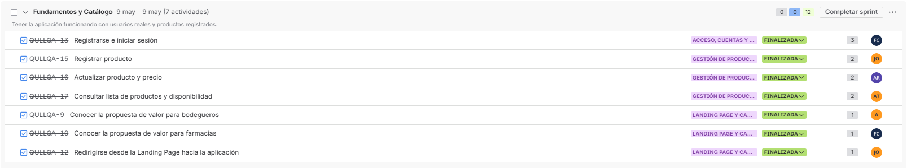
  <br/><i>Artefacto: Jira para Sprint Priorizado</i>
</p>
<p align="center">
  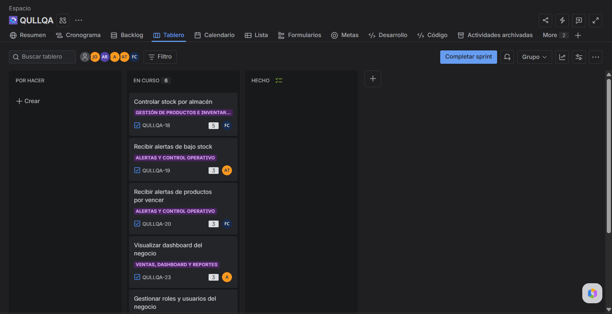
  <br/><i>Artefacto: Jira para demostrar el tablero Kanban - Proceso</i>
</p>
<p align="center">
  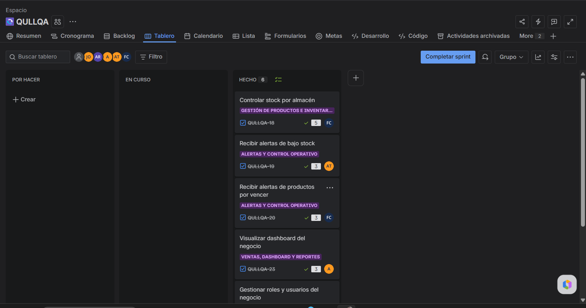
  <br/><i>Artefacto: Jira para demostrar el tablero Kanban - Finalizado</i>
</p>

##### Resumen Técnico
- **Total de Horas:** 67 horas.
- **Distribución:** 2 semanas de desarrollo (considerando jornada laboral estándar).
- **Entregable Principal:** Aplicación base con Landing Page informativa y módulo funcional de inventario (CRUD de productos).

---

#### 5.2.1.4. Development Evidence for Sprint Review
En esta sección se explica y presenta los avances en implementación con relación a los productos de la solución según el alcance del Sprint: Landing
Page.

Primero, se mostrarán los commits más importantes para el Reporte, los cuales muestran el ciclo de vida del proyecto, y toda la información que se usó,
usa y usará para el desarrollo del proyecto:
 
 | **Repository** | **Branch** | **Commit Id** | **Commit Message** | **Commit Message Body** | **Committed on (Date)** |
  | :--- | :--- | :--- | :--- | :--- | :---: |
  | Arturouu | main | 20e25b9 | initial commit | Create repository | 07/04/2026 |
  | Arturouu | chapter-04 | 20e25b9 | docs(chapter-03): add user stories | Added content in all sections of chapter-04 |25/04/2026 |
  | Arturouu | chapter-05 | 85d1161 | docs(chapter-05): add chapter 05 index | Added content in all sections of chapter-05 | 25/04/2026 |

<br/>
A continuación se presentan los commits más importantes para la Landing Page, los cuales muestran todo el contenido visual y funcionalidades
implementadas en el Sprint 1:


| **Repository** | **Branch** | **Commit Id** | **Commit Message** | **Commit Message Body** | **Committed on (Date)** |
  | :--- | :--- | :--- | :--- | :--- | :---: |
  | Arturouu | main | 6f68daa | Initial commit | Create repository | 25/04/2026 |
  | Arturouu | main | 5491a21 | feature(landingPage): update Landing Page - Qullqa | Added files for landing page, like footers, headers, all information about the start-up, subscriptions, forms and other content | 25/04/2026 |
  | Arturouu | main | d68b19c | fix: rename qullqa.html as index.html | Fixed files for landing page | 06/05/2026 |
  <br/>


#### 5.2.1.5. Execution Evidence for Sprint Review
En el sprint 1, hemos logrado implementar todas las secciones de nuestra Landing Page, aunque con algunos desperfectos en cuanto a diseño. A continuación, se explorarán nuestros avances a través de imágenes que muestran el resultado obtenido.
<br/>

1.  Sección header: Aquí mostramos la barra de navegación de nuestro sitio
web.

<br/>
<p align="center">
  
  <br/><i>Sección Header de la Landing page</i>
</p>
<br/>

2. Sección de muestra sobre el monitoreo: Demostramos de manera simple la función de la aplicación incluyendo una demostración del dashboard.

<br/>
<p align="center">
  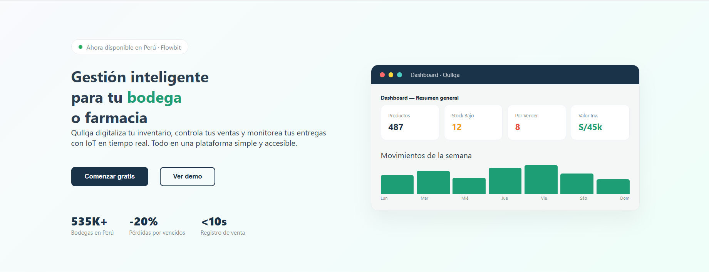
  <br/><i>Sección de muestra sobre el monitoreo en la Landing page</i>
</p>
<br/>

3. Sección sobre el público objetivo: Se muestra el contenido sobre nuestros dos segmentos objetivos.

<br/>
<p align="center">
  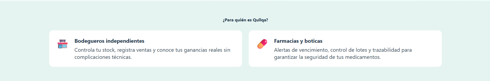
  <br/><i>Sección sobre el público objetivo</i>
</p>
<br/>

4. Sección servicios: Se informa sobre los servicios ofrecidos por el producto.

<br/>
<p align="center">
  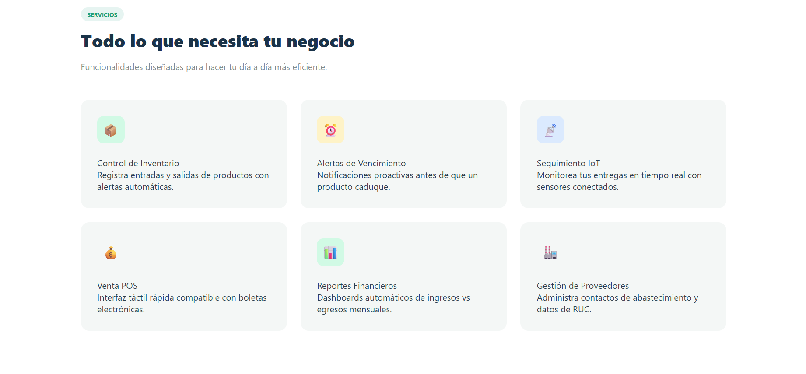
  <br/><i>Sección servicios</i>
</p>
<br/>

5. Sección visión: Se muestra información sobre la visión y misión de la start-up.

<br/>
<p align="center">
  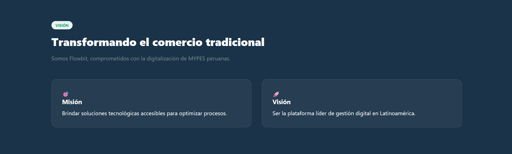
  <br/><i>Sección visión</i>
</p>
<br/>

6. Sección portafolio: Se muestra una recopilación de nuestro trabajo.

<br/>
<p align="center">
  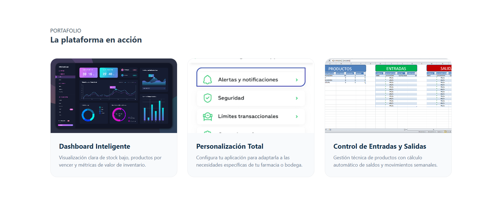
  <br/><i>Sección portafolio</i>
</p>
<br/>

7. Sección planes: Se muestra la información de los planes que ofrecemos para los usuarios.

<br/>
<p align="center">
  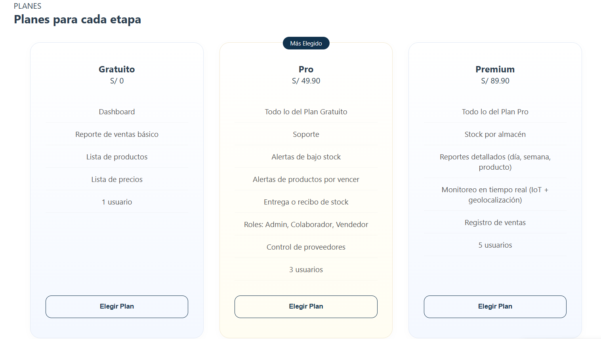
  <br/><i>Sección planes</i>
</p>
<br/>

8. Sección formulario de contacto: Se muestra un formulario con la finalidad de poder contactarse con la startup.

<br/>
<p align="center">
  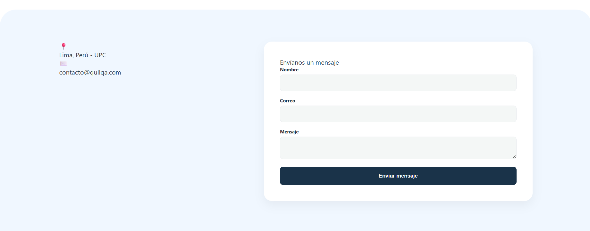
  <br/><i>Sección formulario</i>
</p>
<br/>

9. Sección footer: Parte final del sitio web.

<br/>
<p align="center">
  
  <br/><i>Sección footer</i>
</p>
<br/>


Para finalizar, se mostrará una demostración de nuestro avance sobre la landing page dentro de GitHub, para la publicación de la página web:
<p align="center">
  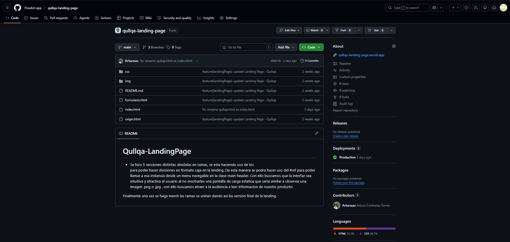
  <br/><i>Repositorio de GitHub sobre la landing page</i>
</p>

Video de explicación sobre esta sección: [Ver video](https://upcedupe-my.sharepoint.com/:v:/g/personal/u202413169_upc_edu_pe/IQDqpNUpHEpuSbdSMAmRmD1bAe_mipNfraF-vfJ5pc-kjIw?e=c2nf7O&nav=eyJyZWZlcnJhbEluZm8iOnsicmVmZXJyYWxBcHAiOiJTdHJlYW1XZWJBcHAiLCJyZWZlcnJhbFZpZXciOiJTaGFyZURpYWxvZy1MaW5rIiwicmVmZXJyYWxBcHBQbGF0Zm9ybSI6IldlYiIsInJlZmVycmFsTW9kZSI6InZpZXcifX0%3D)

#### 5.2.1.6. Services Documentation Evidence for Sprint Review
Para este Sprint, se han implementado y documentado los puntos de interacción de la Landing Page. Aunque el almacenamiento persistente será parte del próximo Sprint, se ha programado la lógica de captura, validación y respuesta visual en el frontend para los siguientes servicios simulados:

| Endpoint / Interacción | Acción (HTTP) | Parámetros (Input IDs) | Descripción del Response |
| :--- | :---: | :--- | :--- |
| `login.html#loginForm` | **POST (Mock)** | `loginEmail`, `loginPass` | **200 OK**: Redirección a Home tras validación de credenciales demo. |
| `register.html#registerForm` | **POST (Mock)** | `bizName`, `bizType`, `fullName`, `regEmail`, `regPass` | **201 Created**: Mensaje de éxito visual y redirección al flujo de inicio. |
| `checkout.html#checkoutForm` | **POST (Mock)** | `bizName`, `cardNum`, `cardExp`, `cardCvc` | **200 OK**: Simulación de pasarela de pagos y confirmación de suscripción. |
| `index.html#contactForm` | **POST (Mock)** | `name`, `email`, `message` | **202 Accepted**: Cambio de estado del botón a "Enviado" y reset del formulario. |

* **URL del Repositorio de Landing Page:** [https://github.com/Flowbit-app/Qullqa-Landing-Page.git](https://github.com/Flowbit-app/Qullqa-Landing-Page)

#### 5.2.1.7. Software Deployment Evidence for Sprint Review
El proceso de despliegue para el Sprint 1 se ejecutó utilizando Firebase Hosting, aprovechando su infraestructura global para garantizar tiempos de carga óptimos para la Landing Page. Se priorizó la automatización para permitir iteraciones rápidas sobre el diseño y contenido informativo orientado a bodegas y farmacias.

**Actividades de Despliegue Realizadas**
* Configuración de Vercel Project: Creación y vinculación del proyecto qullqa-landing mediante el dashboard de Vercel, estableciendo la integración continua con el repositorio de GitHub para despliegues automáticos.

* Vercel CLI Integration: Instalación y configuración de herramientas de línea de comandos para gestionar el despliegue desde el entorno de desarrollo (JettBrains).

* Configuración de GitHub Actions: Se implementó un flujo de trabajo de Continuous Deployment (CD) que activa un comando Vercel deploy automáticamente cada vez que se realiza un merge a la rama main.

**Evidencia Deploy: Landign Page - Responsive**
<p align="center">
  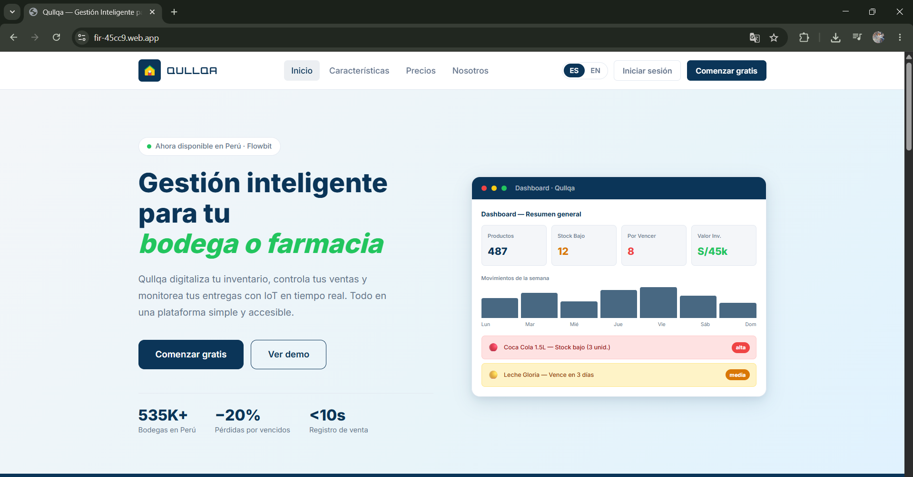
  <br/><i>Landing Page Desplegada</i>
</p>

**Evidencia Deploy: Landign Page Movile - Responsive**
<p align="center">
  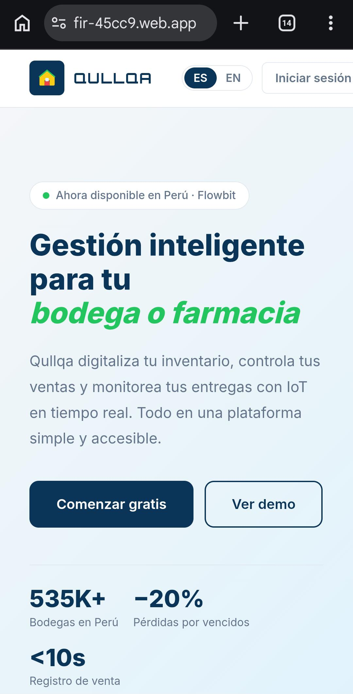
  <br/><i>Landing Page Desplegada</i>
</p>

#### 5.2.1.8. Team Collaboration Insights during Sprint
**Dinámica de Implementación**
<p align="center">
Durante este ciclo, el equipo concentró sus esfuerzos en el desarrollo Frontend y la Documentación Técnica. Se utilizó el modelo GitFlow para separar las tareas de diseño visual de las tareas de redacción del informe. La comunicación se mantuvo mediante Discord y WhatsApp para resolver dudas sobre la guía de estilos en tiempo real.
</p>

**Analíticos de Colaboración**
<p align="center">
La carga de trabajo se distribuyó equitativamente para asegurar que todos los miembros participaran en la construcción de los artefactos visuales y técnicos:

* Desarrollo Frontend: Implementación de componentes responsivos de la Landing Page, secciones de propuesta de valor, internacionalizacion y formularios de captura de datos.

* Documentación y Calidad: Redacción de Historias de Usuario en Jira, diseño de arquitectura C4 y elaboración del informe de Sprint Review conforme a la rúbrica.

* Control de Versiones: Supervisión de la limpieza del historial mediante el uso estratégico de git merge y git rebase para integrar las secciones del documento.
</p>

**Evidencia GitFlow: Graph**
<p align="center">
  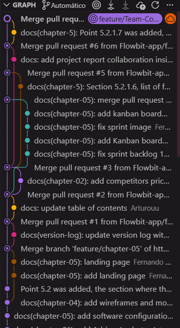
  <br/><i>Grafo de versiones para el gitflow</i>
</p>

**Evidencia GitFlow: Commits**
<p align="center">
  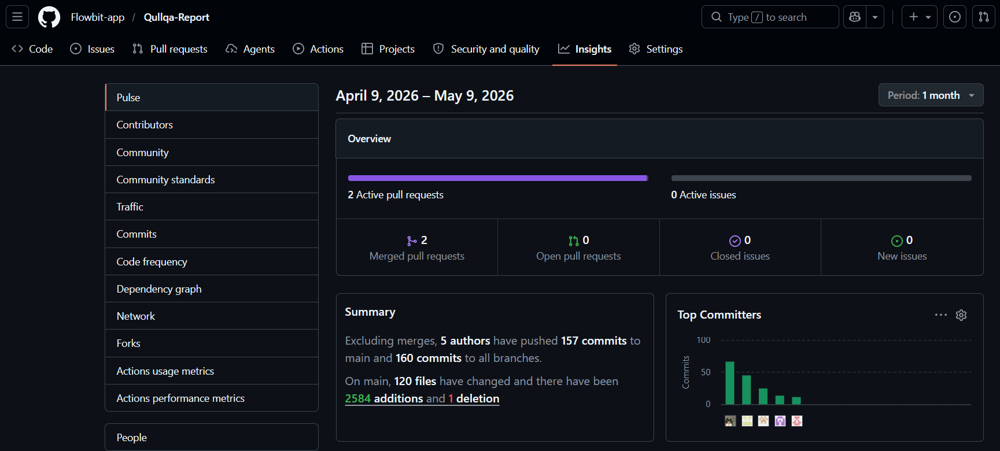
  <br/><i>Grafico estadistico de commits por usuario</i>
</p>

**Evidencia GitFlow: Network**
<p align="center">
  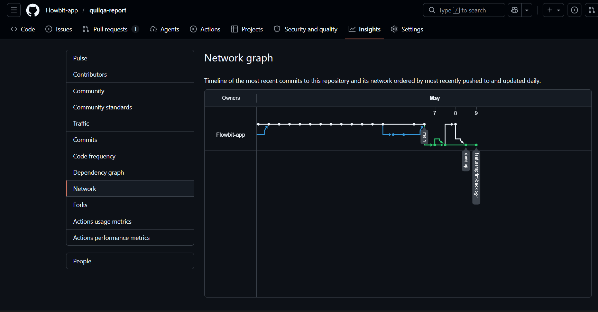
  <br/><i>Grafo de trabajo</i>
</p>


### 5.2.2. Sprint 2
Durante el segundo ciclo de desarrollo, se consolidaron los pilares operativos de QULLQA, integrando un esfuerzo colaborativo bajo metodologías ágiles para entregar un Producto Mínimo Viable (MVP). En este Sprint, el equipo priorizó el desarrollo del core del negocio mediante la implementación de la aplicación web y el despliegue estratégico en Vercel, estableciendo una comunicación funcional con la landing page. Cada fase, desde la planificación en Jira hasta el despliegue final, fue documentada detalladamente para validar la integridad del sistema y asegurar que la propuesta de valor llegue eficazmente a bodegas y farmacias.

#### 5.2.2.1. Sprint Planning 2
El Sprint Planning Meeting inicio la transición hacia la fase de maduración técnica de QULLQA. En esta sesión, el equipo de desarrollo y el Product Owner seleccionaron las Historias de Usuario del Product Backlog enfocadas en envio de alertas y y recepcion de alertas para el administrador o encargado. El objetivo central de este ciclo es transformar los datos operativos en información accionable, asegurando una experiencia de usuario fluida y una arquitectura escalable.
A continuación, se presenta el cuadro resumen con los detalles y acuerdos de esta reunión:

| **Sprint #** | Sprint 2 |
| :--- | :--- |
| **Sprint Planning Background** | |
| **Date** | 2026-05-10 |
| **Time** | 11:00 AM |
| **Location** | Cubiculo - Pabellon L |
| **Prepared By** | Arturo Valentino Contreras Torres  |
| **Attendees (to planning meeting)** | Asmat Alminco, Martin Alejandro / Contreras Torres, Arturo Valentino / Güere Calero, Fernando Julio / Huaman Oscco, Aldo Jesus / Ramos Fuentes Rivera, Adriana Nicole |
| **Sprint 1 Review Summary** | Se completó con éxito la fase de ideación y diseño técnico. Se cuenta con la arquitectura C4, la estructura de la base de datos y el despliegue inicial en Vercel. El Product Owner validó la estructura de los repositorios y hizo comentarios con relacion a la mejora del trabajo coperativo en relacion al gitflow, brindando una guia escrita de como realizar el paso a paso para desarrollarlo. |
| **Sprint 1 Retrospective Summary** | El equipo destacó la eficiencia de las herramientas colaborativas (Jira/GitHub). Como compromiso de mejora, se acordó aplicar reglas estrictas de GitFlow y el uso de Conventional Commits para evitar colisiones en las ramas de desarrollo durante la codificación activa. |
| **Sprint Goal & User Stories** | |
| **Sprint 2 Goal** | **Contexto:** Tras finalizar la fase de ideación, el equipo de QULLQA se enfoca en este segundo ciclo en refinar la identidad digital y materializar la infraestructura técnica. El esfuerzo es dual: por un lado, se optimiza la Landing Page y los diagramas de arquitectura del Sprint 1 para asegurar que la propuesta de valor para bodegas (stock) y farmacias (vencimientos) sea impecable; por otro lado, se inicializa la Web Application, implementando el sistema de gestión de identidad (Auth) y la base del módulo de inventario, transformando los mock-ups en un entorno funcional y seguro. <br><br> **Sprint Goal:**<br>“Our focus is on building a reliable digital presence and enabling a secure entry point to the platform by improving the landing page, refining the architecture diagrams, and launching the web application. The success of this sprint will be measured by the deployment of 100% of the committed user stories (registration, login, and initial inventory) to Vercel, achieving 90% validation of the acceptance criteria, and maintaining a zero (0) critical vulnerabilities report in the development environment. This will allow users like Carlos or Carmen to authenticate and interact with their product catalog for the first time without errors.”|
| **Sprint 2 Velocity** | 15 Story Points. (Velocidad estimada basada en la capacidad inicial del equipo para configurar los entornos y desarrollar codigo en relacion a los bounded context principales del sistema). |
| **Sum of Story Points** | 15 Story Points. |

#### 5.2.2.2. Aspect Leaders and Collaborators
Se presenta la Leadership-and-Collaboration Matrix (LACX), herramienta diseñada para estructurar la gestión de responsabilidades del equipo QULLQA. En esta matriz, se definen los roles de liderazgo (L) y colaboración (C), optimizando la comunicación interna y asegurando el cumplimiento de los objetivos estratégicos de este Sprint.

La organización de líderes y colaboradores está directamente relacionada con la selección de tareas (tasks) que se desarrollarán durante el Sprint.

| Team Member | GitHub Username | Arquitectura & Documentación (L/C) | Desarrollo Backend & API (L/C) | Base de Datos & Persistencia (L/C) | Frontend & UI/UX (L/C) | QA, Testing & DevOps (L/C) |
| :--- | :--- | :---: | :---: | :---: | :---: | :---: |
| Asmat Alminco, Martin Alejandro | Alemarr2 | C | C | C | L | C |
| Contreras Torres, Arturo Valentino | Arturouu  | L | C | C | C | C |
| Güere Calero, Fernando Julio | FerG17 | C | L | C | C | C |
| Huaman Oscco, Aldo Jesus | Jesusho22 | C | C | C | C | L |
| Ramos Fuentes Rivera, Adriana Nicole | Adriana832 | C | C | L | C | C |
---

> **Leyenda:**  </br>
> **L:** Lider (Líder del aspecto)  
> **C:** Colaborador (Colaborador y desarrollo)

#### 5.2.2.3. Sprint Backlog 2

**Periodo:** 4 de mayo – 6 de julio  
**Objetivo del Sprint:** Tener la web aplicattion desplegada con acceso directo desde la landing page, asegurar la comunicacion y contar con usuarios reales accediendo y mostrando interes en nuestro sistema, estableciendo la base visual y funcional de QULLQA.

---
| User Story Id | Título de la Historia | Task Id | Título de la Tarea | Descripción de la Tarea | Est. (Hrs) | Asignado | Status |
| :--- | :--- | :--- | :--- | :--- | :---: | :--- | :--- |
| US-10 | Controlar stock por almacén | T-10-1 | Modelado multi-almacén | Adaptar la base de datos para soportar múltiples ubicaciones por producto. | 7 | Fernando | Done |
| US-10 | Controlar stock por almacén | T-10-2 | Selector de ubicación | Implementar en el Frontend el selector de almacén para entrada/salida de stock. | 5 | Fernando | Done |
| US-10 | Controlar stock por almacén | T-10-3 | Reporte de distribución | Crear la vista de consulta que muestre cuánto stock hay en cada almacén. | 6 | Fernando | Done |
| US-11 | Recibir alertas de bajo stock | T-11-1 | Configuración de umbrales | Crear interfaz para definir el 'stock mínimo' por cada producto. | 4 | Arturo | Done |
| US-11 | Recibir alertas de bajo stock | T-11-2 | Motor de verificación | Programar el trigger que compare el stock actual vs el mínimo en cada movimiento. | 6 | Arturo | Done |
| US-11 | Recibir alertas de bajo stock | T-11-3 | Interfaz de notificaciones | Diseñar el panel de notificaciones dentro de la app para mostrar las alertas. | 4 | Arturo | Done |
| US-12 | Recibir alertas de vencimiento | T-12-1 | Lógica de fechas | Implementar algoritmo que calcule días restantes para el vencimiento de lotes. | 6 | Fernando | Done |
| US-12 | Recibir alertas de vencimiento | T-12-2 | Reporte de mermas | Generar una lista de productos próximos a vencer para acciones preventivas. | 4 | Fernando | Done |
| US-15 | Visualizar dashboard | T-15-1 | Integración de KPIs | Desarrollar los endpoints que calculen ventas totales, stock crítico y alertas. | 8 | Martin | Done |
| US-15 | Visualizar dashboard | T-15-2 | Gráficos estadísticos | Implementar librerías visuales (Charts) para mostrar tendencias de inventario. | 7 | Martin | Done |
| US-15 | Visualizar dashboard | T-15-3 | Filtros de tiempo | Añadir selectores para visualizar el dashboard por día, semana o mes. | 4 | Martin | Done |
| US-18 | Gestionar roles y usuarios | T-18-1 | CRUD de usuarios | Crear la funcionalidad para invitar, editar y eliminar miembros del staff. | 6 | Aldo | Done |
| US-18 | Gestionar roles y usuarios | T-18-2 | Control de permisos | Implementar el Middleware de roles (Admin vs Ventas) para restringir vistas. | 7 | Aldo | Done |
| TS-01 | Enviar alertas mediante API | T-01-1 | Configuración del Servicio | Configurar el proveedor de mensajería/notificación y los Webhooks. | 6 | Adriana | Done |
| TS-01 | Enviar alertas mediante API | T-01-2 | Formateo de mensajes | Programar las plantillas de mensaje para 'Bajo Stock' y 'Vencimiento'. | 4 | Adriana | Done |
| TS-01 | Enviar alertas mediante API | T-01-3 | Pruebas de envío | Realizar tests de integración para asegurar que la API envíe la alerta al dispararse el evento. | 5 | Adriana | Done |
| **TOTAL** | | | | **Esfuerzo total estimado para el Sprint** | **89** | | |

---

<p align="center">
  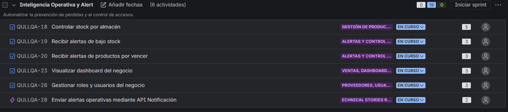
  <br/><i>Artefacto: Jira para Sprint 2 Priorizado</i>
</p>
<p align="center">
  
  <br/><i>Artefacto: Jira para demostrar el tablero Kanban en curso</i>
</p>
<p align="center">
  
  <br/><i>Artefacto: Jira para demostrar el tablero Kanban finalizado</i>
</p>

##### Resumen Técnico
- **Total de Horas:** 67 horas.
- **Distribución:** 2 semanas de desarrollo (considerando jornada laboral estándar).
- **Entregable Principal:** Despliegue de la web application y mejoras en la landing page, aplicando el módulo funcional de inventario (CRUD de productos).

---

#### 5.2.2.4. Development Evidence for Sprint Review
En esta sección se explica y presenta los avances en implementación con relación a los productos de la solución según el alcance del Sprint: Web Application
Page.

Primero, se mostrarán los commits más importantes para el Reporte, los cuales muestran el ciclo de vida del proyecto, y toda la información que se usó,
usa y usará para el desarrollo del proyecto:
 
 | **Repository** | **Branch** | **Commit Id** | **Commit Message** | **Commit Message Body** | **Committed on (Date)** |
  | :--- | :--- | :--- | :--- | :--- | :---: |
  | Arturouu | develop | 98499a0 | Merge pull Flowbit-app/feature/update-class-diagrams | Feature/update class diagrams | 10/05/2026 |
  | Adriana832 | main | 01287d4 | docs(database-diagram) | Aupdate database diagram | 10/05/2026 |
  | Arturouu | chapter-04 | 538d942 | docs(chapter-04) | update class diagrams photos | 10/05/2026 |

<br/>
A continuación se presentan los commits más importantes para la Landing Page, los cuales muestran todo el contenido visual y funcionalidades
implementadas en el Sprint 1:


| **Repository** | **Branch** | **Commit Id** | **Commit Message** | **Commit Message Body** | **Committed on (Date)** |
  | :--- | :--- | :--- | :--- | :--- | :---: |
  | Arturouu | main | 6f68daa | Initial commit | Create repository | 25/04/2026 |
  | Arturouu | main | 5491a21 | feature(landingPage): update Landing Page - Qullqa | Added files for landing page, like footers, headers, all information about the start-up, subscriptions, forms and other content | 25/04/2026 |
  | Arturouu | main | d68b19c | fix: rename qullqa.html as index.html | Fixed files for landing page | 06/05/2026 |
  <br/>

  Finalmente se presentan los commits más importantes para la Web Application, los cuales muestran todo el contenido visual y funcionalidades
implementadas en el Sprint 2:
| **Repository** | **Branch** | **Commit Id** | **Commit Message** | **Commit Message Body** | **Committed on (Date)** |
  | :--- | :--- | :--- | :--- | :--- | :---: |
  | Arturouu | main | 237eeb5 | Merge pull request from upc-pre-202610-flowbit/feature/alerts | Fix: Changes were adjusted in execution, modifications to alerts, sto… | 13/05/2026 |
  | Fernando | main | 5491a21 |  feature(alerts): update business dashboard | update business dashboard | 12/05/2026 |
  | Jesus | main | 538d942 | fidocs(chapter-04):| update class diagrams photos | 13/5/2026 |
  <br/>

#### 5.2.2.5. Execution Evidence for Sprint Review
En el sprint 2, hemos logrado implementar las secciones mas relevantes en la web application, se modifico desperfectos de la lading. A continuación, se explorarán nuestros avances a través de imágenes que muestran el resultado obtenido.
<br/>

1.  Sección Principal: Formulario de inicio de sesion

<br/>
<p align="center">
  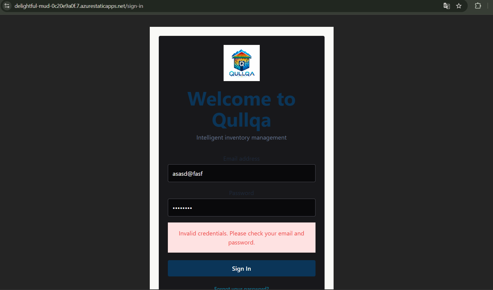
  <br/><i>Formulario de inicio de sesion</i>
</p>
<br/>

2. Sección de formulario para la creacion de una cuenta

<br/>
<p align="center">
  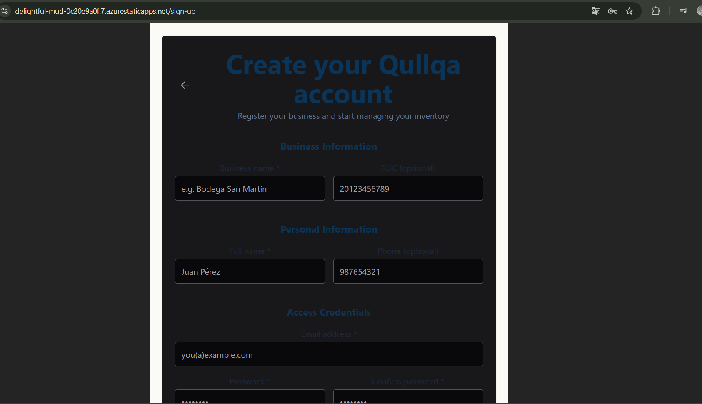
  <br/><i>Sección de muestra para crear cuenta</i>
</p>
<br/>

3. Seccion principal de dashboard

<br/>
<p align="center">
  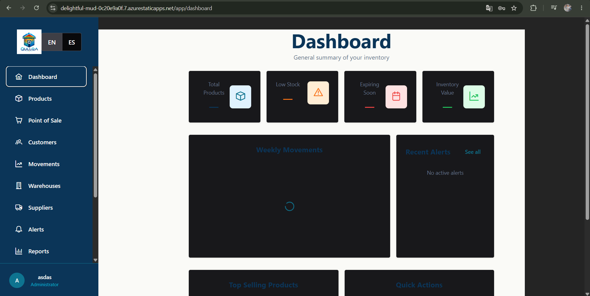
  <br/><i>Seccion visualizacion principal</i>
</p>
<br/>

4. Seccion de visualizacion de productos

<br/>
<p align="center">
  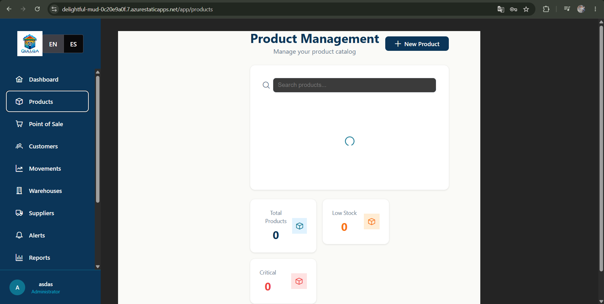
  <br/><i>Seccion productos</i>
</p>
<br/>

5. Sección visión: Carrito de compras.

<br/>
<p align="center">
  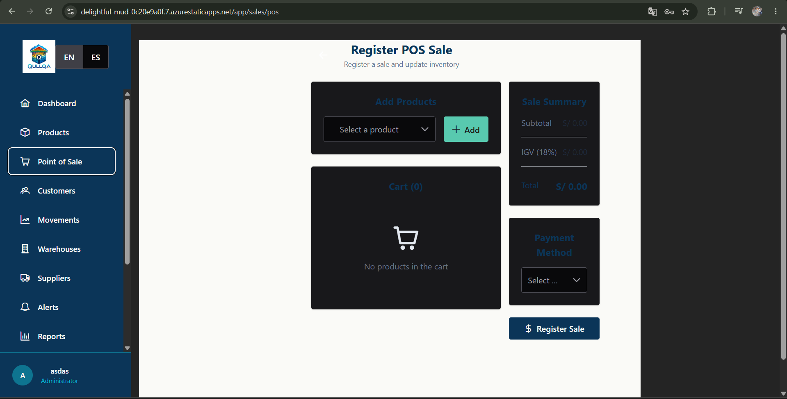
  <br/><i>Seccion compras</i>
</p>
<br/>

6. Sección visualizacion : Customers.

<br/>
<p align="center">
  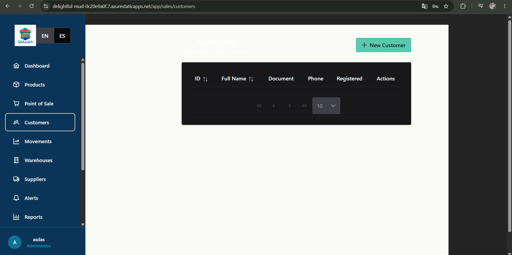
  <br/><i>seccion Customers</i>
</p>
<br/>

7. Sección alertas: Pantalla de alertas.

<br/>
<p align="center">
  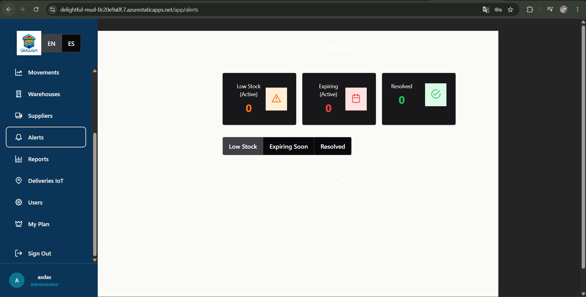
  <br/><i>Pantalla alertas</i>
</p>
<br/>

8. Seccion principal: Implementacion de I18N.

<br/>
<p align="center">
  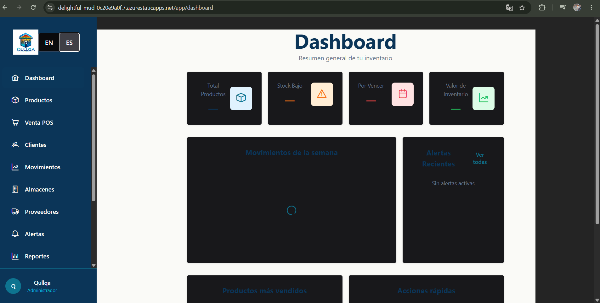
  <br/><i>Implementacion de la internacionalizacion</i>
</p>
<br/>


Para finalizar, se mostrará una demostración de nuestro avance sobre la web application dentro de GitHub, para la publicación de la app web:
<p align="center">
  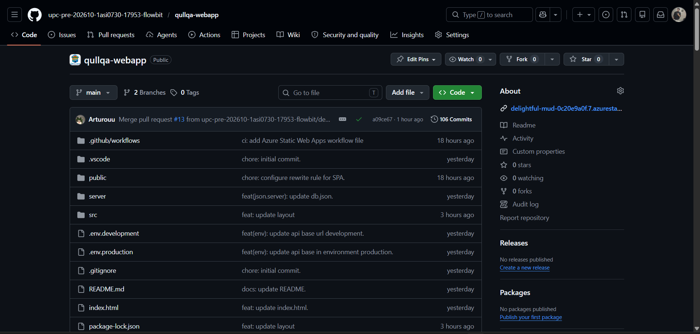
  <br/><i>Repositorio de GitHub sobre la app web</i>
</p>

Video de explicación landing page: [Ver video](https://upcedupe-my.sharepoint.com/:v:/g/personal/u202413169_upc_edu_pe/IQDqpNUpHEpuSbdSMAmRmD1bAe_mipNfraF-vfJ5pc-kjIw?e=c2nf7O&nav=eyJyZWZlcnJhbEluZm8iOnsicmVmZXJyYWxBcHAiOiJTdHJlYW1XZWJBcHAiLCJyZWZlcnJhbFZpZXciOiJTaGFyZURpYWxvZy1MaW5rIiwicmVmZXJyYWxBcHBQbGF0Zm9ybSI6IldlYiIsInJlZmVycmFsTW9kZSI6InZpZXcifX0%3D)

#### 5.2.2.6. Services Documentation Evidence for Sprint Review
Para este Sprint, se han implementado y documentado los puntos de interacción de la Landing Page y el despliegue de la web application, configurando la comunicacion entre ambas partes. El core del negocio se ha aplicado por bounded context a los servicios dados. Ademas,  se ha programado la lógica de captura, validación y respuesta visual en el frontend para los siguientes servicios simulados:

| Endpoint / Interacción | Acción (HTTP) | Parámetros (Input IDs) | Descripción del Response |
| :--- | :---: | :--- | :--- |
| `login.html#loginForm` | **POST (Mock)** | `loginEmail`, `loginPass` | **200 OK**: Redirección a Home tras validación de credenciales demo. |
| `register.html#registerForm` | **POST (Mock)** | `bizName`, `bizType`, `fullName`, `regEmail`, `regPass` | **201 Created**: Mensaje de éxito visual y redirección al flujo de inicio. |
| `checkout.html#checkoutForm` | **POST (Mock)** | `bizName`, `cardNum`, `cardExp`, `cardCvc` | **200 OK**: Simulación de pasarela de pagos y confirmación de suscripción. |
| `index.html#contactForm` | **POST (Mock)** | `name`, `email`, `message` | **202 Accepted**: Cambio de estado del botón a "Enviado" y reset del formulario. |

* **URL del Repositorio de Landing Page:** [https://github.com/Flowbit-app/Qullqa-Landing-Page.git](https://github.com/Flowbit-app/Qullqa-Landing-Page)

* **URL del Repositorio de Web Site:** [https://github.com/upc-pre-202610-1asi0730-17953-flowbit/qullqa-report.git](https://qullqa-landing-page.vercel.app/)

#### 5.2.2.7. Software Deployment Evidence for Sprint Review
Con el objetivo de ofrecer una experiencia robusta a nuestros usuarios de farmacias y bodegas, el despliegue se ejecutó mediante una arquitectura escalable en Vercel. En esta etapa, priorizamos la robustez del flujo de trabajo, logrando que cada mejora en el core del negocio esté disponible de manera inmediata y segura.

**Actividades de Despliegue Realizadas**
* Sincronización Continua (Vercel): Administración del proyecto web mediante el dashboard de Vercel, estableciendo políticas de despliegue automático que conectan directamente el código fuente con la interfaz de usuario.

* Control de Infraestructura: Uso especializado de herramientas de comandos de Vercel para supervisar el estado del hosting y las funciones vinculadas al despliegue.

* Implementación de Pipelines Automáticos: Configuración de disparadores en GitHub Actions que ejecutan pruebas y despliegues (Vercel deploy) de forma autónoma al consolidar cambios en main.

**Evidencia Repo: App Web**
<p align="center">
  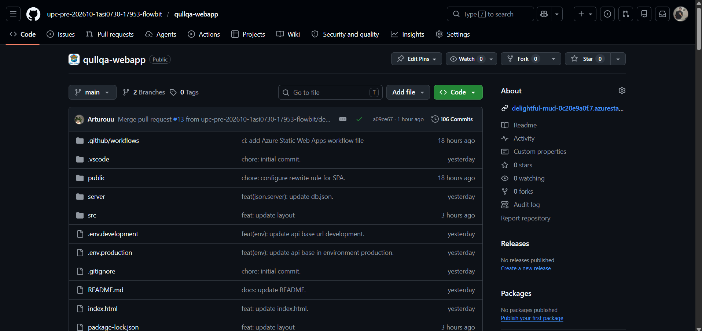<br/>
<i>URL del repositorio (website): <a href="https://github.com/upc-pre-202610-1asi0730-17953-flowbit/qullqa-website">https://github.com/upc-pre-202610-1asi0730-17953-flowbit/qullqa-website</a></i></p>

**Evidencia Deploy: App Web**
<p align="center">
  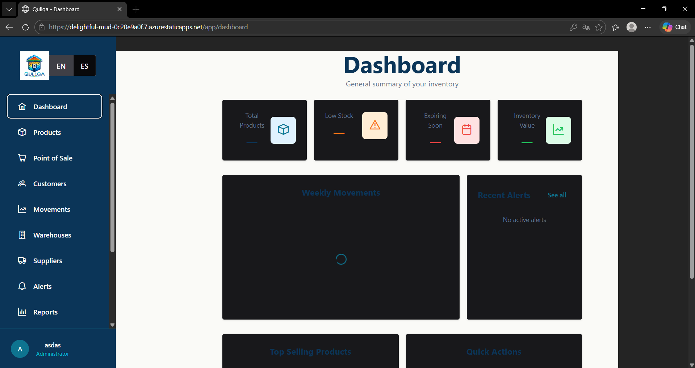
  <br/><i>URL del repositorio (website): <a href="https://delightful-mud-0c20e9a0f.7.azurestaticapps.net/app/dashboard">https://delightful-mud-0c20e9a0f.7.azurestaticapps.net/app/dashboard</a></i>
</p>

#### 5.2.2.8. Team Collaboration Insights during Sprint
**Dinámica de Implementación**
<p align="center">
Durante este segundo ciclo, el equipo evolucionó su enfoque desde el diseño visual hacia la consolidación de la lógica del negocio y la arquitectura técnica de la Web Application. Los esfuerzos se centraron en los siguientes pilares operativos:
</p>

**Analíticos de Colaboración**
<p align="center">
La carga de trabajo se distribuyó equitativamente para asegurar que todos los miembros participaran en la construcción de los artefactos visuales y técnicos:

* Desarrollo Full-stack: Implementación del sistema multi-almacén, lógica de cálculo para alertas de vencimiento (algoritmos de semáforo) y diseño de la interfaz del Dashboard administrativo. 

* Infraestructura y API: Configuración de servicios de notificación externa, creación de endpoints para la gestión de KPIs y modelado de la base de datos para soportar la trazabilidad de stock por usuario.

* Aseguramiento de Calidad: Supervisión de la integridad del repositorio mediante Conventional Commits y validación de historias de usuario mediante pruebas de integración entre los servicios de alerta y la base de datos.
</p>

**Evidencia GitFlow: Graph**
<p align="center">
  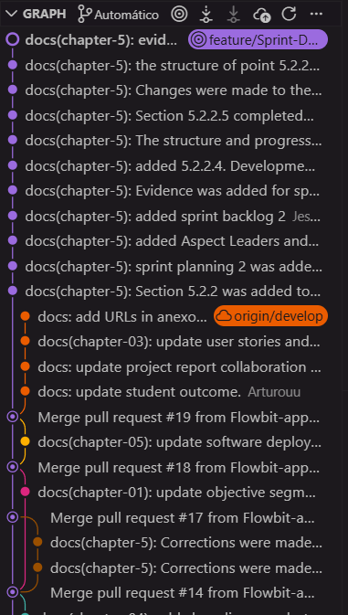
  <br/><i>Grafo de versiones para el gitflow 2.0</i>
</p>

**Evidencia GitFlow: Commits**
<p align="center">
  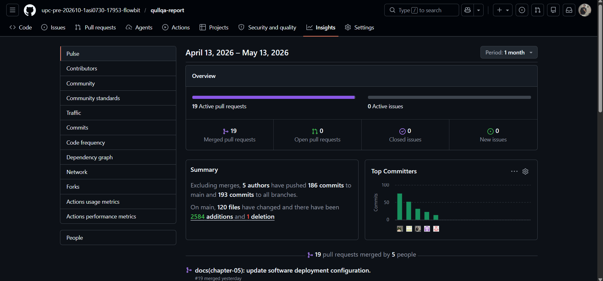
  <br/><i>Grafico estadistico de commits por usuario 2.0</i>
</p>

**Evidencia GitFlow: Network**
<p align="center">
  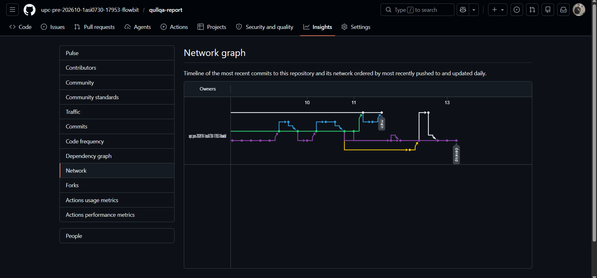
  <br/><i>Grafo de trabajo 2.0</i>
</p>

### 5.2.3. Sprint 3
Durante el tercer ciclo de desarrollo, se consolidaron los pilares operativos y se ejecutaron las funcionalidades clave para estructurar y gestionar la base de datos de QULLQA. Mediante un esfuerzo colaborativo bajo la metodología Scrum, el equipo logró completar con éxito el incremento correspondiente a este Sprint. El enfoque principal se centró en el desarrollo del backend, implementando la lógica necesaria para gestionar el envío y la recepción de solicitudes (requests) de datos. Con esta infraestructura operativa, el equipo está preparado para iniciar las entrevistas de validación, las cuales permitirán que los usuarios interactúen con el producto y evalúen de manera intuitiva el flujo de trabajo de la aplicación.

#### 5.2.3.1. Sprint Planning 3

El Sprint actual marcó el inicio del desarrollo del código de QULLCA para el backend, asimismo, el desarrollo y despliegue de la base de datos. Durante esta sesión, el equipo de desarrollo junto al Product Owner seleccionaron las Historias de Usuario pertinentes del Product Backlog para definir el objetivo central de la iteración. A continuación, se presenta el cuadro resumen con los detalles y acuerdos de esta reunión:

| **Sprint #** | Sprint 3 |
| :--- | :--- |
| **Sprint Planning Background** | |
| **Date** | 2026-06-10 |
| **Time** | 10:00 AM |
| **Location** | Cubiculo - Pabellon I |
| **Prepared By** | Arturo Valentino Contreras Torres  |
| **Attendees (to planning meeting)** | Asmat Alminco, Martin Alejandro / Contreras Torres, Arturo Valentino / Güere Calero, Fernando Julio / Huaman Oscco, Aldo Jesus / Ramos Fuentes Rivera, Adriana Nicole |
| **Sprint 2 Review Summary** |Se completó con éxito la fase de desarrollo del backend, afinar detalles para el Fronted y despliegue técnico para la base de datos. Se cuenta con la arquitectura desarrollada, la estructura de la base de datos aplicada y el despliegue de nuestro producto en Vercel para el acceso libre. El Product Owner validó la estructura de los repositorios y hizo comentarios con relacion a la mejora del trabajo coperativo en relacion al gitflow, reforzando el uso de la guia escrita de como realizar el paso a paso para enviar commits o avances al repositorio.|
| **Sprint 2 Retrospective Summary** | Como retrospectiva del trabajo, el equipo identificó como acierto el uso de herramientas compartidas, estas facilitan el avance colaborativo en tiempo real asi como debatir sobre la participacion de cada uno, ademas, el uso de herramientas colaborativos como GitHub y Jira permiten encapsular el desarrollo de muchas herrramientas. Finalmente, se reconoció como oportunidad de mejora establecer reglas más estrictas de GitFlow para evitar colisiones en los Pull Requests futuros. |
| **Sprint Goal & User Stories** | |
| **Sprint 3 Goal** | **Contexto:** El equipo de ingeniería de Qullqa se enfoca en este sprint en cerrar la brecha entre el diseño arquitectónico y la ejecución funcional. Priorizamos la construcción del ecosistema backend utilizando una arquitectura limpia, el despliegue de la infraestructura de base de datos y la integración de los servicios con el frontend. El objetivo es pasar de una presencia estática a un entorno dinámico donde las operaciones CRUD (Crear, Leer, Actualizar, Borrar) sean ejecutables, asegurando que la conexión entre el cliente y el servidor sea robusta, eficiente y escalable para las necesidades de gestión de inventarios y farmacias.<br><br> **Sprint Goal:**<br>*“Our focus is to transition from architectural planning to a functional, connected system by implementing the core backend logic, deploying the database, and establishing secure API endpoints. We believe this will enable a seamless data flow between the frontend and backend, validating the application’s business logic in real-time. This will be confirmed when users can successfully perform end-to-end operations—specifically adding, retrieving, and updating inventory items—with zero connection errors, and the system maintains consistent state management between the interface and the database.” |
| **Sprint 3 Velocity** | 25 Story Points. (Velocidad estimada basada en la capacidad inicial del equipo para desarrollar entornos y features complejos). |
| **Sum of Story Points** | 15 Story Points. |

#### 5.2.3.2. Aspect Leaders and Collaborators

* En esta sección se presenta la **Leadership-and-Collaboration Matrix (LACX)**. Esta matriz detalla los líderes (L) y colaboradores (C) para cada aspecto clave del Sprint, asegurando una comunicación clara y una distribución de responsabilidades eficiente para el proyecto **QULLQA**.

La organización de líderes y colaboradores está directamente relacionada con la selección de tareas (tasks) que se desarrollarán durante el Sprint.

| Team Member | GitHub Username | Arquitectura & DDD (L/C) | Desarrollo Backend & API (L/C) | Simulacion IoT & Hardware (L/C) | Frontend & UI/UX (L/C) | QA & Testing (L/C) |
| :--- | :--- | :---: | :---: | :---: | :---: | :---: |
| Asmat Alminco, Martin Alejandro | Alemarr2 | L | C | C | C | C |
| Contreras Torres, Arturo Valentino | Arturouu  | C | C | C | C | L |
| Güere Calero, Fernando Julio | FerG17 | C | L | C | C | C |
| Huaman Oscco, Aldo Jesus | Jesusho22 | C | C | C | L | C |
| Ramos Fuentes Rivera, Adriana Nicole | Adriana832 | C | C | L | C | C |
---

> **Leyenda:**  </br>
> **L:** Lider (Líder del aspecto)  
> **C:** Colaborador (Colaborador y desarrollo)

#### 5.2.3.3. Sprint Backlog 3
*Periodo:** 4 de Mayo – 16 de Junio  
**Objetivo del Sprint:** Tener la aplicacion web funcional con usuarios reales accediendo y mostrando interes, estableciendo la base visual y funcional de QULLQA en fase de prueba.

---

| User Story Id | Título de la Historia | Task Id | Título de la Tarea | Descripción de la Tarea | Est. (Hrs) |
| :--- | :--- | :--- | :--- | :--- | :---: |
| **QULLQA-22** | Registrar venta POS | T-22-1 | Interfaz de venta rápida | Diseño de UI para selección de productos y cantidad. | 4 |
| | | T-22-2 | Lógica de validación POS | Validación de stock disponible antes de procesar venta. | 4 |
| | | T-22-3 | Integración con API | Conexión con el endpoint /sales para registrar la transacción. | 2 |
| **QULLQA-14** | Gestionar plan y límites | T-14-1 | Definición de límites | Estructuración de lógica de límites según plan (básico/pro). | 2 |
| | | T-14-2 | Backend de suscripción | Implementar control de permisos en los endpoints. | 2 |
| | | T-14-3 | Notificación de límite | Mostrar aviso visual al usuario al alcanzar su límite. | 2 |
| **QULLQA-21** | Ingreso de stock | T-21-1 | Formulario de entrada | Crear formulario para registrar nueva mercancía recibida. | 2 |
| | | T-21-2 | Actualización de inventario | Lógica backend para incrementar el stock en la base de datos. | 2 |
| | | T-21-3 | Registro de historial | Guardar registro del movimiento (fecha/cantidad) en logs. | 2 |
| **QULLQA-11** | Visualizar planes | T-11-1 | Diseño de comparativa | Crear vista con la tabla comparativa de funcionalidades. | 2 |
| | | T-11-2 | Consumo de datos | Conectar la vista con el servicio de planes del backend. | 2 |
| | | T-11-3 | Feedback visual | Destacar el plan actual del usuario en la vista. | 2 |
| **QULLQA-25** | Gestionar usuarios (/users) | T-25-1 | Controlador de usuarios | Implementar operaciones CRUD básicas para usuarios. | 2   |
| | | T-25-2 | Middleware de seguridad | Asegurar el endpoint con validación de tokens JWT. | 2 |
| | | T-25-3 | Pruebas de integración | Validar el registro y lectura de usuarios en DB. | 2 |
| **QULLQA-30** | Gestionar ventas (/sales) | T-30-1 | Estructura de modelo | Definir el esquema de datos para documentos de venta. | 2 |
| | | T-30-2 | Lógica de negocio | Implementar cálculos de totales y descuentos. | 2 |
| | | T-30-3 | Endpoint de listado | Crear endpoint para consultar historial de ventas. | 2 |
| **QULLQA-34** | Gestionar lotes (/batches) | T-34-1 | Modelo de vencimientos | Crear esquema para tracking de lotes y fechas de expiración. | 2 |
| | | T-34-2 | Lógica de asignación | Lógica para asociar stock nuevo a un lote específico. | 2 |
| | | T-34-3 | Endpoint de consulta | Habilitar endpoint para ver lotes próximos a vencer. | 2 |
| **QULLQA-36** | Gestionar alertas (/alerts) | T-36-1 | Motor de reglas | Definir condiciones para disparar alertas (stock mínimo). | 2 |
|  | T-36-2 | Servicio de alertas | Implementar servicio para persistir notificaciones. | 2 |
| | | T-36-3 | Endpoint de lectura | Habilitar endpoint para obtener alertas del usuario. | 2 |
| **QULLQA-38** | Gestionar productos (/products) | T-38-1 | Optimización de DB | Indexación de campos clave para búsqueda rápida de productos. | 2 |
| | | T-38-2 | Endpoints de gestión | Implementar endpoints para crear, editar y eliminar productos. | 2 |
| | | T-38-3 | Validación de datos | Implementar validaciones de tipos de datos en la entrada. | 2 |
| **QULLQA-39** | Gestionar métricas (/metrics) | T-39-1 | Agregación de datos | Crear consultas para obtener totales de venta y stock. | 2 |
| | | T-39-2 | Endpoint de reporte | Habilitar endpoint para consumo de métricas desde el frontend. | 2 |
| | | T-39-3 | Formateo de respuesta | Asegurar que la data entregada sea eficiente para gráficos. | 2 |
| **TOTAL** | | | | **Esfuerzo total estimado para el Sprint** | **64** | | |

---

<p align="center">
  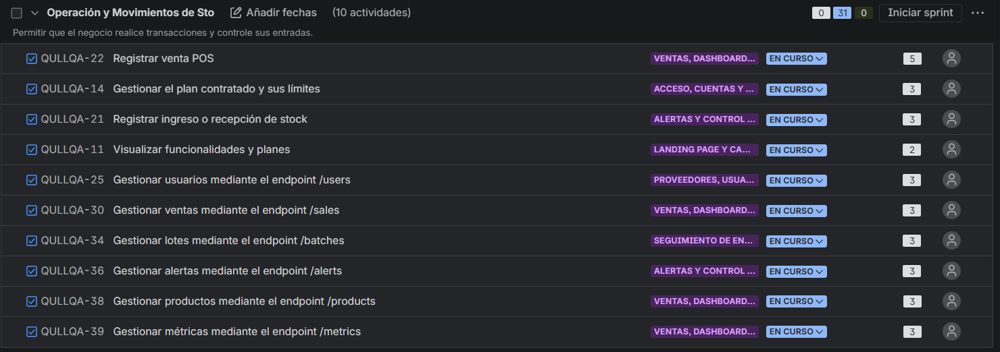
  <br/><i>Artefacto: Jira para Sprint Priorizado</i>
</p>
<p align="center">
  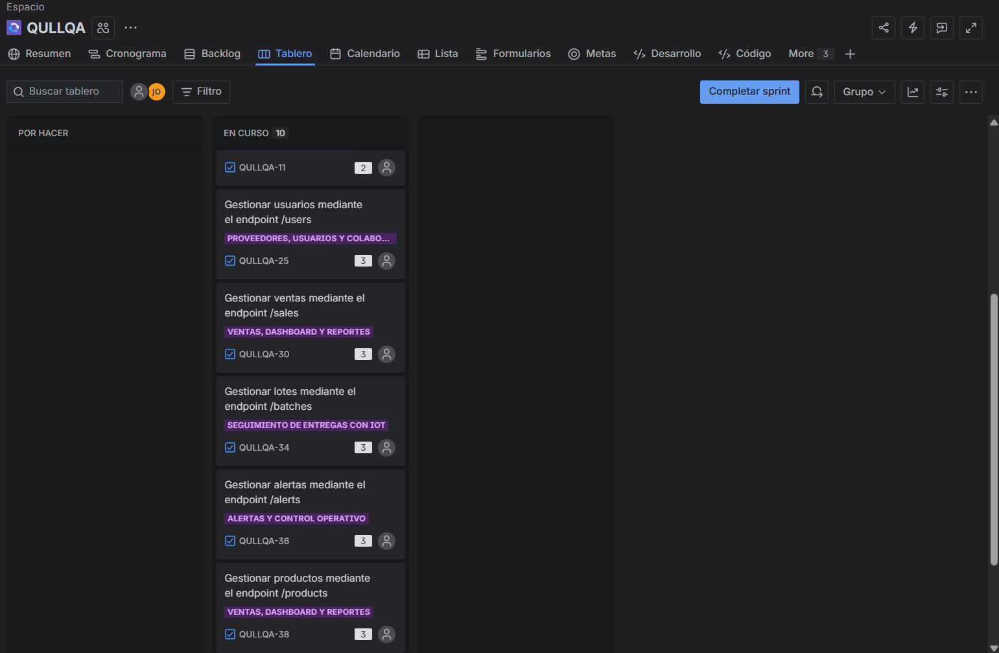
  <br/><i>Artefacto: Jira para demostrar el tablero Kanban - Proceso</i>
</p>
<p align="center">
  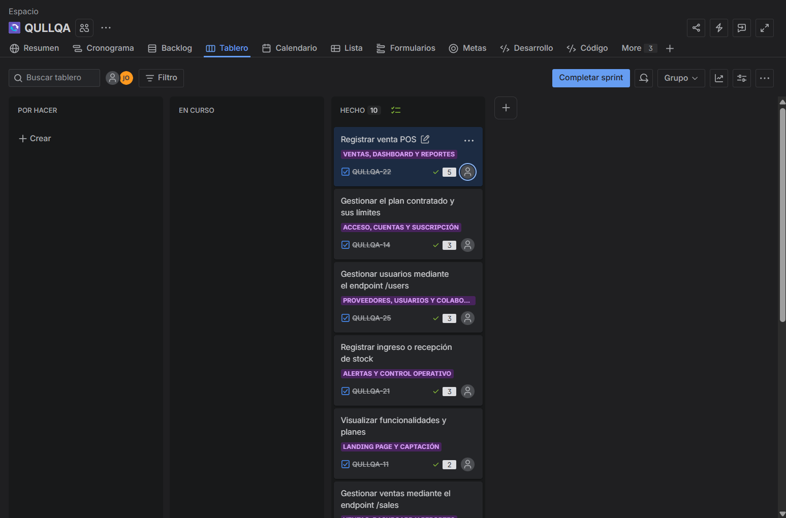
  <br/><i>Artefacto: Jira para demostrar el tablero Kanban - Finalizado</i>
</p>

##### Resumen Técnico
- **Total de Horas:** 64 horas.
- **Distribución:** 2 semanas de desarrollo (considerando jornada laboral estándar).
- **Entregable Principal:** Web application conectada al backend con acceso a la base de datos.

---
#### 5.2.3.4. Development Evidence for Sprint Review
A continuacion se presentan los avances en implementación con relación a los productos de la solución según el alcance del Sprint: Backend deployment and Frontend connection.

A continuacion, se mostrarán los commits más relevantes para el Reporte, los cuales muestran el ciclo de vida del proyecto, y toda la información que se usó,
usa y usará para el desarrollo del proyecto:
 
 | **Repository** | **Branch** | **Commit Id** | **Commit Message** | **Commit Message Body** | **Committed on (Date)** |
  | :--- | :--- | :--- | :--- | :--- | :---: |
  | Arturouu | develop | 98499a0 | Merge pull Flowbit-app/feature/update-class-diagrams | Feature/update class diagrams | 10/05/2026 |
  | Adriana832 | main | 01287d4 | docs(database-diagram) | Aupdate database diagram | 10/05/2026 |
  | Arturouu | chapter-04 | 538d942 | docs(chapter-04) | update class diagrams photos | 10/05/2026 |

<br/>
Ahora se presentan los commits más importantes para el apartado Visual en la landing page, los cuales muestran todo el contenido visual y funcionalidades
implementadas en el Sprint 1:


| **Repository** | **Branch** | **Commit Id** | **Commit Message** | **Commit Message Body** | **Committed on (Date)** |
  | :--- | :--- | :--- | :--- | :--- | :---: |
  | Arturouu | main | 6f68daa | Initial commit | Create repository | 25/04/2026 |
  | Arturouu | main | 5491a21 | feature(landingPage): update Landing Page - Qullqa | Added files for landing page, like footers, headers, all information about the start-up, subscriptions, forms and other content | 25/04/2026 |
  | Arturouu | main | d68b19c | fix: rename qullqa.html as index.html | Fixed files for landing page | 06/05/2026 |
  <br/>

  A continuacion se presentan los commits más importantes para la Web Application, los cuales muestran todo el contenido visual y funcionalidades
implementadas en el Sprint 2:
| **Repository** | **Branch** | **Commit Id** | **Commit Message** | **Commit Message Body** | **Committed on (Date)** |
  | :--- | :--- | :--- | :--- | :--- | :---: |
  | Arturouu | main | 237eeb5 | Merge pull request from upc-pre-202610-flowbit/feature/alerts | Fix: Changes were adjusted in execution, modifications to alerts, sto… | 13/05/2026 |
  | Fernando | main | 5491a21 |  feature(alerts): update business dashboard | update business dashboard | 12/05/2026 |
  | Adriana | develop | 538d942 | fidocs(chapter-04):| update class diagrams photos | 13/5/2026 |
  <br/>

 Finalmente se presentan los commits más importantes para el desarrollo del Backend, los cuales muestran todo el contenido en funcionalidades y conecciones con la base de datos implementadas en el Sprint 3:
| **Repository** | **Branch** | **Commit Id** | **Commit Message** | **Commit Message Body** | **Committed on (Date)** |
  | :--- | :--- | :--- | :--- | :--- | :---: |
  | Arturouu | feature/shared | 1ac3d63 | feat(shared): | update AuditableEntityInterceptor | 18/06/2026 |
  | Fernando | feature/delivery | 5c96b13 |  feat(delivery): | fix delivery bounded context credentials | 19/06/2026 |
  | Jesus | feature/dashboard | 3ff3316 |feat(dashboard): | add DashboardController with REST endpoints | 19/06/2026 |
  | Adriana | festure/sales | deebedec | refactor(sales): | update SalesError definitions | 19/06/2026 |
  | Martin | feature/alerts | 61afba9 | feat(alerts): | update alerts REST controller | 19/06/2026 |
  <br/>

#### 5.2.3.5. Execution Evidence for Sprint Review

En el sprint 3, hemos logrado implementar y conectar las secciones mas relevantes de la web application con la landing page y la base de datos, se modifico desperfectos de la lading y se afino detalles en la web application. A continuación, se explorarán nuestros avances a través de imágenes que muestran el resultado obtenido.
<br/>

1.  Sección Principal: Formulario de inicio de sesion

<br/>
<p align="center">
  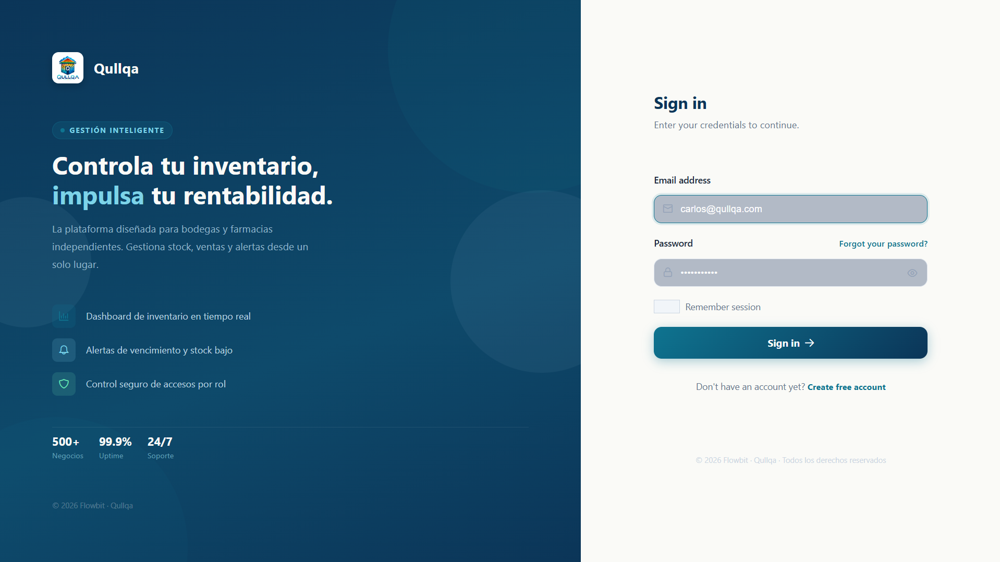
  <br/><i>Formulario de inicio de sesion</i>
</p>
<br/>

2. Sección de formulario para la creacion de una cuenta

<br/>
<p align="center">
  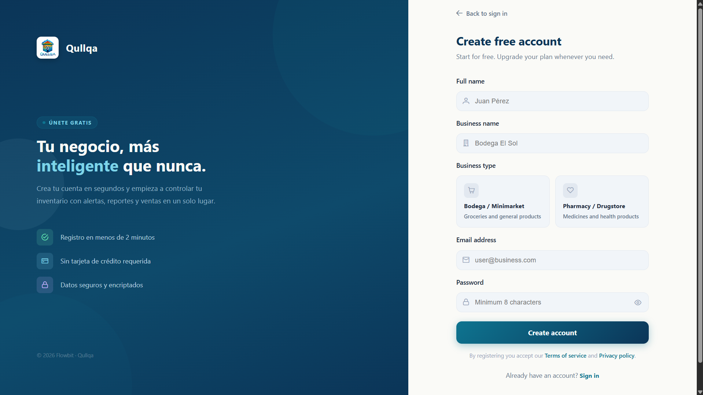
  <br/><i>Sección de muestra para crear cuenta</i>
</p>
<br/>

3. Seccion principal de dashboard

<br/>
<p align="center">
  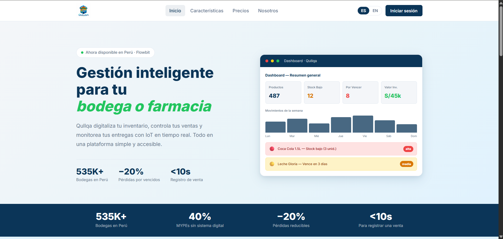
  <br/><i>Seccion visualizacion principal</i>
</p>
<br/>

4. Seccion de visualizacion de productos

<br/>
<p align="center">
  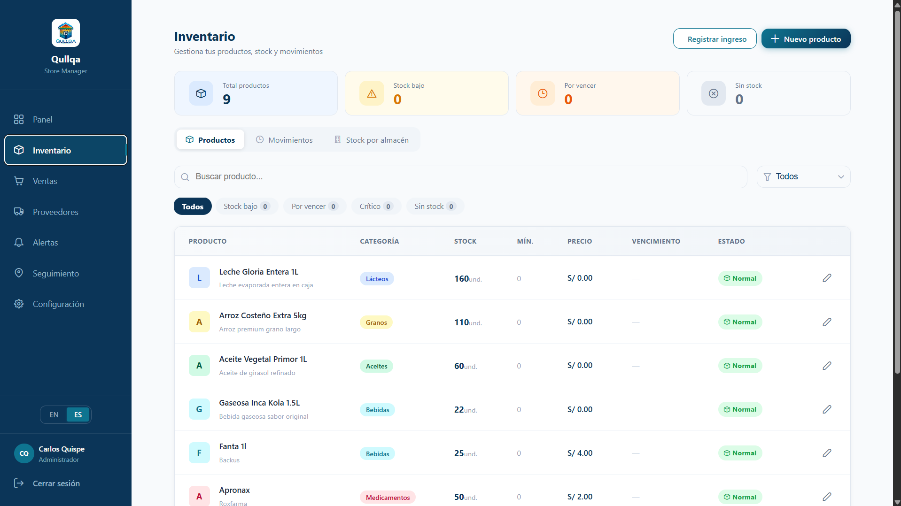
  <br/><i>Seccion productos</i>
</p>
<br/>

5. Sección visión: Ventas y registros.

<br/>
<p align="center">
  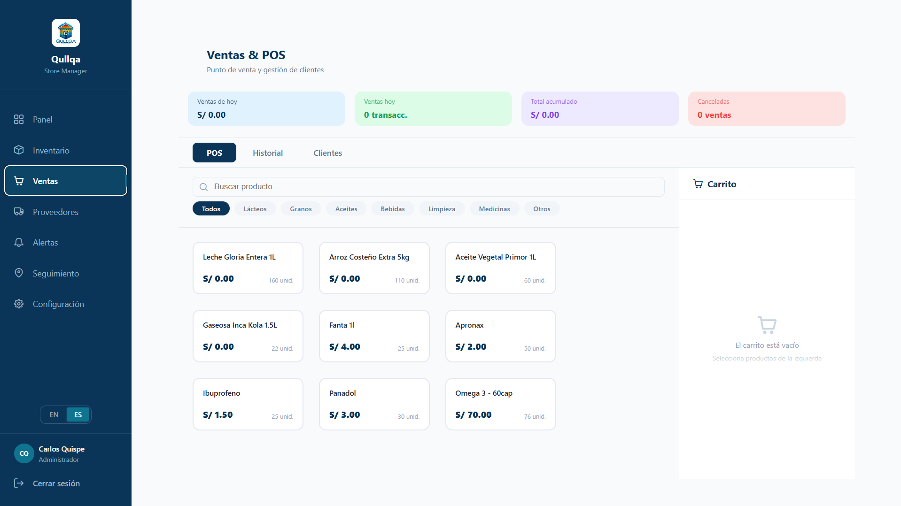
  <br/><i>Seccion compras</i>
</p>
<br/>

6. Sección visualizacion : Proveedores.

<br/>
<p align="center">
  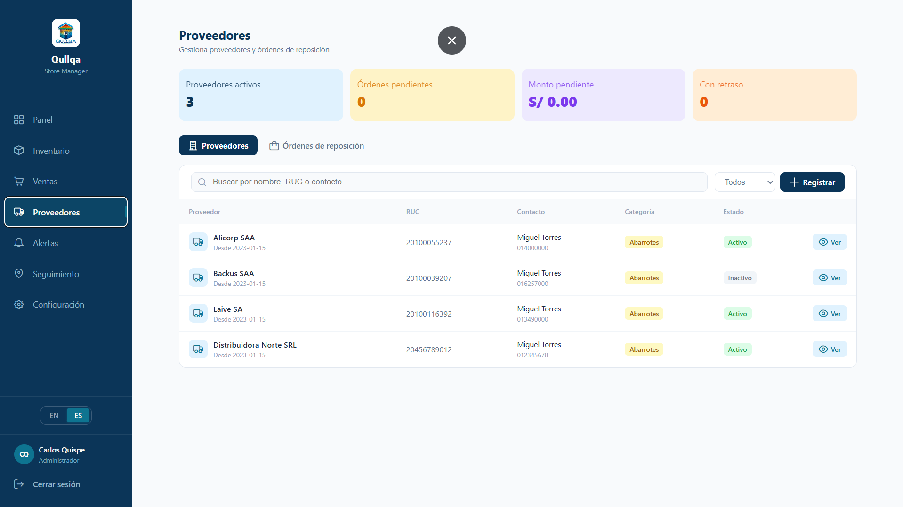
  <br/><i>seccion Customers</i>
</p>
<br/>

7. Sección alertas: Pantalla de alertas.

<br/>
<p align="center">
  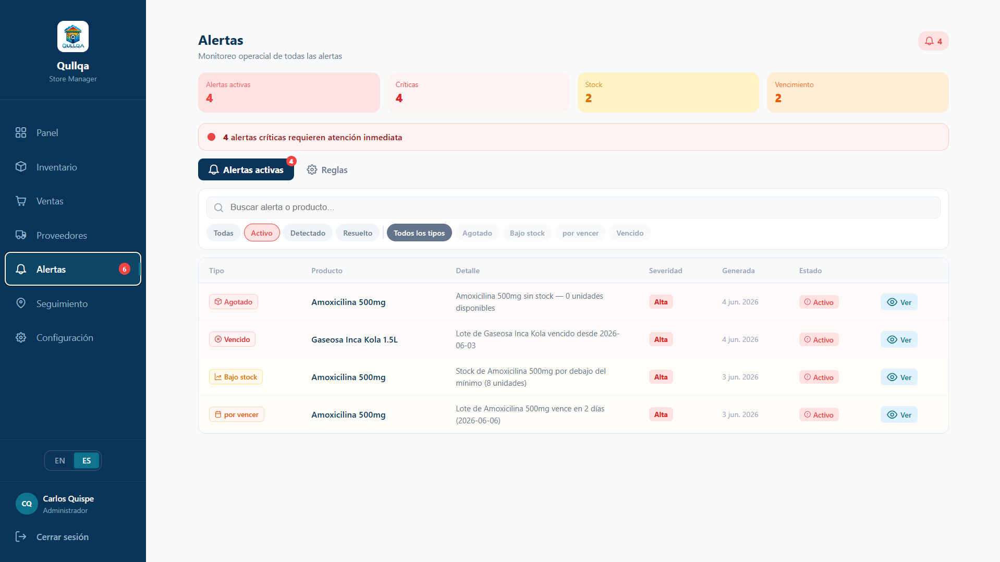
  <br/><i>Pantalla alertas</i>
</p>
<br/>

8. Seccion principal: Implementacion de I18N.

<br/>
<p align="center">
  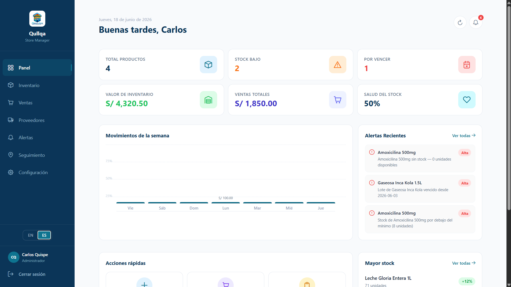
  <br/><i>Implementacion de la internacionalizacion</i>
</p>
<br/>

9. Seccion principal: Coneccion Backend - SQL

<br/>
<p align="center">
  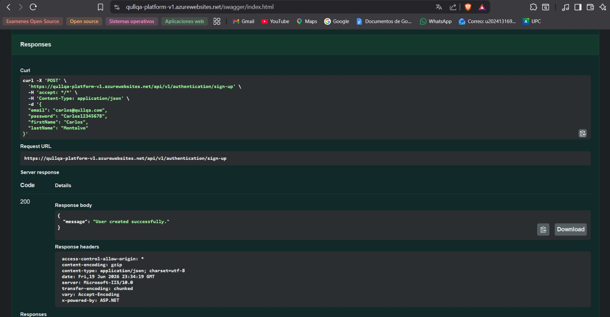
  <br/><i>Coneccion entre el Backend y la base de datos</i>
</p>
<br/>

10. Seccion principal: Validacion de errores

<br/>
<p align="center">
  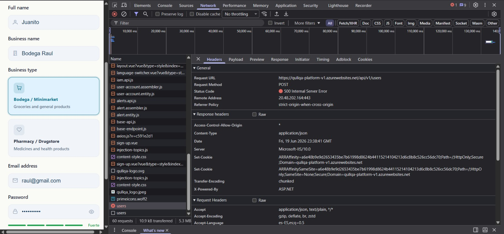
  <br/><i>Validaciones en los endpoints</i>
</p>
<br/>

11. Seccion principal: Swagger

<br/>
<p align="center">
  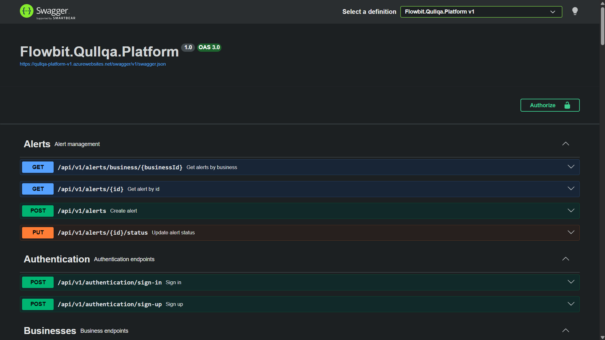
  <br/><i>Despliegue del Backend: Herramienta</i>
</p>
<br/>

12. Seccion principal: Validacion de errores

<br/>
<p align="center">
  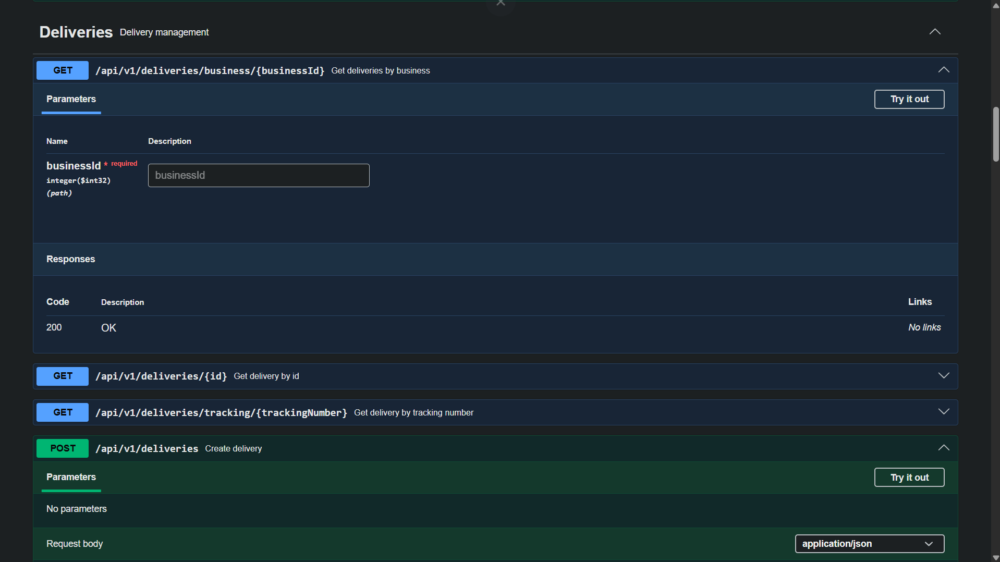
  <br/><i>Evidencia despliegue del Backend</i>
</p>
<br/>

Para finalizar, se mostrará una demostración de nuestro avance sobre la web application dentro de GitHub, para la publicación de la app web:
<p align="center">
  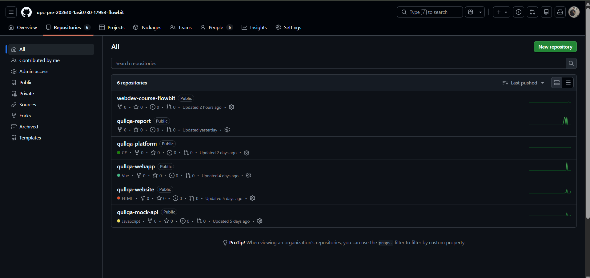
  <br/><i>Repositorio de GitHub sobre la app web</i>
</p>

Video de explicación landing page: [Ver video](https://upcedupe-my.sharepoint.com/:v:/g/personal/u202413169_upc_edu_pe/IQDqpNUpHEpuSbdSMAmRmD1bAe_mipNfraF-vfJ5pc-kjIw?e=c2nf7O&nav=eyJyZWZlcnJhbEluZm8iOnsicmVmZXJyYWxBcHAiOiJTdHJlYW1XZWJBcHAiLCJyZWZlcnJhbFZpZXciOiJTaGFyZURpYWxvZy1MaW5rIiwicmVmZXJyYWxBcHBQbGF0Zm9ybSI6IldlYiIsInJlZmVycmFsTW9kZSI6InZpZXcifX0%3D)

Video de explicación Web Application: [Ver video](https://upcedupe-my.sharepoint.com/:v:/g/personal/u20231h067_upc_edu_pe/IQAJiNl5Q6OVSYIjo7xicw2fAXyhj9OEDmgj92Z6rnCFY0A?nav=eyJyZWZlcnJhbEluZm8iOnsicmVmZXJyYWxBcHAiOiJPbmVEcml2ZUZvckJ1c2luZXNzIiwicmVmZXJyYWxBcHBQbGF0Zm9ybSI6IldlYiIsInJlZmVycmFsTW9kZSI6InZpZXciLCJyZWZlcnJhbFZpZXciOiJNeUZpbGVzTGlua0NvcHkifX0&e=JLPZIr)

#### 5.2.3.6. Services Documentation Evidence for Sprint Review

Para este Sprint, se han implementado y documentado los puntos de interacción de la Landing Page y el despliegue de la web application, configurando la comunicacion entre ambas partes. El core del negocio se ha aplicado por bounded context a los servicios dados. Ademas, se ha programado la lógica de captura, validación y respuestas de los servicios simulados en el backend:

| Endpoint / Interacción | Acción (HTTP) | Parámetros (Input IDs) | Descripción del Response |
| :--- | :---: | :--- | :--- |
| `login.html#loginForm` | **POST (Mock)** | `loginEmail`, `loginPass` | **200 OK**: Redirección a Home tras validación de credenciales demo. |
| `register.html#registerForm` | **POST (Mock)** | `bizName`, `bizType`, `fullName`, `regEmail`, `regPass` | **201 Created**: Mensaje de éxito visual y redirección al flujo de inicio. |
| `checkout.html#checkoutForm` | **POST (Mock)** | `bizName`, `cardNum`, `cardExp`, `cardCvc` | **200 OK**: Simulación de pasarela de pagos y confirmación de suscripción. |
| `index.html#contactForm` | **POST (Mock)** | `name`, `email`, `message` | **202 Accepted**: Cambio de estado del botón a "Enviado" y reset del formulario. |
| `/api/v1/alerts/business/{businessId}` | **GET** | `businessId` | **200 OK**: Retorna la lista de alertas asociadas al negocio indicado. |
| `/api/v1/alerts/{id}` | **GET** | `id` | **200 OK**: Retorna los datos de la alerta con el ID especificado. |
| `/api/v1/alerts` | **POST** | `body: alert data` | **201 Created**: Crea una nueva alerta y retorna los datos creados. |
| `/api/v1/alerts/{id}/status` | **PUT** | `id`, `body: status` | **200 OK**: Actualiza el estado de la alerta indicada. |
| `/api/v1/authentication/sign-in` | **POST** | `body: email, password` | **200 OK**: Retorna token de autenticación tras validar credenciales. |
| `/api/v1/authentication/sign-up` | **POST** | `body: user data` | **201 Created**: Registra un nuevo usuario y retorna sus datos. |
| `/api/v1/businesses` | **GET** | *(none)* | **200 OK**: Retorna la lista completa de negocios registrados. |
| `/api/v1/businesses` | **POST** | `body: business data` | **201 Created**: Crea un nuevo negocio y retorna los datos creados. |
| `/api/v1/businesses/{id}` | **GET** | `id` | **200 OK**: Retorna los datos del negocio con el ID especificado. |
| `/api/v1/customers/business/{businessId}` | **GET** | `businessId` | **200 OK**: Retorna todos los clientes asociados al negocio indicado. |
| `/api/v1/customers` | **POST** | `body: customer data` | **201 Created**: Crea un nuevo cliente y retorna los datos creados. |
| `/api/v1/dashboard/business/{businessId}/metrics` | **GET** | `businessId` | **200 OK**: Retorna las métricas más recientes del negocio indicado. |
| `/api/v1/dashboard/business/{businessId}/reports` | **GET** | `businessId` | **200 OK**: Retorna los reportes generados para el negocio indicado. |
| `/api/v1/dashboard/reports` | **POST** | `body: report data` | **201 Created**: Genera un nuevo reporte y retorna los datos creados. |
| `/api/v1/dashboard/metrics` | **POST** | `body: metrics data` | **201 Created**: Registra un snapshot de métricas y retorna confirmación. |
| `/api/v1/deliveries/business/{businessId}` | **GET** | `businessId` | **200 OK**: Retorna las entregas asociadas al negocio indicado. |
| `/api/v1/deliveries/{id}` | **GET** | `id` | **200 OK**: Retorna los datos de la entrega con el ID especificado. |
| `/api/v1/deliveries/tracking/{trackingNumber}` | **GET** | `trackingNumber` | **200 OK**: Retorna los datos de la entrega con el número de tracking indicado. |
| `/api/v1/deliveries` | **POST** | `body: delivery data` | **201 Created**: Crea una nueva entrega y retorna los datos creados. |
| `/api/v1/deliveries/{id}/status` | **PUT** | `id`, `body: status` | **200 OK**: Actualiza el estado de la entrega indicada. |
| `/api/v1/deliveries/{id}/location` | **PUT** | `id`, `body: location` | **200 OK**: Actualiza la ubicación de la entrega indicada. |
| `/api/v1/products/business/{businessId}` | **GET** | `businessId` | **200 OK**: Retorna todos los productos del negocio indicado. |
| `/api/v1/products/{id}` | **GET** | `id` | **200 OK**: Retorna los datos del producto con el ID especificado. |
| `/api/v1/products/{id}` | **PUT** | `id`, `body: product data` | **200 OK**: Actualiza los datos del producto indicado. |
| `/api/v1/products` | **POST** | `body: product data` | **201 Created**: Crea un nuevo producto y retorna los datos creados. |
| `/api/v1/products/business/{businessId}/inventory` | **GET** | `businessId` | **200 OK**: Retorna el inventario del negocio indicado. |
| `/api/v1/products/stock-movements` | **POST** | `body: movement data` | **201 Created**: Registra un movimiento de stock y retorna confirmación. |
| `/api/v1/products/{productId}/stock-movements/business/{businessId}` | **GET** | `productId`, `businessId` | **200 OK**: Retorna los movimientos de stock de un producto por negocio. |
| `/api/v1/purchase-orders/business/{businessId}` | **GET** | `businessId` | **200 OK**: Retorna las órdenes de compra del negocio indicado. |
| `/api/v1/purchase-orders/{id}` | **GET** | `id` | **200 OK**: Retorna los datos de la orden de compra con el ID especificado. |
| `/api/v1/purchase-orders` | **POST** | `body: order data` | **201 Created**: Crea una nueva orden de compra y retorna los datos creados. |
| `/api/v1/purchase-orders/{id}/details` | **POST** | `id`, `body: detail data` | **201 Created**: Agrega un detalle a la orden de compra indicada. |
| `/api/v1/purchase-orders/{id}/status` | **PUT** | `id`, `body: status` | **200 OK**: Actualiza el estado de la orden de compra indicada. |
| `/api/v1/roles` | **GET** | *(none)* | **200 OK**: Retorna la lista de todos los roles disponibles. |
| `/api/v1/roles` | **POST** | `body: role data` | **201 Created**: Crea un nuevo rol y retorna los datos creados. |
| `/api/v1/sales/business/{businessId}` | **GET** | `businessId` | **200 OK**: Retorna todas las ventas del negocio indicado. |
| `/api/v1/sales/{id}` | **GET** | `id` | **200 OK**: Retorna los datos de la venta con el ID especificado. |
| `/api/v1/sales` | **POST** | `body: sale data` | **201 Created**: Crea una nueva venta y retorna los datos creados. |
| `/api/v1/sales/{id}/details` | **POST** | `id`, `body: detail data` | **201 Created**: Agrega un detalle a la venta indicada. |
| `/api/v1/sales/{id}/pay` | **PUT** | `id` | **200 OK**: Procesa el pago de la venta indicada. |
| `/api/v1/sales/{id}/cancel` | **PUT** | `id` | **200 OK**: Cancela la venta indicada. |
| `/api/v1/suppliers/business/{businessId}` | **GET** | `businessId` | **200 OK**: Retorna los proveedores del negocio indicado. |
| `/api/v1/suppliers/{id}` | **GET** | `id` | **200 OK**: Retorna los datos del proveedor con el ID especificado. |
| `/api/v1/suppliers/{id}` | **PUT** | `id`, `body: supplier data` | **200 OK**: Actualiza los datos del proveedor indicado. |
| `/api/v1/suppliers` | **POST** | `body: supplier data` | **201 Created**: Crea un nuevo proveedor y retorna los datos creados. |
| `/api/v1/users` | **GET** | *(none)* | **200 OK**: Retorna la lista de todos los usuarios registrados. |
| `/api/v1/users/{id}` | **GET** | `id` | **200 OK**: Retorna los datos del usuario con el ID especificado. |
| `/api/v1/users/{id}` | **PUT** | `id`, `body: user data` | **200 OK**: Actualiza los datos del usuario indicado. |

* **URL del Repositorio de Landing Page:** [https://github.com/upc-pre-202610-1asi0730-17953-flowbit/qullqa-website.git](https://qullqa-landing-page.vercel.app/)

* **URL del Repositorio de Web Application:** [https://github.com/upc-pre-202610-1asi0730-17953-flowbit/qullqa-webapp.git](https://calm-tree-02cb7940f.7.azurestaticapps.net/)

* **URL del Repositorio de Qullqa Platform:** [https://github.com/upc-pre-202610-1asi0730-17953-flowbit/qullqa-platform.git](https://qullqa-platform-v1.azurewebsites.net/swagger/index.html)

> Para acceder al Repositorio copia y pega el enlace en el navegador.
> Para acceder al Producto da click en el enlace.

#### 5.2.3.7. Software Deployment Evidence for Sprint Review

Durante este ciclo, QULLQA consolidó su madurez técnica mediante el despliegue integral de una arquitectura Full-stack. El equipo logró la interconectividad entre el core del negocio, la capa de persistencia de datos y la interfaz de usuario, garantizando un ecosistema funcional y disponible en producción.

**Actividades de Despliegue Realizadas**
* Arquitectura Full-stack Integrada: Se automatizó el despliegue del Frontend en Vercel y para el Backend en conjunto con la base de datos en Azure, asegurando la consistencia entre la lógica de servidor y la experiencia del usuario final.

* Gestión de Persistencia y Datos: Configuración y despliegue del motor de base de datos vinculado al backend, garantizando la trazabilidad y disponibilidad de la información en tiempo real para las operaciones de farmacias y bodegas.

* Comunicación End-to-End: Se implementó y validó la comunicación dinámica entre el backend y el frontend, permitiendo la ejecución de las User Stories críticas mediante el consumo eficiente de endpoints.

* Optimización y Aseguramiento: Se realizaron mejoras críticas en el frontend para cumplir con los estándares de usabilidad, integrando auditorías de seguridad que garantizan la estabilidad del despliegue.

* Implementación de Pipelines Automáticos: Configuración de disparadores en GitHub Actions que ejecutan pruebas y despliegues (Vercel deploy) de forma autónoma al consolidar cambios en main.

**Evidencia Repo: App Web**
<p align="center">
  <br/>
<i>URL del repositorio (website): <a href="https://github.com/upc-pre-202610-1asi0730-17953-flowbit/qullqa-webapp.git">https://github.com/upc-pre-202610-1asi0730-17953-flowbit/qullqa-webapp.git</a></i></p>

**Evidencia Deploy: App Web**
<p align="center">
  
  <br/><i>URL del repositorio (website): <a href="https://calm-tree-02cb7940f.7.azurestaticapps.net/">https://calm-tree-02cb7940f.7.azurestaticapps.net/</a></i>
</p>

**Evidencia Coneccion: Connecion entre el Backend y SQL**
<p align="center">
  
  <br/><i>Evidencia de coneccion entre el Backend y SQL</i>
</p>

#### 5.2.3.8. Team Collaboration Insights during Sprint

**Dinámica de Implementación**
<p align="center">
Durante este tercer ciclo de desarrollo, el equipo mejoro el enfoque del diseño visual para que sea relevante con las necesidades del usario y una correcta funcionalidad, ademas se confirmo que la arquitectura desarrollada para la weba application fue correcta en cuanto a lo que el usuario pedia de nuestro producto. Los esfuerzos se centraron en los siguientes pilares operativos:
- Desarrollo y desploy del Backend.
- Desarrollo y deploy del Frontend.
- Conexion del Backend a la base de datos.
- Conexion entre el Fronted y el Backend.
</p>

**Analíticos de Colaboración**
<p align="center">
La carga de trabajo se distribuyó equitativamente para asegurar que todos los miembros participaran en la construcción de los artefactos visuales(Frontend) y técnicos(Backend):

* Arquitectura Full-stack & Despliegue: Se completó la transición a un entorno de producción funcional, integrando el Frontend con el Backend desplegado. Se finalizó el motor de lógica de negocio (multi-almacén y semáforos de vencimiento) y se establecieron los pipelines de despliegue para asegurar la persistencia y disponibilidad de los datos en tiempo real.

* Conectividad y Core del Negocio: Se validó la comunicación end-to-end entre la Landing Page y la Web App, permitiendo un flujo de usuario fluido desde el registro hasta la gestión administrativa. Los endpoints de KPIs y notificaciones fueron estabilizados, consolidando la propuesta de valor para el control de inventarios y toma de decisiones.

* Calidad y Estabilidad Operativa: Se aseguró la integridad del sistema mediante auditorías de seguridad (npm audit) y pruebas de integración exhaustivas. La gobernanza del repositorio (GitFlow) permitió gestionar el desarrollo paralelo de módulos críticos sin impacto en la estabilidad de las ramas principales (main y develop), garantizando un despliegue libre de regresiones.
</p>

**Evidencia GitFlow: Contribucion**
<p align="center">
  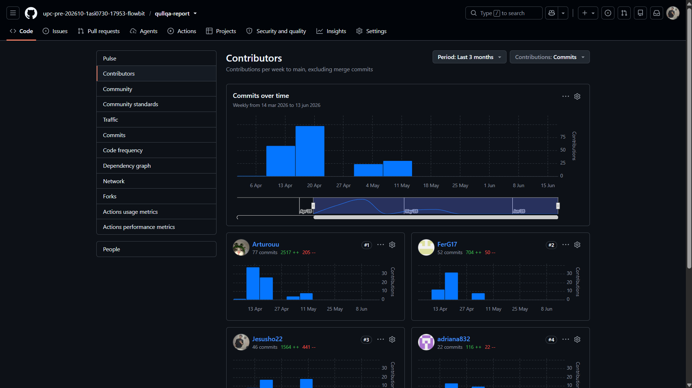
  <br/><i>Grafico de contribucion Sprint 3</i>
</p>

**Evidencia GitFlow: Commits**
<p align="center">
  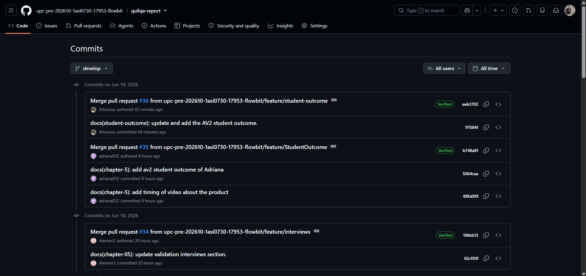
  <br/><i>Relacion de commits para el Sprint 3</i>
</p>

**Evidencia GitFlow: Network**
<p align="center">
  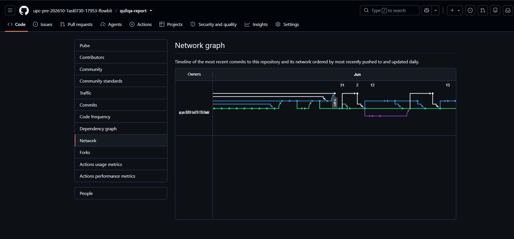
  <br/><i>Grafo de trabajo 3.0</i>
</p>

## 5.3. Validation Interviews
### 5.3.1. Diseño de Entrevistas
#### Segmento 1: Bodegueros independientes

Para las entrevistas de validación se evaluará la usabilidad, viabilidad y eficiencia de Qullqa desde la perspectiva del bodeguero independiente. Esto se logrará considerando los avances del proyecto hasta el sprint 2 y 3, ajustándose al progreso entregado por el equipo de desarrollo y a la disponibilidad coordinada con los entrevistados. Se recogerá el feedback de cada participante respecto al uso de la aplicación web, enfocándose en las funcionalidades orientadas a la gestión de inventario y al manejo de proveedores dentro del flujo operativo del negocio.

##### Objetivos de la Entrevista:

1) Validar la experiencia de usuario (UX) y la interfaz de usuario (UI) del panel del bodeguero, evaluando si comprende la arquitectura de navegación y puede acceder de forma intuitiva a las funcionalidades del sistema de gestión de inventario (IRP).

2) Evaluar si Qullqa ofrece una propuesta de valor diferencial frente a otras alternativas de gestión de inventario, y si las funcionalidades base relacionadas al registro y consulta de proveedores satisfacen las necesidades operativas del bodeguero.

##### Criterios de Evaluación:

- Evaluar si el usuario puede navegar por la aplicación web con facilidad: familiarización con el dashboard general del IRP.
- Medir el tiempo que toma al usuario comprender las funcionalidades e interfaces principales de la aplicación.
- Evaluar la comprensión de la propuesta de valor de la solución por parte del usuario.
- Evaluar si el usuario puede identificar y acceder a la sección de Suppliers desde el panel principal sin ambigüedades.
- Evaluar si el usuario comprende el proceso de registro de un nuevo proveedor, incluyendo los campos requeridos del formulario.
- Evaluar si el usuario puede consultar proveedores existentes y filtrarlos por categoría de manera intuitiva.

*Se considerarán los siguientes User Flows*:

- **Userflow 5**: Consultar lista de productos y disponibilidad.

El User Flow propuesto corresponde a una funcionalidad core del módulo de inventario para el rol de bodeguero, donde abarca como se consultan los productos y los escenarios posibles al momento de realizar dicha acción. 

---

#### Segmento 2: Farmacias independientes

Para las entrevistas de validación se evaluará la usabilidad, viabilidad y eficiencia de Qullqa desde la perspectiva de la farmacia independiente. Esto se logrará considerando los avances del proyecto hasta el sprint 2 y 3, variando según el progreso propuesto por el equipo de desarrollo y la coordinación con los entrevistados. Se recogerá el feedback de cada participante en el uso de la aplicación web, con especial énfasis en las funcionalidades de monitoreo de alertas, notificaciones y control de vencimientos, propias del manejo de productos farmacéuticos.

##### Objetivos de la Entrevista:

1) Validar la experiencia de usuario (UX) y la interfaz de usuario (UI) del módulo de alertas, evaluando si el usuario comprende la arquitectura de navegación y puede acceder de manera intuitiva al monitoreo de alertas dentro del sistema IRP.

2) Evaluar si Qullqa ofrece una propuesta de valor diferencial respecto a otras soluciones de gestión de inventario, y si las funcionalidades de notificación de alertas y aviso de expiración de productos cubren satisfactoriamente las necesidades de control de la farmacia.

##### Criterios de Evaluación:

- Evaluar si el usuario puede navegar por la aplicación web con facilidad: familiarización con el dashboard general del IRP.
- Medir el tiempo que toma al usuario comprender las funcionalidades e interfaces relacionadas al módulo de alertas.
- Evaluar la comprensión de la propuesta de valor de la solución por parte del usuario, en especial respecto al control de vencimientos.
- Evaluar si el usuario puede identificar y acceder a la sección de Alerts desde el panel principal sin ambigüedades.
- Evaluar si el usuario comprende los indicadores resumen (alertas activas, críticas, de stock y de vencimiento) presentados en el dashboard de alertas.
- Evaluar si el usuario puede filtrar y priorizar las alertas de productos por expirar, así como reconocer (Acknowledge) o resolver (Resolve) una alerta desde el detalle correspondiente.

*Se considerarán los siguientes User Flows*:

- **Userflow 3**: Recibir alertas de productos por vencer.

El User Flow propuesto corresponde a una funcionalidad core del módulo de alertas para el rol de farmacia, abarcando el ciclo completo desde la detección automática de productos próximos a vencer hasta la gestión y resolución de la alerta correspondiente.

### 5.3.2. Registro de Entrevistas

**PRIMER SEGMENTO OBJETIVO (BODEGUEROS INDEPENDIENTES)** <br>
**Userflow 5**: Consultar lista de productos y disponibilidad.

<u>Entrevista 1:</u>

Entrevistador: Arturo Contreras Torres

Datos del entrevistado

- **Nombre:** Ruben
- **Apellidos:** De la Cruz
- **Edad:** 53 años
- **Distrito:** Comas
- **Timing:** 0:00:02 - 0:14:25

<p align="center">
  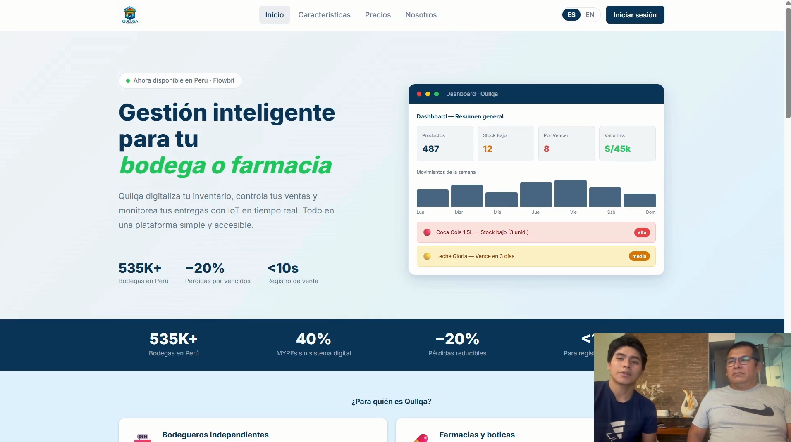
  <br/><i>Evidencia de entrevista: Ruben de la Cruz </i>
</p>

**Resumen descriptivo:**

<div align="justify">
Rubén De la Cruz, bodeguero independiente de 53 años residente en Comas, encontró interesante la landing page de Qullqa, destacando que es muy vistosa y llamativa, conteniendo todos los datos importantes para conocer más acerca del producto. Expresó particular interés en la sección de ventas y planteó una pregunta relevante respecto a la flexibilidad del sistema: cuestionó cómo se aplicaría la venta en caso de que un cliente quisiera adquirir una cantidad de arroz no registrada en el sistema, como 1/4 de arroz, que es muy común en las bodegas. Identificó claramente el flujo de "Consultar lista de productos y disponibilidad" como una funcionalidad clave, señalando que es claro e interesante, ya que servirá de gran ayuda para bodegueros con estos puntos débiles y agilizará significativamente sus negocios. Mencionó que es muy importante que la aplicación permita añadir más productos, considerando que una bodega contiene infinidad de artículos y la capacidad de gestionar un catálogo amplio es esencial. En general, le gustó la aplicación Qullqa, considerándola interactiva, amigable y muy fácil de entender, lo que sugiere un potencial significativo para mejorar la operatividad de pequeños comerciantes como él.
</div>

***Enlace del video:*** [Ver grabación aquí](https://upcedupe-my.sharepoint.com/:v:/g/personal/u202414802_upc_edu_pe/IQC9FJTxFdWQSK_glUj1Gr6RAcE7JG8vUcuE8xO7KTuXakE?nav=eyJyZWZlcnJhbEluZm8iOnsicmVmZXJyYWxBcHAiOiJPbmVEcml2ZUZvckJ1c2luZXNzIiwicmVmZXJyYWxBcHBQbGF0Zm9ybSI6IldlYiIsInJlZmVycmFsTW9kZSI6InZpZXciLCJyZWZlcnJhbFZpZXciOiJNeUZpbGVzTGlua0NvcHkifX0&e=Na4bfI)

<u>Entrevista 2:</u>

Entrevistador: Fernando Julio Güere Calero

Datos del entrevistado

- **Nombre: Raul** 
- **Apellidos: Gimenez** 
- **Edad: 61 años**
- **Distrito: Chaclacayo** 
- **Timing: 15:58** 

<p align="center">
  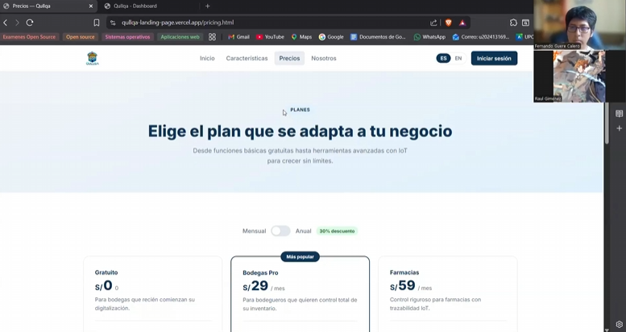
  <br/><i>Evidencia de entrevista: Raul Gimenez </i>
</p>

**Resumen descriptivo:**

<div align="justify">
Raúl Gimenez, bodeguero independiente de 61 años residente en Chaclacayo, exploró la propuesta de Qullqa, destacando que su interfaz es bastante atractiva y sus funcionalidades se perciben muy completas desde el primer vistazo. Expresó particular interés en el módulo de registro de transacciones y planteó distintas observaciones que se presentaron al momento de la explicacion, como el duplicado de imagenes en el portafolio, el error de los formularion dentro de la app web, entre otros. Identificó claramente el flujo de "Registro rápido de productos, ventas y clientes" como una herramienta fundamental, señalando que parece muy intuitiva, ya que servirá de enorme ayuda para mantener el orden de las cuentas diarias y reducirá los tiempos de atención al cliente. Mencionó que, aunque siente que el programa está completo en cuanto a opciones operativas, considera que definitivamente se pueden realizar mejoras al producto, enfocándose más que todo en refinar la interfaz para el usuario. En general, quedó satisfecho con la aplicación Qullqa, considerándola una solución sólida y bien estructurada, lo que sugiere un impacto muy positivo para facilitar el trabajo de bodegueros tradicionales como él.
</div>

***Enlace del video:*** [Ver grabación aquí]( https://upcedupe-my.sharepoint.com/:v:/g/personal/u202413169_upc_edu_pe/IQA3DYjrfZ9gQIGrUn0tcVkiAa3WAIuDh0ApoUbamb99WlA?nav=eyJyZWZlcnJhbEluZm8iOnsicmVmZXJyYWxBcHAiOiJTdHJlYW1XZWJBcHAiLCJyZWZlcnJhbFZpZXciOiJTaGFyZURpYWxvZy1MaW5rIiwicmVmZXJyYWxBcHBQbGF0Zm9ybSI6IldlYiIsInJlZmVycmFsTW9kZSI6InZpZXcifX0%3D&e=CtEEDW)

<u>Entrevista 3:</u>

Entrevistador: Fernando Julio Güere Calero

Datos del entrevistado

- **Nombre: Juan** 
- **Apellidos: Ayllon Pauccar** 
- **Edad: 27 años**
- **Distrito: Chorrillos** 
- **Timing: 26:56** 

<p align="center">
  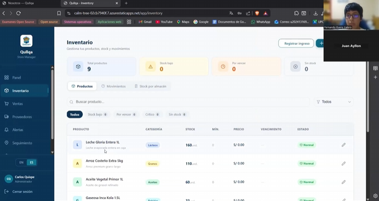
  <br/><i>Evidencia de entrevista: Juan Ayllon Pauccar </i>
</p>

**Resumen descriptivo:**

<div align="justify">
Juan Ayllon Pauccar, bodeguero de 27 años proveniente de Chorrillos, analizó la plataforma de Qullqa, expresando más que todo halagos al destacar que el proyecto se ve muy completo y tiene una excelente estructura general. Expresó particular interés en la sección de administración del sistema, pero planteó una observación relevante respecto a la usabilidad técnica: identificó ciertos "bugs" o errores menores al interactuar con los formularios destinados a agregar distintos objetos, ya sea al registrar un nuevo producto, un proveedor o algún otro formulario similar. Identificó claramente el flujo de "Registro y gestión de productos" como una funcionalidad clave, señalando que está muy bien planteada y servirá de enorme ayuda para mantener el orden del negocio de forma ágil. Mencionó que siente que todo el diseño está bien logrado y enfatiza menos en hacerle mejoras a la interfaz visual, pero remarcó que de todos modos es indispensable solucionar esos fallos en los formularios para perfeccionar la experiencia del usuario. En general, le gustó mucho la aplicación Qullqa, considerándola una herramienta sólida y directa, lo que sugiere un gran potencial operativo una vez aplicados esos ajustes técnicos.
</div>

***Enlace del video:*** [Ver grabación aquí](https://upcedupe-my.sharepoint.com/:v:/g/personal/u202413169_upc_edu_pe/IQB9DMRTBLIHRpSgstMUKgLtAYfcufx9IzRchfAdBSh64jE?nav=eyJyZWZlcnJhbEluZm8iOnsicmVmZXJyYWxBcHAiOiJTdHJlYW1XZWJBcHAiLCJyZWZlcnJhbFZpZXciOiJTaGFyZURpYWxvZy1MaW5rIiwicmVmZXJyYWxBcHBQbGF0Zm9ybSI6IldlYiIsInJlZmVycmFsTW9kZSI6InZpZXcifX0%3D&e=ZNoXPe)

**SEGUNDO SEGMENTO OBJETIVO (FARMACIAS INDEPENDIENTES)** <br>
**Userflow 3**: Recibir alertas de productos por vencer.

<u>Entrevista 1:</u>

Entrevistador: Adriana Nicole Ramos Fuentes Rivera

Datos del entrevistado

- **Nombre:** Maria Genoveva
- **Apellidos:** Mariños Roble
- **Edad:** 49 años
- **Distrito:** Comas
- **Timing:** 00:00:00 - 00:16:53

<p align="center">
  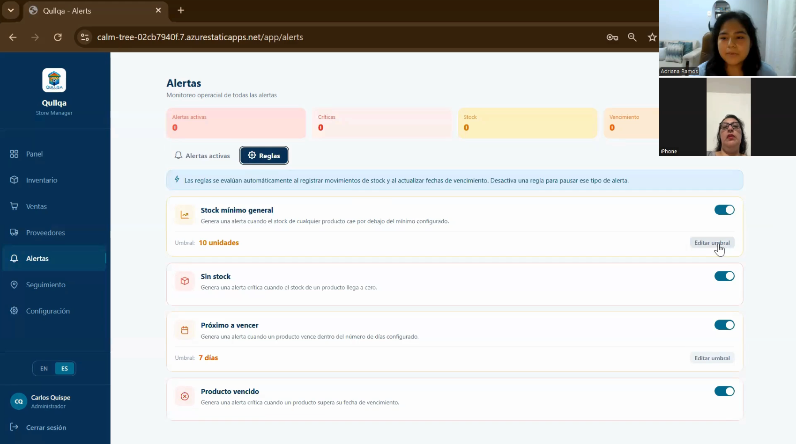
  <br/><i>Evidencia de entrevista: Maria Mariños </i>
</p>

**Resumen descriptivo:**

<div align="justify">
Maria Mariños, propietaria de una farmacia independiente de 49 años y reside en Comas, consideró que la landing page de Qullqa presenta un diseño atractivo, ordenado y fácil de comprender, destacando que la información proporcionada explica de manera precisa las principales funcionalidades y beneficios del sistema. Además, mostró especial interés en el dashboard de movimientos de inventario, ya que consideró que esta herramienta le permitiría supervisar con mayor facilidad las entradas y salidas de productos de su farmacia. Asimismo, identificó el flujo de “Recibir alertas de productos por vencer” como una funcionalidad clara y de gran utilidad para su negocio, principalmente la configuración del número de días en el que vence un producto, debido a que le permitiría detectar anticipadamente los medicamentos próximos a vencer, tomar medidas preventivas y reducir las pérdidas económicas. Finalmente, expresó satisfacción con las notificaciones de stock mínimo y productos agotados, pues estas facilitarían la reposición oportuna del inventario. En resumen, María percibió Qullqa como una aplicación práctica, muy intuitiva y adecuada para mejorar la organización y gestión diaria de negocios como el suyo.
</div>

***Enlace del video:*** [Ver grabación aquí](https://upcedupe-my.sharepoint.com/:v:/g/personal/u202018427_upc_edu_pe/IQAKQLxNzKWKSIVMUMhStymhAYEWEAfZo0-5LVXYF5N2vDw?nav=eyJyZWZlcnJhbEluZm8iOnsicmVmZXJyYWxBcHAiOiJTdHJlYW1XZWJBcHAiLCJyZWZlcnJhbFZpZXciOiJTaGFyZURpYWxvZy1MaW5rIiwicmVmZXJyYWxBcHBQbGF0Zm9ybSI6IldlYiIsInJlZmVycmFsTW9kZSI6InZpZXcifX0%3D&e=JqHgS1)


<u>Entrevista 2:</u>

Entrevistador: Martin Alejandro Asmat Alminco 

Datos del entrevistado

- **Nombre:** Pedro Pablo  
- **Apellidos:** Aguilar Noquez
- **Edad:** 55 años 
- **Distrito:** La Maná
- **Timing:** 00:00:00 - 00:20:24 

<p align="center">
  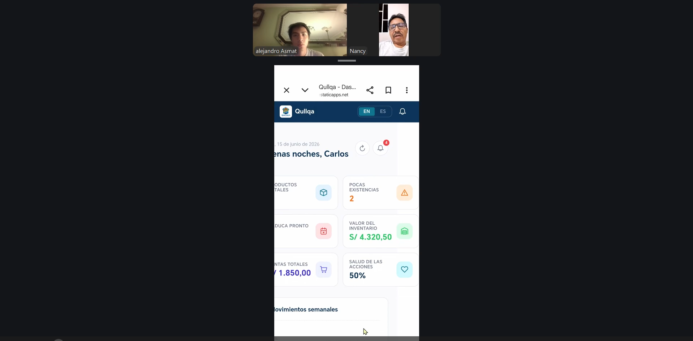
  <br/><i>Evidencia de entrevista: Pablo Aguilar </i>
</p>

**Resumen descriptivo:**

<div align="justify">

Pedro Aguilar, trabajador con rol del administrador de una farmacia independiente con unos 57 años. Le pareció que la landing Page. Piensa que el diseño comunica la idea, la propuesta. Sin embargo, considera que se debe mejorar como se accede a ciertos slides o como funciona la navigation bar en móvil. Considera luego en el apartado de la aplicación, la sugerencia de mejorar la traducción del i18n, tuvo ciertos problemas cuando se traducía del inglés al español debido a su navegador. Luego, identificó con éxito el dashboard de la aplicación y todas las sugerencias mostradas a primera vista, Sin embargo, no logró identifcar correctamente la ubicación del sidebar para por acceder el userflow alerts asignado. Una vez dentro, consideró que las funcionalidades son básicas, y que debemos mejorarlas sobretodo si queremos mejorar la escalabilidad a largo plazo. Aunque, para lo que es básico, considera que funciona correctamente, por lo que es un producto viable de utilizar y él personalmente, lo usaría.  


</div>

***Enlace del video:*** [Ver grabación aquí](https://upcedupe-my.sharepoint.com/:v:/g/personal/u202416272_upc_edu_pe/IQCWKgxy0tTtQY3BbQPF90sPAaBYhpV7PRTlkd3LSsUahy4?e=b1nTkZ&nav=eyJyZWZlcnJhbEluZm8iOnsicmVmZXJyYWxBcHAiOiJTdHJlYW1XZWJBcHAiLCJyZWZlcnJhbFZpZXciOiJTaGFyZURpYWxvZy1MaW5rIiwicmVmZXJyYWxBcHBQbGF0Zm9ybSI6IldlYiIsInJlZmVycmFsTW9kZSI6InZpZXcifX0%3D)


<u>Entrevista 3:</u>

Entrevistador: Aldo Jesus Huaman Oscco

Datos del entrevistado

- **Nombre:** Wilmer Sebastian
- **Apellidos:** Rojas Pulache
- **Edad:** 28
- **Distrito:** Pachacamac
- **Timing:** 17:19 min

<p align="center">
  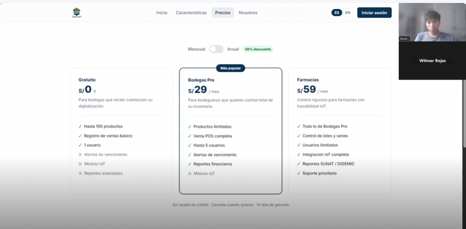
  <br/><i>Evidencia de entrevista: Wilmer Sebastian Rojas Pulache </i>
</p>

**Resumen descriptivo:**

<div align="justify">
Wilmer Rojas, socio de farmacia independiente de 28 años residente en Pachacamac, encontró interesante la landing page de Qullqa, menciona que es llamativa, conteniendo datos relevantes para conocer más acerca del producto y de la empresa, generando cierta cofianza y espectativa. Dice tener interés en la sección de inventario y planteó una pregunta relevante respecto a la flexibilidad y uso intuitivo del sistema: cuestiono el uso de distintos idiomas nacionales para acercarse a nuevos segmentos estudiados o por explorar, ademas dio un feedback respecto a la interfaz, mencionando que el cambio de estilo a dark para invertir la paleta de colores a oscuros podria ser un atractivo visual en el sistema. Asimismo, indica que los demas diseños son intuitivos y por ende es facil de utilizar. Finalmente, destaca que el proyecto o aplicacion es de gran interes y ayuda en el contexto actual del Peru, pues hay muchas personas dueñas de farmacia que aun usar una gestion a papel.
</div>

***Enlace del video:*** [https://upcedupe-my.sharepoint.com/:v:/g/personal/u20231h067_upc_edu_pe/IQDfea9TGuZzRJvdVeBhjy5mAdxf1pd3l4c4MFBbEunnp6E?nav=eyJyZWZlcnJhbEluZm8iOnsicmVmZXJyYWxBcHAiOiJPbmVEcml2ZUZvckJ1c2luZXNzIiwicmVmZXJyYWxBcHBQbGF0Zm9ybSI6IldlYiIsInJlZmVycmFsTW9kZSI6InZpZXciLCJyZWZlcnJhbFZpZXciOiJNeUZpbGVzTGlua0NvcHkifX0&e=VQDWTS]()

### 5.3.3. Evaluaciones según heurísticas

# UX Heuristics & Principles Evaluation
## Usability – Inclusive Design – Information Architecture

| | |
|---|---|
| **CARRERA** | Ingeniería de Software |
| **CURSO** | Aplicaciones Web |
| **SECCIÓN** | *[17953]* |
| **PROFESORES** | Humberto Sánchez Ponce|
| **AUDITOR** | vetsmart |
| **CLIENTE(S)** | *[Martin Asmat, Arturo Contreras, Fernando Güere, Aldo Huaman, Adriana Ramos]* |

---

## SITE o APP A EVALUAR

**Qullqa** — Sistema de gestión de inventario para bodegas y farmacias independientes.

URL Web App: https://delightful-mud-0c20e9a0f.7.azurestaticapps.net/
URL Landing Page: https://qullqa-landing-page.vercel.app/

---

## TAREAS A EVALUAR

El alcance de esta evaluación incluye la revisión de la usabilidad de las siguientes tareas:

1. Consultar lista de productos y disponibilidad (User Flow 5 – Segmento bodegueros)
2. Filtrar productos por categoría desde la sección Inventory
3. Visualizar el estado de stock de productos disponibles y agotados
4. Recibir y visualizar alertas de productos por vencer (User Flow 3 – Segmento farmacias)
5. Filtrar alertas por tipo de expiración desde la sección Alerts
6. Reconocer (Acknowledge) y resolver (Resolve) una alerta de vencimiento
7. Navegar entre las secciones principales de la aplicación web (menú lateral)
8. Navegar por la landing Page para concer la propuesta de negocio

No están incluidas en esta versión de la evaluación las siguientes tareas:

1. Registro e inicio de sesión de nuevos usuarios
2. Registro y edición de productos en el inventario
3. Registro de ventas POS
4. Gestión de proveedores (Suppliers)
5. Consulta y descarga de reportes detallados (User Flow 16)
6. Gestión del plan contratado y sus límites (User Flow 6)
7. Rastreo de entregas con IoT

---

## ESCALA DE SEVERIDAD

Los errores serán puntuados tomando en cuenta la siguiente escala de severidad:

| Nivel | Descripción |
|---|---|
| 1 | Problema superficial: puede ser fácilmente superado por el usuario o ocurre con muy poca frecuencia. No necesita ser arreglado a no ser que exista disponibilidad de tiempo. |
| 2 | Problema menor: puede ocurrir un poco más frecuentemente o es un poco más difícil de superar para el usuario. Se le debería asignar una prioridad baja resolverlo de cara al siguiente release. |
| 3 | Problema mayor: ocurre frecuentemente o los usuarios no son capaces de resolverlos. Es importante que sean corregidos y se les debe asignar una prioridad alta. |
| 4 | Problema muy grave: un error de gran impacto que impide al usuario continuar con el uso de la herramienta. Es imperativo que sea corregido antes del lanzamiento. |

---

## TABLA RESUMEN

| # | Problema | Escala de Severidad | Heurística/Principio violada(o) |
|---|---|---|---|
| 1 | Los textos de la interfaz están en inglés, lo que generó confusión en usuarios hispanohablantes que no reconocían etiquetas clave como "Acknowledge", "Resolve" o "Expiry" | 3 | Inclusive Design: Proporciona experiencias comparables |
| 2 | El usuario no encontró de forma autónoma la sección de Alerts y necesitó ser guiado para acceder a ella desde el menú lateral | 3 | Information Architecture: Is it findable? |
| 3 | No existe un mecanismo visible para regresar al dashboard principal desde vistas internas de la aplicación | 2 | Usability: Libertad y control del usuario |
| 4 | Algunos íconos del menú lateral no tienen etiqueta de texto de apoyo, lo que dificultó su reconocimiento por parte de usuarios con menor familiaridad tecnológica | 2 | Usability: Reconocimiento antes que recuerdo |
| 5 | Errores en la conexión con la base de datos causaron que algunas vistas no cargaran datos reales o mostraran estados vacíos sin mensaje explicativo al usuario | 4 | Usability: Visibilidad del estado del sistema |
| 6 | Los formularios de registro (productos, proveedores) presentaron fallos al intentar guardar, sin mostrar retroalimentación clara sobre el error ocurrido | 3 | Usability: Visibilidad del estado del sistema |
| 7 | No se ofrecen alternativas de contenido en español ni indicadores visuales de idioma que permitan al usuario cambiar el idioma de la interfaz | 2 | Inclusive Design: Proporciona experiencias comparables |

---

## DESCRIPCIÓN DE PROBLEMAS

---

### PROBLEMA #1
**Los textos de la interfaz están en inglés, generando confusión en usuarios hispanohablantes**

**Severidad:** 3
**Heurística violada:** Inclusive Design – Proporciona experiencias comparables

**Problema:**
Durante las sesiones de validación con ambos segmentos objetivo (bodegueros y farmacias), los usuarios no comprendieron términos clave de la interfaz como "Acknowledge", "Resolve", "Expiry", "Low Stock" o "Out of Stock". Aunque la aplicación cuenta con soporte de internacionalización (i18n), la interfaz se presentó en inglés durante la sesión, lo que generó una barrera de acceso directa para usuarios que no dominan el idioma. Esto afecta la igualdad de experiencia entre distintos perfiles de usuario.

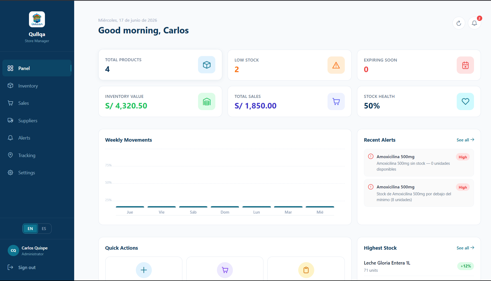

**Recomendación:**
Activar el idioma español como configuración predeterminada para el mercado peruano. Asegurar que el switch de idioma sea visible y accesible desde el primer acceso, y que todos los textos, etiquetas de botones y mensajes del sistema estén correctamente traducidos en la versión en español.

---

### PROBLEMA #2
**El usuario no encontró de forma autónoma la sección de Alerts**

**Severidad:** 3
**Heurística violada:** Information Architecture – Is it findable?

**Problema:**
Durante la entrevista de validación del User Flow 3 (Recibir alertas de productos por vencer), los usuarios del segmento farmacias no lograron identificar ni acceder a la sección "Alerts" desde el menú lateral sin asistencia del entrevistador. Ello ocurre especialmente con el display que se encuentra en formato móvil. El sidebar, la etiqueta y el ícono no fueron suficientemente reconocibles. Se sugiere cambiar fuente o tamaño. Ello es relevante ya que son funcionalidades de alto valor para este segmento.

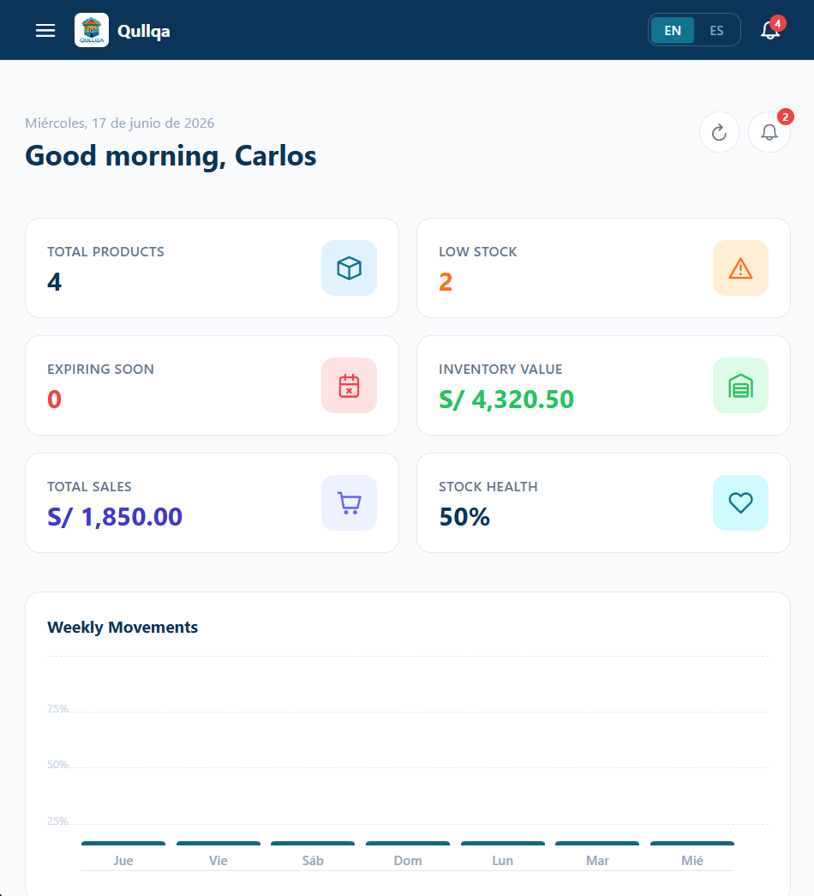

**Recomendación:**
Rediseñar la entrada de "Alerts" en el menú lateral para que cuente con una etiqueta textual clara en español ("Alertas"), un ícono de campana acompañado de un indicador numérico de alertas activas (badge), y considerar destacarla visualmente cuando existan alertas críticas pendientes.

---

### PROBLEMA #3
**No existe un mecanismo visible para regresar al dashboard principal desde vistas internas**

**Severidad:** 2
**Heurística violada:** Usability – Libertad y control del usuario

**Problema:**
Al navegar hacia vistas de detalle dentro de la aplicación (como el modal de detalle de una alerta o la vista de un producto), los usuarios no encontraron un botón o enlace claro para regresar al panel principal o al listado anterior sin necesidad de usar el botón "atrás" del navegador. Esto genera sensación de pérdida de control y puede interrumpir el flujo natural de trabajo.

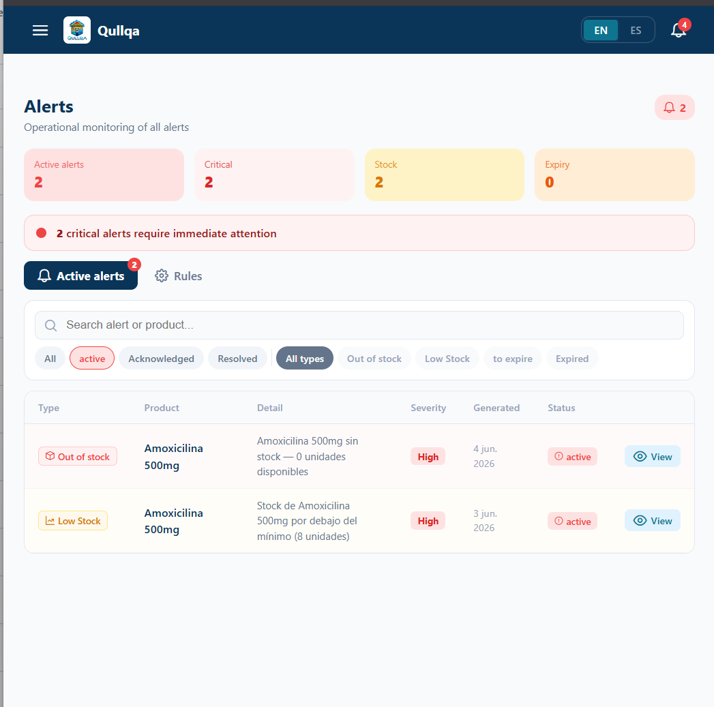

**Recomendación:**
Incorporar breadcrumbs o un botón de regreso claramente etiquetado ("← Volver a Alertas", "← Volver al Inventario") en todas las vistas de detalle. Este control debe estar visible sin necesidad de hacer scroll.

---

### PROBLEMA #4
**Íconos del menú lateral sin etiqueta de texto de apoyo**

**Severidad:** 2
**Heurística violada:** Usability – Reconocimiento antes que recuerdo

**Problema:**
Algunos ítems del menú lateral de la aplicación web presentan únicamente un ícono sin texto descriptivo, especialmente en resoluciones reducidas o cuando el menú está colapsado. Los usuarios con menor experiencia tecnológica, como los bodegueros de mayor edad entrevistados, no reconocieron la función de estos íconos y requirieron más tiempo para orientarse dentro de la navegación.

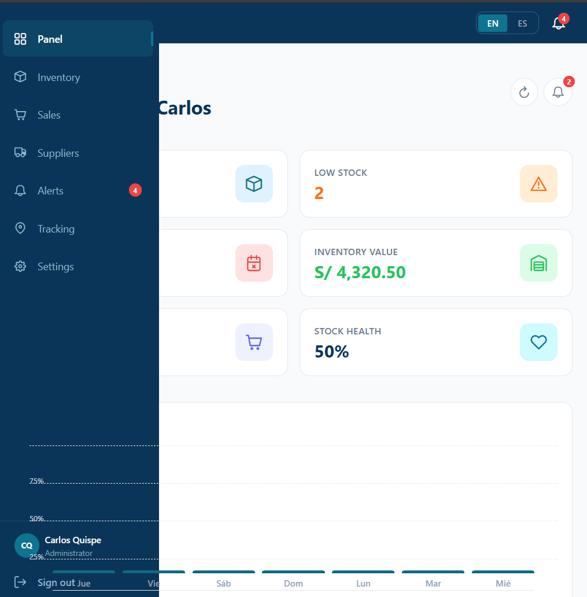

**Recomendación:**
Asegurar que todos los ítems del menú lateral cuenten con etiqueta textual visible en todo momento, o al menos un tooltip con el nombre de la sección al pasar el cursor. Priorizar la legibilidad sobre la compacidad visual en el diseño de la barra de navegación.

---

### PROBLEMA #5
**Errores de conexión con la base de datos generaron vistas vacías sin mensaje explicativo**

**Severidad:** 4
**Heurística violada:** Usability – Visibilidad del estado del sistema

**Problema:**
Durante las sesiones de validación se observaron fallos en la conexión con la base de datos (errores en assembleres, queries y configuración del backend), que provocaron que varias secciones de la aplicación mostraran contenido vacío o no cargaran datos. En ninguno de estos casos el sistema informó al usuario sobre el error ocurrido, el motivo o los pasos a seguir. El usuario interpretó estos estados vacíos como ausencia de datos, no como un fallo técnico.

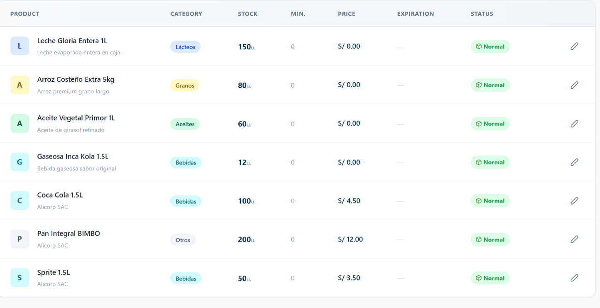

**Recomendación:**
Implementar manejo de errores en todas las llamadas a la API que muestre mensajes claros y amigables cuando ocurra un fallo de conexión (ej. "No se pudo cargar la información. Por favor, intenta nuevamente."). Adicionalmente, resolver los problemas de configuración del backend para estabilizar la conexión con la base de datos antes del lanzamiento.

---

### PROBLEMA #6
**Formularios de registro presentaron fallos al guardar sin retroalimentación al usuario**

**Severidad:** 3
**Heurística violada:** Usability – Visibilidad del estado del sistema

**Problema:**
Los usuarios que intentaron completar formularios de registro (productos, proveedores) reportaron que al presionar el botón de guardar, la acción no producía ningún resultado visible: ni confirmación de éxito, ni mensaje de error, ni indicación de carga. Esto generó confusión sobre si la operación se había completado, y en algunos casos el usuario intentó enviar el formulario múltiples veces.

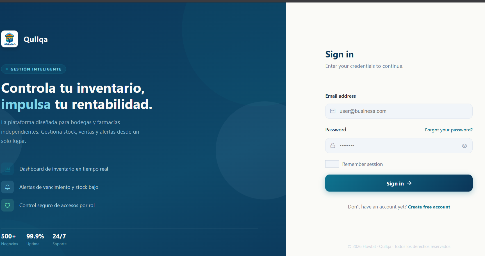

**Recomendación:**
Añadir feedback visual inmediato tras cada acción de formulario: un indicador de carga mientras se procesa la solicitud, un mensaje de éxito cuando la operación se completa correctamente (ej. "Producto registrado con éxito"), y un mensaje de error descriptivo cuando falla (ej. "No se pudo guardar. Verifica tu conexión e intenta de nuevo.").

---

### PROBLEMA #7
**No se ofrece un selector de idioma visible desde la interfaz**

**Severidad:** 2
**Heurística violada:** Inclusive Design – Proporciona experiencias comparables

**Problema:**
Si bien la aplicación cuenta con una implementación de internacionalización (i18n), durante las sesiones de validación no fue posible identificar un control de cambio de idioma visible en la interfaz. Los usuarios que no manejan el inglés no tienen forma de acceder a la versión en español de manera autónoma, lo que limita la accesibilidad de la herramienta para el segmento objetivo principal.

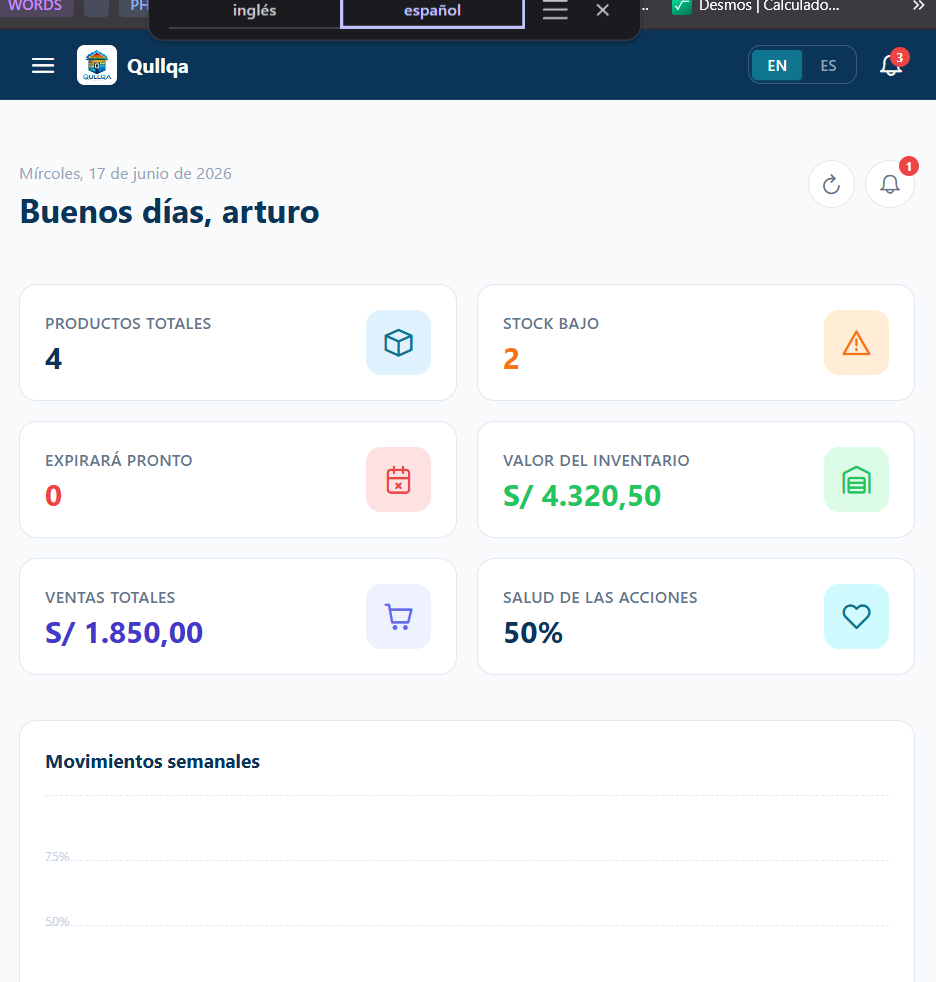

**Recomendación:**
Incorporar un selector de idioma accesible desde el encabezado o la configuración de la aplicación, con opciones claramente identificadas (ES / EN). El idioma español debe establecerse como valor predeterminado para todos los usuarios nuevos registrados en el mercado peruano.

## 5.4. Video About-the-Product

<div align="justify">
En el video About the Product se presenta Qullqa, un sistema inteligente diseñado para optimizar la gestión de bodegas y farmacias. A través del video promocional, se explican las principales características y beneficios de la plataforma, como el control eficiente del inventario, el registro y análisis de ventas, alertas de productos con bajo stock o próximos a vencer y seguimiento de pedidos. Asimismo, se muestra la opinión positiva de un usuario, con el propósito de evidenciar cómo Qullqa ayuda a la administración diaria de estos negocios.
</div>
<br>

- **Timing: 00:01:44**

<br>
<p align="center">
  
  <br/><i>Video About The Product</i>
</p>


***Enlace del video:*** [Ver video aquí](https://upcedupe-my.sharepoint.com/:v:/g/personal/u202018427_upc_edu_pe/IQABChTq3VTVQZITcDkCLlagAVm2k7gM-A3KX86KF7Z2uA4?e=YXqRsN&nav=eyJyZWZlcnJhbEluZm8iOnsicmVmZXJyYWxBcHAiOiJTdHJlYW1XZWJBcHAiLCJyZWZlcnJhbFZpZXciOiJTaGFyZURpYWxvZy1MaW5rIiwicmVmZXJyYWxBcHBQbGF0Zm9ybSI6IldlYiIsInJlZmVycmFsTW9kZSI6InZpZXcifX0%3D)

# Conclusiones
## Conclusiones y recomendaciones
### Conclusiones

* Es importante continuar con la validación de Qullqa mediante pruebas piloto en bodegas y farmacias reales, con el fin de obtener retroalimentación constante que permita mejorar la experiencia de usuario y adaptar las funcionalidades a necesidades específicas del mercado.

* A partir de las entrevistas realizadas a los segmentos objetivo, se comprobó que existe una necesidad real de soluciones tecnológicas simples, accesibles y adaptadas al contexto de los microempresarios peruanos ya que los usuarios manifestaron interés en herramientas que reduzcan el tiempo de gestión y mejoren el control operativo de sus negocios.

* La aplicación de metodologías como Lean UX, entrevistas, análisis competitivo y Domain-Driven Design permitió construir una solución más alineada con las necesidades reales de los usuarios, facilitando la definición de funcionalidades prioritarias y una arquitectura escalable.

* El proyecto también permitió fortalecer las competencias técnicas y colaborativas del equipo, especialmente en áreas como desarrollo web, arquitectura de software, modelado de dominio, trabajo en equipo y comunicación efectiva.

### Recomendaciones

* Es importante priorizar la simplicidad de la interfaz y la facilidad de uso, considerando que muchos usuarios poseen conocimientos tecnológicos limitados o muestran resistencia al cambio digital.

* Resulta necesario fortalecer los módulos financieros y de reportes analíticos para brindar mayor claridad sobre ganancias, flujo de caja y productos más rentables, permitiendo una mejor toma de decisiones.

* Es fundamental optimizar la integración con dispositivos IoT para garantizar estabilidad, precisión y funcionamiento incluso en entornos con conectividad limitada, especialmente en zonas alejadas o con infraestructura deficiente.

* Es conveniente desarrollar estrategias de capacitación y acompañamiento para los usuarios finales, ya que la adopción tecnológica depende no solo de la herramienta, sino también de la confianza y comprensión que los usuarios tengan sobre ella.

## Video About-the-Team

# Bibliografía

Romero, P. (2024, 10 de enero). Retos para impulsar la expansión de las billeteras digitales en las bodegas peruanas. Conexión ESAN. Recuperado de https://www.esan.edu.pe/conexion-esan/retos-para-impulsar-la-expansion-de-las-billeteras-digitales-en-las-bodegas-peruanas

Delgado, R. S. B., & Lopez, H. Y. B., (2024). Modelo PDCA para incrementar el índice de rotación de inventario aplicando la clasificación ABC-SLP, Kanban y Conteo Cíclico en una pequeña empresa de comercio farmacéutico [Tesis de maestría, Universidad Peruana de Ciencias Aplicadas]. Repositorio Académico UPC. https://repositorioacademico.upc.edu.pe/handle/10757/682410

Mendoza, B. J. F., & Anchiraico, B. W. R., (2018). Determinación de patrones de ventas en boticas independientes para mejorar las ventas [Tesis de maestría, Universidad San Ignacio de Loyola]. Repositorio Académico USIL. https://hdl.handle.net/20.500.14005/8591

# Anexos

URL del repositorio (report): https://github.com/upc-pre-202610-1asi0730-17953-flowbit/qullqa-report <br>
URL del repositorio (webapp): https://github.com/upc-pre-202610-1asi0730-17953-flowbit/qullqa-webapp <br>
URL del repositorio (website): https://github.com/upc-pre-202610-1asi0730-17953-flowbit/qullqa-website <br>
URL del repositorio (platform): https://github.com/upc-pre-202610-1asi0730-17953-flowbit/qullqa-platform <br>
URL del repositorio (mockapi): https://github.com/upc-pre-202610-1asi0730-17953-flowbit/qullqa-mock-api <br>

URL de landing page (vercel): https://qullqa-landing-page.vercel.app/ <br>
URL de webapp (azure): https://delightful-mud-0c20e9a0f.7.azurestaticapps.net/ <br>
URL de mockapi (azure): https://qullqa-mockapi.azurewebsites.net/api/v1 <br>
URL de Qullqa platform (Swagger): https://qullqa-platform-v1.azurewebsites.net/swagger/index.html  

URL de exposición (TB1): https://upcedupe-my.sharepoint.com/:v:/g/personal/u202414802_upc_edu_pe/IQACumfS21ugS4xNNlSmksD9AeuBMP7hwW2PhQl8cFKjrgA?nav=eyJyZWZlcnJhbEluZm8iOnsicmVmZXJyYWxBcHAiOiJPbmVEcml2ZUZvckJ1c2luZXNzIiwicmVmZXJyYWxBcHBQbGF0Zm9ybSI6IldlYiIsInJlZmVycmFsTW9kZSI6InZpZXciLCJyZWZlcnJhbFZpZXciOiJNeUZpbGVzTGlua0NvcHkifX0&e=cG5D63
